# BẢN THIẾT KẾ CƠ SỞ DỮ LIỆU & SƠ ĐỒ ERD (ENTITY RELATIONSHIP DIAGRAM v4.0)
## ĐỀ TÀI CAPSTONE FA26SE166 — KHOA KỸ THUẬT PHẦN MỀM — ĐẠI HỌC FPT TP.HCM (FPT SG)
### Hệ Thống Luyện Thi & Đánh Giá Vấn Đáp Bằng LLM Cho Ngành Kỹ Thuật Phần Mềm
*(An LLM-based Oral Examination Practice and Assessment System for Software Engineering Major)*

---

> **Mã đề tài:** FA26SE166 | **Học kỳ:** Fall 2026 (FA26)  
> **Nhóm tác giả & Kỹ sư thực hiện:**  
> - 🧑 **Nguyễn Quang Thành** — Lead Backend Engineer & System Architect  
> - 🧑 **Nguyễn Trọng Tốt** — Backend Developer, AI Engineer & QA Lead  
> - 🧑 **Nguyễn Đăng Hải** — DB Specialist & Frontend Developer (phụ trách Database 30 bảng PostgreSQL và dồn toàn lực phát triển Frontend; tuyệt đối không code C# Backend)  
> - 🧑 **Lê Vũ Hoàng** — Lead Frontend Architect & Fullstack Coordinator  
> **Chuẩn thiết kế:** Chuẩn hóa Bậc 3 (3NF) — ACID Transactions — PostgreSQL 16+ (30 bảng 3NF: 27 bảng lõi + 1 bảng phúc khảo + 1 bảng cấu hình hệ thống + 1 bảng thông báo)  
> **Sơ đồ ERD:** Nhúng trực tiếp trong Mục 2 của tài liệu này (Mermaid ERD) và tệp Kiến trúc [`KIEN_TRUC_HE_THONG.drawio`](./diagrams/KIEN_TRUC_HE_THONG.drawio)  
> **Bộ mã nguồn SQL DDL & Seed:** [`infra/postgres/init/01_schema.sql`](../infra/postgres/init/01_schema.sql) và [`02_seed.sql`](../infra/postgres/init/02_seed.sql)

---

## 1. TỔNG QUAN KIẾN TRÚC DỮ LIỆU (6 BOUNDED CONTEXTS — 30 BẢNG 3NF: 27 BẢNG LÕI + 1 BẢNG PHÚC KHẢO + 2 BẢNG HỆ THỐNG & THÔNG BÁO)

Cơ sở dữ liệu được thiết kế bóc tách hoàn toàn giữa hai thế giới: **Kho tự luyện tập mở (Practice)** và **Kho thi cử bảo mật (Exam)**, giải quyết triệt để nguy cơ lộ đề thi và không phụ thuộc vòng lẫn nhau. Hệ thống bao gồm 30 bảng (27 bảng lõi + 1 bảng phúc khảo + 1 bảng cấu hình hệ thống + 1 bảng thông báo) chia thành 6 Bounded Contexts cốt lõi và các phân hệ hỗ trợ:

```
┌─────────────────────────────────────────────────────────────────────────────────────────────────┐
│                          HỆ THỐNG CSDL CHUẨN HÓA 3NF POSTGRESQL 16 (FA26SE166)                  │
├────────────────────────────────┬────────────────────────────────┬───────────────────────────────┤
│  [1] Identity & RBAC           │  [2] Academic Cohorts          │  [3] Rubrics & Assessment     │
│  • users                       │  • semesters                   │  • rubrics (CHECK = 10.00)    │
│    (admin, department_head,    │  • courses (has_follow_up,     │  • rubric_criteria            │
│     lecturer, proctor,         │    transcript_buffer_seconds,  │    (Weight, Bloom, MaxScore)  │
│     student, UUID PK)          │    max_follow_up_questions)   │                               │
│                                │  • classes                     │                               │
│                                │  • class_enrollments           │                               │
├────────────────────────────────┼────────────────────────────────┼───────────────────────────────┤
│  [4] Practice Module (MF-01)   │  [5] Mock Exam Module (MF-02)  │  [6] Official Exam & Audit    │
│  • practice_questions (Public) │  • exam_structures (Matrix)   │    (MF-04)                    │
│  • practice_sessions           │  • exam_sets (Randomized)      │  • exam_questions (Secure)    │
│  • practice_answers            │  • exam_set_questions         │  • official_exam_sessions     │
│  • ai_evaluations              │  • mock_exam_quotas            │  • real_exam_session_shifts   │
│  • ai_evaluation_details       │    (Dynamic Quota)             │  • student_exam_tickets (1-40)│
│                                │  • mock_exam_sessions (Timer)  │  • exam_question_submissions  │
│                                │    (trỏ practice_questions)   │  • lecturer_audits (Reason)   │
│                                │                                │  • lecturer_audit_details     │
│                                │                                │  • appeal_requests (Phúc khảo)│
├────────────────────────────────┴────────────────────────────────┴───────────────────────────────┤
│  [Chịu Lỗi, Cấu Hình & Thông Báo Enterprise]                                                   │
│  • dead_letter_queues (Zero Data Loss - Phục hồi tự động 4 tầng)                                │
│  • audit_logs (Lưu vết thay đổi dữ liệu nhạy cảm & điểm số)                                    │
│  • system_configs (Cấu hình động: Min/Max Practice, Buffer, Follow-up, Inactivity Timeout 10m) │
│  • notifications (Hộp thư thông báo trong ứng dụng FE-11: 5 sự kiện)                           │
└─────────────────────────────────────────────────────────────────────────────────────────────────┘
```

---

## 2. SƠ ĐỒ THỰC THỂ LIÊN KẾT (MERMAID ERD DIAGRAM)

```mermaid
%%{init: {'theme': 'default', 'themeVariables': { 'fontSize': '14px', 'fontFamily': 'Arial' }}}%%
erDiagram
    %% =========================================================================
    %% QUAN HỆ GIỮA CÁC THỰC THỂ (BOUNDED CONTEXTS POSTGRESQL 16)
    %% =========================================================================

    %% PHÂN HỆ 1 & 2: IDENTITY & ACADEMIC COHORTS
    SEMESTERS ||--o{ COURSES : "contains"
    SEMESTERS ||--o{ CLASSES : "schedules"
    COURSES ||--o{ CLASSES : "has classes"
    USERS ||--o{ CLASSES : "lectures"
    CLASSES ||--o{ CLASS_ENROLLMENTS : "enrolls"
    USERS ||--o{ CLASS_ENROLLMENTS : "attends"

    %% PHÂN HỆ 3: RUBRIC & CRITERIA
    COURSES ||--o{ RUBRICS : "defines rubrics"
    RUBRICS ||--|{ RUBRIC_CRITERIA : "contains criteria"

    %% PHÂN HỆ 4: KHO CÂU HỎI & PHIÊN LUYỆN TẬP TỰ DO (MF-01 & MF-03)
    COURSES ||--o{ PRACTICE_QUESTIONS : "has practice questions"
    RUBRICS ||--o{ PRACTICE_QUESTIONS : "assesses question"
    USERS ||--o{ PRACTICE_QUESTIONS : "submits/approves"
    USERS ||--o{ PRACTICE_SESSIONS : "starts practice"
    COURSES ||--o{ PRACTICE_SESSIONS : "practices course"
    PRACTICE_SESSIONS ||--|{ PRACTICE_ANSWERS : "submits answers"
    PRACTICE_QUESTIONS ||--o{ PRACTICE_ANSWERS : "answered for"
    PRACTICE_ANSWERS ||--o| PRACTICE_ANSWERS : "follow-up parent"
    PRACTICE_ANSWERS ||--o| AI_EVALUATIONS : "evaluated by AI"
    AI_EVALUATIONS ||--|{ AI_EVALUATION_DETAILS : "breaks down criteria"
    RUBRIC_CRITERIA ||--o{ AI_EVALUATION_DETAILS : "benchmarks criterion"

    %% PHÂN HỆ 5: MA TRẬN ĐỀ, BỘ ĐỀ, HẠN NGẠCH & THI THỬ (MF-02)
    COURSES ||--o{ EXAM_STRUCTURES : "defines matrix"
    USERS ||--o{ EXAM_STRUCTURES : "creates structure"
    EXAM_STRUCTURES ||--o{ EXAM_SETS : "generates sets"
    COURSES ||--o{ EXAM_SETS : "belongs to course"
    EXAM_SETS ||--|{ EXAM_SET_QUESTIONS : "comprises questions"
    EXAM_QUESTIONS ||--o{ EXAM_SET_QUESTIONS : "included in set"
    USERS ||--o{ MOCK_EXAM_QUOTAS : "enforces daily quota"
    COURSES ||--o{ MOCK_EXAM_QUOTAS : "quota per course"
    USERS ||--o{ MOCK_EXAM_SESSIONS : "takes mock exam"
    COURSES ||--o{ MOCK_EXAM_SESSIONS : "mocks course"
    EXAM_SETS ||--o{ MOCK_EXAM_SESSIONS : "uses set"
    MOCK_EXAM_SESSIONS ||--|{ MOCK_EXAM_ANSWERS : "records answers"
    PRACTICE_QUESTIONS ||--o{ MOCK_EXAM_ANSWERS : "questions answered from practice pool"

    %% PHÂN HỆ 6: KHO CÂU HỎI THI, CA THI LAB, VÉ THI 1-40 & THẨM ĐỊNH (MF-04)
    COURSES ||--o{ EXAM_QUESTIONS : "has exam questions"
    RUBRICS ||--o{ EXAM_QUESTIONS : "assesses exam question"
    USERS ||--o{ EXAM_QUESTIONS : "approves question"
    COURSES ||--o{ OFFICIAL_EXAM_SESSIONS : "schedules final exam"
    USERS ||--o{ OFFICIAL_EXAM_SESSIONS : "created by department head"
    EXAM_STRUCTURES ||--o{ OFFICIAL_EXAM_SESSIONS : "governs exam rules"
    OFFICIAL_EXAM_SESSIONS ||--|{ REAL_EXAM_SESSION_SHIFTS : "divides into shifts"
    USERS ||--o{ REAL_EXAM_SESSION_SHIFTS : "proctors shift"
    REAL_EXAM_SESSION_SHIFTS ||--|{ STUDENT_EXAM_TICKETS : "allocates booth 1-40"
    USERS ||--o{ STUDENT_EXAM_TICKETS : "ticket for candidate"
    USERS ||--o{ STUDENT_EXAM_TICKETS : "publishes grades"
    EXAM_SETS ||--o{ STUDENT_EXAM_TICKETS : "assigned exam set"
    STUDENT_EXAM_TICKETS ||--|{ EXAM_QUESTION_SUBMISSIONS : "submits spoken answer"
    EXAM_QUESTIONS ||--o{ EXAM_QUESTION_SUBMISSIONS : "question submitted"
    STUDENT_EXAM_TICKETS ||--o| LECTURER_AUDITS : "audited by examiner"
    USERS ||--o{ LECTURER_AUDITS : "audited by lecturer"
    LECTURER_AUDITS ||--|{ LECTURER_AUDIT_DETAILS : "overrides criteria"
    RUBRIC_CRITERIA ||--o{ LECTURER_AUDIT_DETAILS : "rubric benchmark"
    STUDENT_EXAM_TICKETS ||--o| APPEAL_REQUESTS : "appealed by candidate"
    USERS ||--o{ APPEAL_REQUESTS : "assigned regrading lecturer"

    %% PHÂN HỆ BẢO MẬT, CHỊU LỖI & THÔNG BÁO
    USERS ||--o{ AUDIT_LOGS : "performed by user"
    USERS ||--o{ NOTIFICATIONS : "receives in-app notifications"
```



---

## 3. TỪ ĐIỂN DỮ LIỆU CHI TIẾT (DATA DICTIONARY 30 BẢNG: 27 BẢNG LÕI + 1 BẢNG PHÚC KHẢO + 2 BẢNG HỆ THỐNG & THÔNG BÁO)

### 3.1. Phân hệ 1: Định danh & Phân quyền (Identity & RBAC)

#### Bảng `users`
| Tên cột | Kiểu dữ liệu | Ràng buộc | Mô tả nghiệp vụ |
|:---|:---|:---:|:---|
| `id` | `uuid` | PK, Default `gen_random_uuid()` | Định danh người dùng duy nhất toàn hệ thống |
| `email` | `varchar(255)` | NOT NULL, UNIQUE | Email Google OAuth 2.0 PKCE toàn hệ thống (chấp nhận mọi tài khoản email hợp lệ) |
| `full_name` | `varchar(150)` | NOT NULL | Họ và tên đầy đủ |
| `student_code` | `varchar(20)` | UNIQUE, NULLABLE | Mã sinh viên (chỉ có với vai trò `student`, ví dụ: `SE170001`) |
| `role` | `varchar(20)` | NOT NULL, CHECK in (`admin`, `department_head`, `lecturer`, `proctor`, `student`) | Vai trò người dùng trong hệ thống (`lecturer`: Giảng viên dùng AI sinh đề theo barem và cấu hình môn; `department_head`: Trưởng Bộ Môn duyệt đề và thẩm định phúc khảo) |
| `is_active` | `boolean` | NOT NULL, Default `true` | Trạng thái kích hoạt tài khoản |
| `created_at` | `timestamptz` | NOT NULL, Default `CURRENT_TIMESTAMP` | Thời điểm tạo |
| `updated_at` | `timestamptz` | NOT NULL, Default `CURRENT_TIMESTAMP` | Thời điểm cập nhật cuối |

---

### 3.2. Phân hệ 2: Quản lý Đào tạo & Niên khóa (Academic Cohorts)

#### Bảng `semesters`
| Tên cột | Kiểu dữ liệu | Ràng buộc | Mô tả nghiệp vụ |
|:---|:---|:---:|:---|
| `id` | `uuid` | PK, Default `gen_random_uuid()` | Khóa chính học kỳ |
| `code` | `varchar(20)` | NOT NULL, UNIQUE | Mã học kỳ (FA26, SP26, SU26...) |
| `name` | `varchar(100)` | NOT NULL | Tên hiển thị học kỳ (Fall 2026) |
| `start_date` | `date` | NOT NULL | Ngày bắt đầu học kỳ |
| `end_date` | `date` | NOT NULL, CHECK `end_date >= start_date` | Ngày kết thúc học kỳ |
| `is_active` | `boolean` | NOT NULL, Default `true` | Trạng thái học kỳ hiện hành |

#### Bảng `courses`
| Tên cột | Kiểu dữ liệu | Ràng buộc | Mô tả nghiệp vụ |
|:---|:---|:---:|:---|
| `id` | `uuid` | PK, Default `gen_random_uuid()` | Khóa chính môn học |
| `code` | `varchar(20)` | NOT NULL, UNIQUE | Mã môn học chuẩn (PRN231, SWD392...) |
| `name` | `varchar(200)` | NOT NULL | Tên môn học đầy đủ |
| `credits` | `int` | NOT NULL, CHECK `credits > 0` | Số tín chỉ của môn học |
| `semester_id` | `uuid` | FK `semesters(id)` ON DELETE RESTRICT | Học kỳ áp dụng |
| `has_follow_up` | `boolean` | NOT NULL, Default `false` | Cờ bật/tắt hỏi xoáy Follow-up cho môn học do Giảng viên cấu hình |
| `transcript_buffer_seconds` | `int` | NOT NULL, Default `60`, CHECK `transcript_buffer_seconds BETWEEN 10 AND 300` | Thời gian đệm hiệu đính phiên âm theo môn (10–300s, mặc định 60s) |
| `max_follow_up_questions` | `int` | NOT NULL, Default `2`, CHECK `max_follow_up_questions BETWEEN 1 AND 5` | Số câu hỏi phụ Follow-up tối đa do Admin cấu hình cho hệ thống luyện tập MF-01 (1–5 câu, mặc định 2 câu) |
| `max_mock_exams_per_day` | `int` | NOT NULL, Default `3`, CHECK `max_mock_exams_per_day >= 1` | Hạn ngạch thi thử tối đa trong ngày do Trưởng Bộ Môn cấu hình theo môn |
| `allow_transcript_edit` | `boolean` | NOT NULL, Default `true` | Cho phép mở màn hình đệm sửa transcript sau khi phát biểu qua micro |
| `exam_input_mode` | `varchar(30)` | NOT NULL, Default `'VoiceWithTranscriptEdit'`, CHECK in (`'VoiceOnly'`, `'VoiceWithTranscriptEdit'`) | Phương thức trả lời bài thi theo môn (`VoiceOnly`: chỉ mic, khóa phím; `VoiceWithTranscriptEdit`: nói mic + mở đệm sửa transcript) |
| `is_active` | `boolean` | NOT NULL, Default `true` | Trạng thái hoạt động |

#### Bảng `classes`
| Tên cột | Kiểu dữ liệu | Ràng buộc | Mô tả nghiệp vụ |
|:---|:---|:---:|:---|
| `id` | `uuid` | PK, Default `gen_random_uuid()` | Khóa chính lớp học |
| `code` | `varchar(50)` | NOT NULL, UNIQUE | Mã lớp học (SE1801-NET, SE1802-SWD) |
| `course_id` | `uuid` | FK `courses(id)` ON DELETE RESTRICT | Môn học trực thuộc |
| `semester_id` | `uuid` | FK `semesters(id)` ON DELETE RESTRICT | Học kỳ diễn ra lớp |
| `lecturer_id` | `uuid` | FK `users(id)` ON DELETE SET NULL | Giảng viên đứng lớp |
| `max_students` | `int` | NOT NULL, Default `35`, CHECK `max_students > 0` | Sĩ số tối đa |
| `is_active` | `boolean` | NOT NULL, Default `true` | Trạng thái lớp học |

#### Bảng `class_enrollments`
| Tên cột | Kiểu dữ liệu | Ràng buộc | Mô tả nghiệp vụ |
|:---|:---|:---:|:---|
| `id` | `uuid` | PK, Default `gen_random_uuid()` | Khóa chính ghi danh |
| `class_id` | `uuid` | FK `classes(id)` ON DELETE CASCADE | Lớp học tham gia |
| `student_id` | `uuid` | FK `users(id)` ON DELETE CASCADE | Sinh viên ghi danh |
| `enrolled_at` | `timestamptz` | NOT NULL, Default `CURRENT_TIMESTAMP` | Thời điểm ghi danh |
| `status` | `varchar(20)` | NOT NULL, CHECK in (`enrolled`, `dropped`) | Trạng thái học tập |

---

### 3.3. Phân hệ 3: Barem Đánh giá & Tiêu chuẩn Rubric (MF-03)

#### Bảng `rubrics`
| Tên cột | Kiểu dữ liệu | Ràng buộc | Mô tả nghiệp vụ |
|:---|:---|:---:|:---|
| `id` | `uuid` | PK, Default `gen_random_uuid()` | Khóa chính barem |
| `course_id` | `uuid` | FK `courses(id)` ON DELETE CASCADE | Môn học áp dụng |
| `name` | `varchar(200)` | NOT NULL | Tên barem chấm điểm |
| `description` | `text` | NULLABLE | Mô tả mục tiêu đánh giá |
| `total_max_score` | `numeric(4,2)` | NOT NULL, Default `10.00`, CHECK `total_max_score = 10.00` | **Quy tắc sắt: Bắt buộc = 10.00đ** |
| `is_active` | `boolean` | NOT NULL, Default `true` | Trạng thái sử dụng |

#### Bảng `rubric_criteria`
| Tên cột | Kiểu dữ liệu | Ràng buộc | Mô tả nghiệp vụ |
|:---|:---|:---:|:---|
| `id` | `uuid` | PK, Default `gen_random_uuid()` | Khóa chính tiêu chí |
| `rubric_id` | `uuid` | FK `rubrics(id)` ON DELETE CASCADE | Thuộc barem nào |
| `criterion_name` | `varchar(200)` | NOT NULL | Tên tiêu chí đánh giá |
| `description` | `text` | NULLABLE | Hướng dẫn chấm chi tiết |
| `max_score` | `numeric(4,2)` | NOT NULL, CHECK `max_score > 0` | Điểm tối đa của tiêu chí |
| `weight` | `numeric(3,2)` | NOT NULL, CHECK `weight > 0 AND weight <= 1` | Trọng số tiêu chí trong barem |
| `bloom_level` | `varchar(20)` | CHECK in (`Remember`, `Understand`, `Apply`, `Analyze`, `Evaluate`, `Create`) | Bậc nhận thức Bloom |
| `order_index` | `int` | NOT NULL, Default `1` | Thứ tự hiển thị |

---

### 3.4. Phân hệ 4: Kho Câu hỏi & Luyện tập Tự do (MF-01)

#### Bảng `practice_questions`
| Tên cột | Kiểu dữ liệu | Ràng buộc | Mô tả nghiệp vụ |
|:---|:---|:---:|:---|
| `id` | `uuid` | PK, Default `gen_random_uuid()` | Khóa chính câu hỏi luyện tập |
| `course_id` | `uuid` | FK `courses(id)` ON DELETE CASCADE | Môn học trực thuộc |
| `rubric_id` | `uuid` | FK `rubrics(id)` ON DELETE RESTRICT | Barem đánh giá tương ứng |
| `title` | `varchar(300)` | NOT NULL | Tiêu đề câu hỏi |
| `content` | `text` | NOT NULL | Nội dung đề bài |
| `sample_answer` | `text` | NULLABLE | Câu trả lời mẫu chuẩn mực (Model Answer >= 50 ký tự) hiển thị cho sinh viên học tập |
| `key_points` | `jsonb` | NOT NULL, Default `'[]'::jsonb` | Danh sách các ý chính bắt buộc phải có |
| `difficulty` | `varchar(20)` | NOT NULL, CHECK in (`easy`, `medium`, `hard`) | Độ khó câu hỏi |
| `bloom_level` | `varchar(20)` | NOT NULL, CHECK in 6 mức Bloom | Bậc nhận thức Bloom (1 đến 6) |
| `source` | `varchar(20)` | NOT NULL, Default `'manual'`, CHECK in (`manual`, `flm_api`) | Nguồn gốc tạo câu hỏi: `'manual'` (soạn thủ công) hoặc `'flm_api'` (sinh tự động từ FLM API) |
| `approval_status` | `varchar(20)` | NOT NULL, Default `'DRAFT'`, CHECK in (`'DRAFT'`, `'SUBMITTED_FOR_REVIEW'`, `'APPROVED'`, `'NEEDS_REVISION'`, `'REJECTED'`) | Trạng thái thẩm định phê duyệt: Dự thảo, Đã gửi Bộ môn, Đã phê duyệt, Yêu cầu chỉnh sửa, Từ chối |
| `submitted_by` | `uuid` | NULLABLE, FK `users(id)` ON DELETE SET NULL | Giảng viên đệ trình câu hỏi lên Bộ Môn thẩm định |
| `approved_by` | `uuid` | NULLABLE, FK `users(id)` ON DELETE SET NULL | Trưởng Bộ Môn thẩm định và phê duyệt |
| `review_notes` | `text` | NULLABLE | Nhận xét, hướng dẫn chỉnh sửa hoặc căn cứ phê duyệt của Trưởng Bộ Môn |
| `has_follow_up` | `boolean` | NOT NULL, Default `false` | Cho phép hỏi xoáy thêm câu phụ |
| `follow_up_prompt` | `text` | NULLABLE | Nội dung gợi ý câu hỏi xoáy A2 |
| `is_active` | `boolean` | NOT NULL, Default `true` | Trạng thái hiển thị |
| `created_at` | `timestamptz` | NOT NULL, Default `CURRENT_TIMESTAMP` | Thời điểm tạo câu hỏi |

#### Bảng `practice_sessions`
| Tên cột | Kiểu dữ liệu | Ràng buộc | Mô tả nghiệp vụ |
|:---|:---|:---:|:---|
| `id` | `uuid` | PK, Default `gen_random_uuid()` | Khóa chính phiên luyện tập |
| `student_id` | `uuid` | FK `users(id)` ON DELETE CASCADE | Sinh viên thực hiện |
| `course_id` | `uuid` | FK `courses(id)` ON DELETE CASCADE | Môn học luyện tập |
| `practice_mode` | `varchar(20)` | NOT NULL, CHECK in (`per_question`, `full_session`) | Chế độ luyện từng câu (`per_question` On-Demand) hay cả đề tiến trình (`full_session`) |
| `started_at` | `timestamptz` | NOT NULL, Default `CURRENT_TIMESTAMP` | Thời điểm bắt đầu phiên luyện tập |
| `completed_at` | `timestamptz` | NULLABLE | Thời điểm hoàn thành phiên |
| `status` | `varchar(20)` | NOT NULL, Default `'in_progress'`, CHECK in (`'in_progress'`, `'completed'`, `'abandoned'`, `'timed_out'`) | Trạng thái phiên: đang làm, đã hoàn thành, bỏ dở, hoặc quá hạn timeout không tương tác |
| `last_activity_at` | `timestamptz` | NOT NULL, Default `CURRENT_TIMESTAMP` | Thời điểm tương tác gần nhất của sinh viên (tạo phiên, bốc câu tiếp theo `POST /next-question`, nộp câu trả lời), phục vụ kiểm soát Lazy Timeout 10 phút không tương tác |
| `selected_difficulties` | `jsonb` | NOT NULL, Default `'[]'::jsonb` | Mảng JSON lưu trữ tổ hợp mức độ khó sinh viên đã chọn (ví dụ: `["easy"]`, `["easy", "medium"]`, `["easy", "medium", "hard"]`) phục vụ thuật toán bốc đề On-Demand chặn 3 câu liên tiếp cùng mức |

#### Bảng `practice_answers`
| Tên cột | Kiểu dữ liệu | Ràng buộc | Mô tả nghiệp vụ |
|:---|:---|:---:|:---|
| `id` | `uuid` | PK, Default `gen_random_uuid()` | Khóa chính câu trả lời |
| `session_id` | `uuid` | FK `practice_sessions(id)` ON DELETE CASCADE | Phiên luyện tập |
| `question_id` | `uuid` | FK `practice_questions(id)` ON DELETE RESTRICT | Câu hỏi được trả lời |
| `student_id` | `uuid` | FK `users(id)` ON DELETE CASCADE | Sinh viên nộp bài |
| `answer_text` | `text` | NOT NULL | Văn bản câu trả lời sau Buffer (mặc định 60s cho MF-01 hoặc theo cấu hình môn) |
| `is_follow_up` | `boolean` | NOT NULL, Default `false` | Có phải câu trả lời cho câu hỏi xoáy A2 |
| `parent_answer_id` | `uuid` | FK `practice_answers(id)` ON DELETE SET NULL | Liên kết câu trả lời gốc nếu là câu phụ |
| `status` | `varchar(20)` | NOT NULL, CHECK in (`pending`, `grading`, `graded`, `failed`) | Trạng thái chấm điểm |
| `submitted_at` | `timestamptz` | NOT NULL, Default `CURRENT_TIMESTAMP` | Thời điểm nộp bài |

#### Bảng `ai_evaluations`
| Tên cột | Kiểu dữ liệu | Ràng buộc | Mô tả nghiệp vụ |
|:---|:---|:---:|:---|
| `id` | `uuid` | PK, Default `gen_random_uuid()` | Khóa chính đánh giá AI |
| `practice_answer_id` | `uuid` | NULLABLE, FK `practice_answers(id)` ON DELETE CASCADE | Câu trả lời luyện tập (MF-01) |
| `mock_exam_answer_id` | `uuid` | NULLABLE, FK `mock_exam_answers(id)` ON DELETE CASCADE | Câu trả lời thi thử (MF-02) |
| `submission_id` | `uuid` | NULLABLE, FK `exam_question_submissions(id)` ON DELETE CASCADE | Bài nộp câu hỏi thi thật (MF-04) |
| `total_score` | `numeric(4,2)` | NOT NULL | Tổng điểm AI chấm theo barem 10.0đ |
| `feedback` | `text` | NOT NULL | Nhận xét sư phạm tổng thể |
| `confidence_score` | `numeric(3,2)` | NOT NULL, CHECK `confidence_score >= 0.00 AND confidence_score <= 1.00` | Hệ số tin cậy của AI |
| `cot_trace` | `text` | NOT NULL | Chuỗi tư duy suy luận Chain-of-Thought 3 bước của Gemini phục vụ Evidence Panel |
| `created_at` | `timestamptz` | NOT NULL, Default `CURRENT_TIMESTAMP` | Thời điểm đánh giá |

#### Bảng `ai_evaluation_details`
| Tên cột | Kiểu dữ liệu | Ràng buộc | Mô tả nghiệp vụ |
|:---|:---|:---:|:---|
| `id` | `uuid` | PK, Default `gen_random_uuid()` | Khóa chính chi tiết tiêu chí |
| `evaluation_id` | `uuid` | FK `ai_evaluations(id)` ON DELETE CASCADE | Đánh giá tổng thể trực thuộc |
| `criterion_id` | `uuid` | FK `rubric_criteria(id)` ON DELETE RESTRICT | Tiêu chí rubric đối chiếu |
| `score` | `numeric(4,2)` | NOT NULL, CHECK `score >= 0` | Điểm số đạt được |
| `comment` | `text` | NULLABLE | Nhận xét chi tiết cho tiêu chí |

---

### 3.5. Phân hệ 5: Ma trận Đề, Bộ đề, Hạn ngạch & Thi thử (MF-02)

#### Bảng `exam_structures` (Ma trận Cấu trúc Đề thi)
| Tên cột | Kiểu dữ liệu | Ràng buộc | Mô tả nghiệp vụ |
|:---|:---|:---:|:---|
| `id` | `uuid` | PK, Default `gen_random_uuid()` | Khóa chính cấu trúc ma trận đề thi |
| `course_id` | `uuid` | FK `courses(id)` ON DELETE CASCADE | Môn học áp dụng cấu trúc đề |
| `created_by` | `uuid` | FK `users(id)` ON DELETE RESTRICT | Giảng viên thiết lập cấu trúc đề thi |
| `name` | `varchar(200)` | NOT NULL | Tên gọi cấu trúc ma trận đề (ví dụ: Cấu trúc Đề thi Vấn đáp Cuối kỳ PRN231) |
| `total_questions` | `int` | NOT NULL, Default `5`, CHECK `total_questions > 0` | Tổng số câu hỏi của một bộ đề thi |
| `duration_minutes` | `int` | NOT NULL, Default `30`, CHECK `duration_minutes > 0` | Thời lượng làm bài thi thử / thi thật (phút) |
| `bloom_distribution` | `jsonb` | NOT NULL, Default `'{}'::jsonb` | Tỷ lệ phân bổ câu hỏi theo bậc nhận thức Bloom (ví dụ: `{"Understand": 2, "Apply": 2, "Analyze": 1}`) |
| `is_active` | `boolean` | NOT NULL, Default `true` | Trạng thái kích hoạt cấu trúc đề |
| `created_at` | `timestamptz` | NOT NULL, Default `CURRENT_TIMESTAMP` | Thời điểm tạo cấu trúc ma trận |

#### Bảng `exam_sets` (Bộ Đề Thi)
| Tên cột | Kiểu dữ liệu | Ràng buộc | Mô tả nghiệp vụ |
|:---|:---|:---:|:---|
| `id` | `uuid` | PK, Default `gen_random_uuid()` | Khóa chính bộ đề thi |
| `structure_id` | `uuid` | FK `exam_structures(id)` ON DELETE CASCADE | Thuộc cấu trúc ma trận đề thi nào |
| `course_id` | `uuid` | FK `courses(id)` ON DELETE CASCADE | Môn học trực thuộc |
| `set_code` | `varchar(50)` | NOT NULL | Mã định danh bộ đề thi (ví dụ: `PRN231-SET01`) |
| `generated_at` | `timestamptz` | NOT NULL, Default `CURRENT_TIMESTAMP` | Thời điểm sinh ngẫu nhiên bộ đề |
| `is_active` | `boolean` | NOT NULL, Default `true` | Trạng thái sẵn sàng sử dụng của bộ đề |

#### Bảng `exam_set_questions` (Chi tiết Câu hỏi trong Bộ Đề)
| Tên cột | Kiểu dữ liệu | Ràng buộc | Mô tả nghiệp vụ |
|:---|:---|:---:|:---|
| `id` | `uuid` | PK, Default `gen_random_uuid()` | Khóa chính liên kết câu hỏi trong bộ đề |
| `exam_set_id` | `uuid` | FK `exam_sets(id)` ON DELETE CASCADE | Bộ đề thi trực thuộc |
| `exam_question_id` | `uuid` | FK `exam_questions(id)` ON DELETE RESTRICT | Câu hỏi thi được gán vào bộ đề |
| `order_index` | `int` | NOT NULL, Default `1` | Thứ tự xuất hiện của câu hỏi trong bộ đề |
| (UNIQUE) | `uq_exam_set_questions` | UNIQUE `(exam_set_id, exam_question_id)` | Ràng buộc: Một câu hỏi không được trùng lặp trong cùng một bộ đề |

#### Bảng `mock_exam_quotas` (Hạn ngạch Thi Thử Ngày Theo Môn)
| Tên cột | Kiểu dữ liệu | Ràng buộc | Mô tả nghiệp vụ |
|:---|:---|:---:|:---|
| `id` | `uuid` | PK, Default `gen_random_uuid()` | Khóa chính bản ghi hạn ngạch thi thử |
| `student_id` | `uuid` | FK `users(id)` ON DELETE CASCADE | Sinh viên thực hiện thi thử |
| `course_id` | `uuid` | FK `courses(id)` ON DELETE CASCADE | Môn học thi thử áp dụng hạn ngạch |
| `quota_date` | `date` | NOT NULL | Ngày áp dụng hạn ngạch thi thử |
| `used_count` | `int` | NOT NULL, Default `0`, CHECK `used_count >= 0` | Số lượt thi thử đã sử dụng trong ngày (Kiểm tra đối chiếu `courses.max_mock_exams_per_day` do Trưởng Bộ Môn cấu hình theo môn, vượt hạn ngạch bị chặn `HTTP 429 Too Many Requests`) |
| `updated_at` | `timestamptz` | NOT NULL, Default `CURRENT_TIMESTAMP` | Thời điểm cập nhật số lượt thi gần nhất |
| (UNIQUE) | `uq_mock_exam_quotas` | UNIQUE `(student_id, course_id, quota_date)` | Ràng buộc: Mỗi sinh viên chỉ có 1 bản ghi hạn ngạch cho mỗi môn trong một ngày |

#### Bảng `mock_exam_sessions`
| Tên cột | Kiểu dữ liệu | Ràng buộc | Mô tả nghiệp vụ |
|:---|:---|:---:|:---|
| `id` | `uuid` | PK, Default `gen_random_uuid()` | Khóa chính phiên thi thử |
| `student_id` | `uuid` | FK `users(id)` ON DELETE CASCADE | Sinh viên tham gia thi thử |
| `course_id` | `uuid` | FK `courses(id)` ON DELETE CASCADE | Môn học thi thử |
| `exam_set_id` | `uuid` | NULLABLE, FK `exam_sets(id)` ON DELETE SET NULL | Bộ đề thi rút ngẫu nhiên |
| `has_follow_up` | `boolean` | NOT NULL, Default `false` | Chế độ thi thử do sinh viên chủ động chọn: true (Có Follow-up đào sâu), false (Không Follow-up) |
| `started_at` | `timestamptz` | NOT NULL, Default `CURRENT_TIMESTAMP` | Thời điểm bắt đầu (Server Master Timer) |
| `expected_end_time` | `timestamptz` | NOT NULL | Thời điểm dự kiến kết thúc (Grace Period 10s) |
| `submitted_at` | `timestamptz` | NULLABLE | Thời điểm thực tế nộp bài |
| `total_score` | `numeric(4,2)` | NULLABLE | Tổng điểm thi thử đạt được |
| `scorecard_json` | `jsonb` | NULLABLE | Instant Feedback Scorecard chi tiết theo Rubric lưu Lịch sử thi |
| `status` | `varchar(20)` | NOT NULL, Default `'in_progress'`, CHECK in (`'in_progress'`, `'submitted'`, `'graded'`, `'abandoned'`) | Trạng thái phiên thi thử |

#### Bảng `mock_exam_answers`
| Tên cột | Kiểu dữ liệu | Ràng buộc | Mô tả nghiệp vụ |
|:---|:---|:---:|:---|
| `id` | `uuid` | PK, Default `gen_random_uuid()` | Khóa chính câu trả lời thi thử |
| `session_id` | `uuid` | FK `mock_exam_sessions(id)` ON DELETE CASCADE | Phiên thi thử trực thuộc |
| `question_id` | `uuid` | FK `practice_questions(id)` ON DELETE RESTRICT | Khóa ngoại trỏ sang kho câu hỏi luyện tập chung (`practice_questions`) |
| `student_id` | `uuid` | FK `users(id)` ON DELETE CASCADE | Sinh viên nộp câu trả lời |
| `answer_text` | `text` | NOT NULL | Văn bản câu trả lời sau màn hình đệm |
| `is_follow_up` | `boolean` | NOT NULL, Default `false` | Có phải câu hỏi phụ Follow-up theo ngữ cảnh |
| `status` | `varchar(20)` | NOT NULL, Default `'answered'`, CHECK in (`'answered'`, `'graded'`) | Trạng thái chấm điểm câu trả lời |
| `score` | `numeric(4,2)` | NULLABLE | Điểm câu hỏi thi thử |
| `submitted_at` | `timestamptz` | NOT NULL, Default `CURRENT_TIMESTAMP` | Thời điểm nộp câu trả lời |

---

### 3.6. Phân hệ 6: Thi thật Phòng Lab, Kiosk Lockdown & Thẩm định Giảng viên (MF-04)

#### Bảng `exam_questions` (Kho câu hỏi thi bảo mật)
| Tên cột | Kiểu dữ liệu | Ràng buộc | Mô tả nghiệp vụ |
|:---|:---|:---:|:---|
| `id` | `uuid` | PK, Default `gen_random_uuid()` | Khóa chính câu hỏi thi |
| `course_id` | `uuid` | FK `courses(id)` ON DELETE CASCADE | Môn học trực thuộc |
| `rubric_id` | `uuid` | FK `rubrics(id)` ON DELETE RESTRICT | Barem đánh giá |
| `title` | `varchar(300)` | NOT NULL | Tiêu đề câu hỏi thi |
| `content` | `text` | NOT NULL | Nội dung câu hỏi bí mật |
| `sample_answer` | `text` | NULLABLE | Đáp án chuẩn mẫu (Model Answer >= 50 ký tự) cho AI đối chiếu (giấu kín) |
| `key_points` | `jsonb` | NOT NULL, Default `'[]'::jsonb` | Các luận điểm mấu chốt |
| `difficulty` | `varchar(20)` | NOT NULL | Độ khó (`easy`, `medium`, `hard`) |
| `bloom_level` | `varchar(20)` | NOT NULL | Bậc nhận thức Bloom (1 đến 6) |
| `source` | `varchar(50)` | NOT NULL, Default `'manual'`, CHECK in (`manual`, `flm_api`) | Nguồn gốc tạo câu hỏi: `'manual'` (soạn thủ công) hoặc `'flm_api'` (sinh tự động từ FLM API) |
| `approval_status` | `varchar(30)` | NOT NULL, Default `'DRAFT'`, CHECK in (`'DRAFT'`, `'SUBMITTED_FOR_REVIEW'`, `'APPROVED'`, `'NEEDS_REVISION'`, `'REJECTED'`) | Trạng thái thẩm định phê duyệt: Chỉ các câu hỏi `'APPROVED'` mới được bốc vào đề thi thật MF-04 |
| `submitted_by` | `uuid` | NULLABLE, FK `users(id)` ON DELETE SET NULL | Giảng viên thiết kế và đệ trình câu hỏi |
| `approved_by` | `uuid` | NULLABLE, FK `users(id)` ON DELETE SET NULL | Cán bộ Trưởng Bộ Môn thẩm định & phê duyệt chính thức đưa vào kho thi |
| `review_notes` | `text` | NULLABLE | Ghi chú thẩm định, căn cứ phê duyệt của Trưởng Bộ Môn |
| `is_active` | `boolean` | NOT NULL, Default `true` | Trạng thái hoạt động |
| `created_at` | `timestamptz` | NOT NULL, Default `CURRENT_TIMESTAMP` | Thời điểm tạo câu hỏi thi |

#### Bảng `official_exam_sessions` (Đợt thi vấn đáp chính thức phòng Lab)
| Tên cột | Kiểu dữ liệu | Ràng buộc | Mô tả nghiệp vụ |
|:---|:---|:---:|:---|
| `id` | `uuid` | PK, Default `gen_random_uuid()` | Khóa chính đợt thi chính thức |
| `course_id` | `uuid` | FK `courses(id)` ON DELETE CASCADE | Môn học tổ chức thi |
| `exam_structure_id` | `uuid` | FK `exam_structures(id)` ON DELETE RESTRICT | Ma trận cấu trúc đề thi áp dụng |
| `title` | `varchar(255)` | NOT NULL | Tiêu đề đợt thi vấn đáp |
| `exam_date` | `date` | NOT NULL | Ngày thi chính thức |
| `has_follow_up` | `boolean` | NOT NULL, Default `true` | Cờ bật/tắt hỏi chuyên sâu do Trưởng Bộ Môn cấu hình cho môn thi trong kỳ thi |
| `max_follow_up_questions` | `int` | NOT NULL, Default `2`, CHECK `max_follow_up_questions BETWEEN 1 AND 5` | Số câu hỏi phụ tối đa do Trưởng Bộ Môn cấu hình cho môn thi trong kỳ thi (1–5 câu, mặc định 2 câu, áp dụng đồng bộ cho các ca thi) |
| `exam_input_mode` | `varchar(30)` | NOT NULL, Default `'VoiceWithTranscriptEdit'`, CHECK in (`'VoiceOnly'`, `'VoiceWithTranscriptEdit'`) | Phương thức làm bài do Trưởng Bộ Môn cấu hình cho môn thi (`VoiceOnly` hoặc `VoiceWithTranscriptEdit`) |
| `transcript_buffer_seconds` | `int` | NOT NULL, Default `60`, CHECK `transcript_buffer_seconds BETWEEN 10 AND 300` | Thời gian đếm ngược màn hình đệm sửa transcript nếu cho phép (10–300s, mặc định 60s) |
| `created_by` | `uuid` | NULLABLE, FK `users(id)` ON DELETE SET NULL | Cán bộ Trưởng Bộ Môn khởi tạo kỳ thi |
| `status` | `varchar(20)` | NOT NULL, Default `'scheduled'`, CHECK in (`scheduled`, `in_progress`, `grading`, `auditing`, `concluded`) | Trạng thái đợt thi |
| `created_at` | `timestamptz` | NOT NULL, Default `CURRENT_TIMESTAMP` | Thời điểm tạo đợt thi |

#### Bảng `real_exam_session_shifts` (Kíp thi chi tiết phòng Lab)
| Tên cột | Kiểu dữ liệu | Ràng buộc | Mô tả nghiệp vụ |
|:---|:---|:---:|:---|
| `id` | `uuid` | PK, Default `gen_random_uuid()` | Khóa chính kíp thi phòng Lab |
| `session_id` | `uuid` | FK `official_exam_sessions(id)` ON DELETE CASCADE | Đợt thi chính thức trực thuộc |
| `shift_name` | `varchar(100)` | NOT NULL | Tên kíp thi (ví dụ: Kíp 1 - 07:30 đến 09:30) |
| `room_lab` | `varchar(50)` | NOT NULL | Phòng máy Lab (ví dụ: Lab 301, Lab 302) |
| `start_time` | `timestamptz` | NOT NULL | Thời điểm bắt đầu kíp thi |
| `end_time` | `timestamptz` | NOT NULL, CHECK `end_time > start_time` | Thời điểm kết thúc kíp thi |
| `proctor_user_id` | `uuid` | NULLABLE, FK `users(id)` ON DELETE SET NULL | Cán bộ giám thị coi thi |
| `status` | `varchar(20)` | NOT NULL, Default `'scheduled'`, CHECK in (`scheduled`, `in_progress`, `completed`, `cancelled`) | Trạng thái kíp thi |
| `created_at` | `timestamptz` | NOT NULL, Default `CURRENT_TIMESTAMP` | Thời điểm tạo kíp thi |

#### Bảng `student_exam_tickets` (Vé thi phân bổ máy trạm Kiosk)
| Tên cột | Kiểu dữ liệu | Ràng buộc | Mô tả nghiệp vụ |
|:---|:---|:---:|:---|
| `id` | `uuid` | PK, Default `gen_random_uuid()` | Khóa chính vé thi |
| `shift_id` | `uuid` | FK `real_exam_session_shifts(id)` ON DELETE CASCADE | Ca thi phòng Lab |
| `student_id` | `uuid` | FK `users(id)` ON DELETE CASCADE | Thí sinh tham gia thi |
| `seat_number` | `int` | NOT NULL, CHECK `seat_number BETWEEN 1 AND 40` | Số thứ tự máy trạm (Booth 1-40) |
| `ip_address` | `varchar(45)` | NULLABLE | Địa chỉ IP máy trạm phòng Lab |
| `status` | `varchar(30)` | NOT NULL, CHECK in (`'SCHEDULED'`, `'IN_PROGRESS'`, `'SUBMITTED'`, `'AI_GRADED'`, `'AUDITED'`, `'PUBLISHED'`, `'LOCKED'`) | Vòng đời vé thi 7 bước: Lập lịch $\to$ Đang thi $\to$ Đã nộp (Kiosk khóa an toàn) $\to$ AI chấm ngầm $\to$ Giảng viên hậu kiểm $\to$ Công bố điểm $\to$ Khóa một chiều |
| `ai_confidence_score` | `numeric(3,2)` | NULLABLE, CHECK `ai_confidence_score >= 0.00 AND ai_confidence_score <= 1.00` | Hệ số tin cậy tổng thể của AI khi chấm bài |
| `is_suspicious` | `boolean` | NOT NULL, Default `false` | Cờ lọc phân nhóm Hậu kiểm: `true` nếu `ai_confidence_score < 0.70` hoặc phát hiện âm thanh/nội dung dị thường |
| `student_acknowledgement_status` | `varchar(20)` | NOT NULL, Default `'PENDING'`, CHECK in (`'PENDING'`, `'ACKNOWLEDGED'`, `'APPEALED'`) | Trạng thái sinh viên xác nhận nhận điểm trên Student Portal sau khi Giảng viên công bố. Nếu không chấp nhận, sinh viên nộp đơn phúc khảo nội bộ trực tiếp trên hệ thống gán cho Trưởng Bộ Môn thẩm định |
| `is_locked` | `boolean` | NOT NULL, Default `false` | Cờ niêm phong khóa điểm 1 chiều (One-Way Lock) sau khi Giảng viên Publish điểm |
| `published_at` | `timestamptz` | NULLABLE | Thời điểm Giảng viên bấm Công bố điểm |
| `published_by` | `uuid` | NULLABLE, FK `users(id)` ON DELETE SET NULL | Cán bộ Giảng viên công bố điểm |
| `checked_in_at` | `timestamptz` | NULLABLE | Thời điểm điểm danh máy trạm |
| `created_at` | `timestamptz` | NOT NULL, Default `CURRENT_TIMESTAMP` | Thời điểm tạo vé thi |

#### Bảng `exam_question_submissions` (Bài nộp âm thanh & Điểm AI tức thì)
| Tên cột | Kiểu dữ liệu | Ràng buộc | Mô tả nghiệp vụ |
|:---|:---|:---:|:---|
| `id` | `uuid` | PK, Default `gen_random_uuid()` | Khóa chính bài nộp câu hỏi |
| `ticket_id` | `uuid` | FK `student_exam_tickets(id)` ON DELETE CASCADE | Vé thi trực thuộc |
| `exam_question_id` | `uuid` | FK `exam_questions(id)` ON DELETE RESTRICT | Câu hỏi thi |
| `audio_r2_url` | `text` | NOT NULL | Đường dẫn file âm thanh `STT_MSSV.webm` trên Cloudflare R2 |
| `audio_hash_sha256` | `varchar(64)` | NOT NULL | Mã băm SHA-256 niêm phong pháp lý |
| `transcript_whisper` | `text` | NULLABLE | Văn bản bóc băng giọng nói |
| `timestamps_whisper` | `jsonb` | NULLABLE | Mốc thời gian từng từ/câu phục vụ đối chiếu bằng chứng |
| `ai_score` | `numeric(4,2)` | NULLABLE | Điểm AI chấm tức thì cho câu hỏi |
| `ai_confidence_score` | `numeric(3,2)` | NULLABLE, CHECK `ai_confidence_score >= 0.00 AND ai_confidence_score <= 1.00` | Độ tin cậy của AI khi chấm câu hỏi này |
| `is_suspicious` | `boolean` | NOT NULL, Default `false` | Cờ nghi ngờ chất lượng câu trả lời |
| `ai_feedback` | `text` | NULLABLE | Nhận xét sư phạm, điểm mạnh và lỗ hổng kiến thức |
| `time_spent_seconds` | `int` | NOT NULL, Default `0` | Thời gian làm câu hỏi |
| `submitted_at` | `timestamptz` | NOT NULL, Default `CURRENT_TIMESTAMP` | Thời điểm nộp bài |

#### Bảng `lecturer_audits` (Cổng Hậu kiểm & Thẩm định Điểm của Giảng viên)
| Tên cột | Kiểu dữ liệu | Ràng buộc | Mô tả nghiệp vụ |
|:---|:---|:---:|:---|
| `id` | `uuid` | PK, Default `gen_random_uuid()` | Khóa chính phiên hậu kiểm bài thi |
| `ticket_id` | `uuid` | UNIQUE, FK `student_exam_tickets(id)` ON DELETE CASCADE | Vé thi được thẩm định điểm (quan hệ 1-1) |
| `lecturer_id` | `uuid` | FK `users(id)` ON DELETE RESTRICT | Giảng viên thực hiện hậu kiểm và điều chỉnh điểm |
| `original_ai_score` | `numeric(4,2)` | NOT NULL, CHECK `original_ai_score >= 0` | Điểm số ban đầu do AI (Gemini) chấm tự động |
| `audited_score` | `numeric(4,2)` | NOT NULL, CHECK `audited_score >= 0` | Điểm số sau khi Giảng viên thẩm định/điều chỉnh |
| `override_reason` | `text` | NOT NULL | Lý do bắt buộc giải trình khi điều chỉnh điểm (bảo đảm minh bạch khảo thí) |
| `is_locked` | `boolean` | NOT NULL, Default `false` | Cờ khóa niêm phong một chiều (One-Way Lock) sau khi công bố điểm |
| `audited_at` | `timestamptz` | NOT NULL, Default `CURRENT_TIMESTAMP` | Thời điểm Giảng viên hoàn tất hậu kiểm |

#### Bảng `lecturer_audit_details` (Chi tiết Điều chỉnh theo Từng Tiêu chí Rubric)
| Tên cột | Kiểu dữ liệu | Ràng buộc | Mô tả nghiệp vụ |
|:---|:---|:---:|:---|
| `id` | `uuid` | PK, Default `gen_random_uuid()` | Khóa chính chi tiết tiêu chí hậu kiểm |
| `audit_id` | `uuid` | FK `lecturer_audits(id)` ON DELETE CASCADE | Phiên hậu kiểm trực thuộc |
| `criterion_id` | `uuid` | FK `rubric_criteria(id)` ON DELETE RESTRICT | Tiêu chí Barem Rubric được can thiệp điều chỉnh |
| `ai_score` | `numeric(4,2)` | NOT NULL, CHECK `ai_score >= 0` | Điểm ban đầu AI chấm cho tiêu chí này |
| `audited_score` | `numeric(4,2)` | NOT NULL, CHECK `audited_score >= 0` | Điểm Giảng viên chấm lại cho tiêu chí này |
| `lecturer_comment` | `text` | NULLABLE | Nhận xét sư phạm chi tiết của Giảng viên cho tiêu chí |

#### Bảng `appeal_requests` (Phân hệ Phúc khảo bài thi nội bộ)
| Tên cột | Kiểu dữ liệu | Ràng buộc | Mô tả nghiệp vụ |
|:---|:---|:---:|:---|
| `id` | `uuid` | PK, Default `gen_random_uuid()` | Khóa chính đơn phúc khảo |
| `ticket_id` | `uuid` | FK `student_exam_tickets(id)` ON DELETE CASCADE | Vé thi bài thi cần phúc khảo |
| `student_id` | `uuid` | FK `users(id)` ON DELETE CASCADE | Sinh viên nộp đơn phúc khảo |
| `reason` | `text` | NOT NULL | Lý do chi tiết yêu cầu phúc khảo của sinh viên |
| `status` | `varchar(20)` | NOT NULL, Default `'PENDING'`, CHECK in (`'PENDING'`, `'APPROVED'`, `'REJECTED'`) | Trạng thái thẩm định đơn: Đang chờ, Đã chấp thuận, Đã từ chối |
| `assigned_to` | `uuid` | FK `users(id)` ON DELETE RESTRICT | Giảng viên (`lecturer`) được Trưởng Bộ Môn phân công chấm lại bài thi |
| `proposed_score` | `numeric(4,2)` | NULLABLE, CHECK `proposed_score >= 0.00 AND proposed_score <= 10.00` | Điểm số điều chỉnh sau phúc khảo (nếu được chấp thuận) |
| `review_notes` | `text` | NULLABLE | Nhận xét giải trình của Giảng viên chấm lại và căn cứ phán quyết |
| `created_at` | `timestamptz` | NOT NULL, Default `CURRENT_TIMESTAMP` | Thời điểm sinh viên nộp đơn |
| `reviewed_at` | `timestamptz` | NULLABLE | Thời điểm Trưởng Bộ Môn phê chuẩn quyết định |

---

### 3.7. Phân hệ Bảo mật & Chịu lỗi: DLQ & Audit Logs

#### Bảng `dead_letter_queues` (Khu Cách ly Cứu hộ Tác vụ Lỗi — Zero Data Loss)
| Tên cột | Kiểu dữ liệu | Ràng buộc | Mô tả nghiệp vụ |
|:---|:---|:---:|:---|
| `id` | `uuid` | PK, Default `gen_random_uuid()` | Khóa chính bản ghi cách ly hàng đợi lỗi |
| `task_type` | `varchar(50)` | NOT NULL | Loại tác vụ nền gặp sự cố (ví dụ: `eval_grading`, `stt_transcription`) |
| `payload_json` | `jsonb` | NOT NULL | Toàn bộ dữ liệu payload đầu vào của tác vụ dạng JSON để phục vụ replay |
| `error_message` | `text` | NOT NULL | Thông điệp lỗi chi tiết từ AI/STT (HTTP 429, Timeout, Circuit Breaker) |
| `retry_count` | `int` | NOT NULL, Default `0` | Số lần đã retry trong Background Worker (Polly tối đa 3 lần trước khi vào DLQ) |
| `status` | `varchar(20)` | NOT NULL, Default `'pending'`, CHECK in (`'pending'`, `'resolved'`, `'abandoned'`) | Trạng thái xử lý DLQ: `pending` (chờ xử lý), `resolved` (đã chấm bù thành công), `abandoned` (đã hủy) |
| `created_at` | `timestamptz` | NOT NULL, Default `CURRENT_TIMESTAMP` | Thời điểm cách ly tác vụ vào DLQ |
| `resolved_at` | `timestamptz` | NULLABLE | Thời điểm xử lý bù / phục hồi thành công |

#### Bảng `audit_logs` (Nhật ký Kiểm toán Hệ thống Không thể Chối bỏ)
| Tên cột | Kiểu dữ liệu | Ràng buộc | Mô tả nghiệp vụ |
|:---|:---|:---:|:---|
| `id` | `uuid` | PK, Default `gen_random_uuid()` | Khóa chính bản ghi kiểm toán |
| `user_id` | `uuid` | NULLABLE, FK `users(id)` ON DELETE SET NULL | Người dùng thực hiện thao tác (NULL nếu do background worker) |
| `action` | `varchar(50)` | NOT NULL | Tên hành động nghiệp vụ (ví dụ: `PUBLISH_GRADES`, `OVERRIDE_SCORE`, `UPDATE_CONFIG`) |
| `entity_name` | `varchar(100)` | NOT NULL | Tên thực thể/bảng bị tác động (ví dụ: `student_exam_tickets`, `courses`) |
| `entity_id` | `uuid` | NULLABLE | Định danh bản ghi thực thể bị tác động |
| `old_values` | `jsonb` | NULLABLE | Trạng thái dữ liệu trước khi thay đổi (JSON) |
| `new_values` | `jsonb` | NULLABLE | Trạng thái dữ liệu sau khi thay đổi (JSON) |
| `ip_address` | `varchar(45)` | NULLABLE | Địa chỉ IP của máy trạm/máy khách thực hiện hành động |
| `created_at` | `timestamptz` | NOT NULL, Default `CURRENT_TIMESTAMP` | Thời điểm ghi nhận hành vi kiểm toán |

---

### 3.8. Phân hệ 8: Cấu hình Hệ thống Enterprise (System Configs)

#### Bảng `system_configs`
| Tên cột | Kiểu dữ liệu | Ràng buộc | Mô tả nghiệp vụ |
|:---|:---|:---:|:---|
| `id` | `uuid` | PK, Default `gen_random_uuid()` | Khóa chính bản ghi cấu hình |
| `key` | `varchar(100)` | NOT NULL, UNIQUE | Mã định danh tham số cấu hình hệ thống (`SessionInactivityTimeoutMinutes`, `MinMixedPracticeQuestions`, `MaxMixedPracticeQuestions`, `TranscriptBufferSeconds`, `MaxPracticeQuestionsPerSession`, `MaxPracticeFollowUpQuestions`) |
| `value` | `varchar(500)` | NOT NULL | Giá trị thiết lập hiện hành (lưu dạng chuỗi, ứng dụng parse sang kiểu số nguyên/boolean tương ứng) |
| `description` | `text` | NULLABLE | Mô tả chi tiết mục đích và phạm vi áp dụng của cấu hình |
| `updated_at` | `timestamptz` | NOT NULL, Default `CURRENT_TIMESTAMP` | Thời điểm cập nhật cuối |

##### Danh mục tham số cấu hình mặc định (Default System Configuration Seeds)
| Khóa cấu hình (`key`) | Giá trị mặc định (`value`) | Kiểu dữ liệu logic | Mô tả nghiệp vụ & Phạm vi áp dụng |
|:---|:---:|:---:|:---|
| `SessionInactivityTimeoutMinutes` | `10` | Số nguyên (Integer, phút) | **Thời gian timeout không tương tác của phiên luyện tập MF-01.** Nếu quá 10 phút sinh viên không có tương tác (bốc câu mới hoặc nộp bài), hệ thống tự động kết thúc phiên (`status = 'timed_out'`), trả `HTTP 410 Gone` và bảo toàn kết quả các câu đã làm. |
| `MaxPracticeQuestionsPerSession` | `10` | Số nguyên (Integer, câu) | Giới hạn số lượng câu hỏi luyện tập tối đa sinh viên có thể thực hiện trong một phiên luyện tập. |
| `MinMixedPracticeQuestions` | `3` | Số nguyên (Integer, câu) | Số lượng câu hỏi luyện tập tối thiểu cho chế độ Full-Session tự động phân bổ tiến trình từ Dễ đến Khó. |
| `MaxMixedPracticeQuestions` | `10` | Số nguyên (Integer, câu) | Số lượng câu hỏi luyện tập tối đa cho chế độ Full-Session tự động phân bổ tiến trình từ Dễ đến Khó. |
| `TranscriptBufferSeconds` | `60` | Số nguyên (Integer, giây) | Thời gian đệm hiệu đính transcript mặc định (từ 10–300s, mặc định 60s) cho màn hình đệm sửa lỗi phát âm kỹ thuật trước khi nộp bài. |
| `MaxPracticeFollowUpQuestions` | `2` | Số nguyên (Integer, câu) | Số lượng câu hỏi phụ Follow-up tối đa (từ 1–5 câu, mặc định 2 câu) khi điểm số câu trả lời rơi vào khoảng ranh giới 4.0–8.0đ ở chế độ Per-Question. |

---

### 3.9. Phân hệ 9: Hộp thư Thông báo trong Ứng dụng (In-App Notifications - FE-11)

#### Bảng `notifications`
| Tên cột | Kiểu dữ liệu | Ràng buộc | Mô tả nghiệp vụ |
|:---|:---|:---:|:---|
| `id` | `uuid` | PK, Default `gen_random_uuid()` | Khóa chính thông báo |
| `user_id` | `uuid` | FK `users(id)` ON DELETE CASCADE | Người dùng nhận thông báo |
| `title` | `varchar(200)` | NOT NULL | Tiêu đề thông báo |
| `message` | `text` | NOT NULL | Nội dung chi tiết thông báo |
| `type` | `varchar(50)` | NOT NULL | Phân loại thông báo (5 sự kiện: `EXAM_SCHEDULE_PUBLISHED`, `EXAM_GRADE_PUBLISHED`, `APPEAL_LECTURER_ASSIGNED`, `QUESTION_REVIEW_SUBMITTED`, `QUESTION_NEEDS_REVISION`) |
| `is_read` | `boolean` | NOT NULL, Default `false` | Trạng thái đã đọc/chưa đọc |
| `metadata` | `jsonb` | NULLABLE | Dữ liệu phụ trợ đi kèm (ID thực thể liên quan, deep-link, thông tin ca thi/vé thi) |
| `created_at` | `timestamptz` | NOT NULL, Default `CURRENT_TIMESTAMP` | Thời điểm gửi thông báo |
| `read_at` | `timestamptz` | NULLABLE | Thời điểm người dùng ấn đọc thông báo |

---

## 4. CHIẾN LƯỢC CHỈ MỤC HIỆU NĂNG & RÀNG BUỘC TOÀN VẸN (INDEXES & CONSTRAINTS MATRIX)

Nhằm đảm bảo hiệu năng truy vấn cao (< 50ms) và bảo vệ tính toàn vẹn dữ liệu học thuật, hệ thống thiết lập hệ thống chỉ mục và ràng buộc toàn diện:

### 4.1. Bảng Chỉ Mục Hiệu Năng Trọng Yếu (Database Indexes)
| Tên chỉ mục | Bảng mục tiêu | Cột đánh chỉ mục | Loại chỉ mục | Mục đích tối ưu hiệu năng |
|:---|:---|:---|:---:|:---|
| `ix_users_role` | `users` | `(role) WHERE is_active = true` | Partial B-Tree | Tối ưu hóa truy vấn xác thực RBAC, lọc danh sách cán bộ theo vai trò (`department_head`, `lecturer`, `student`). |
| `ix_users_email` | `users` | `(email)` UNIQUE | Unique B-Tree | Đăng nhập và xác thực FPT Google OAuth PKCE (< 10ms). |
| `ix_practice_questions_course` | `practice_questions` | `(course_id, difficulty, is_active)` | Composite B-Tree | Lọc danh sách câu hỏi luyện tập theo môn học và độ khó. |
| `ix_practice_questions_source` | `practice_questions` | `(course_id, source)` | Composite B-Tree | Tối ưu tra cứu và phân loại câu hỏi sinh từ FLM API (`flm_api`) so với soạn thủ công (`manual`). |
| `ix_practice_questions_rubric` | `practice_questions` | `(rubric_id)` | B-Tree | Join tức thời bảng Barem khi sinh scorecard luyện tập. |
| `ix_practice_sessions_last_activity` | `practice_sessions` | `(status, last_activity_at)` | Composite B-Tree | Tối ưu hóa truy vấn lọc các phiên đang mở (`status = 'in_progress'`) có `last_activity_at` vượt quá thời gian timeout (10 phút) để Lazy Validation và Background Worker quét dọn chuyển sang `'timed_out'`. |
| `ix_exam_questions_course` | `exam_questions` | `(course_id, difficulty, is_active)` | Composite B-Tree | Bốc ngẫu nhiên câu hỏi theo cấu trúc ma trận đề thi MF-02/MF-04. |
| `ix_exam_questions_source` | `exam_questions` | `(course_id, source)` | Composite B-Tree | Phân loại câu hỏi thi chính thức theo nguồn gốc FLM API. |
| `ix_exam_questions_approved` | `exam_questions` | `(approved_by)` | B-Tree | Thống kê số lượng câu hỏi do Trưởng Bộ Môn hoặc Giảng viên phê duyệt. |
| `ix_exam_questions_rubric` | `exam_questions` | `(rubric_id)` | B-Tree | Nạp Barem Rubric đối chiếu chấm thi chính thức. |
| `ix_mock_exam_quotas_lookup` | `mock_exam_quotas` | `(student_id, course_id, quota_date)` | Unique B-Tree | Quota Guard kiểm tra hạn ngạch thi thử theo môn `max_mock_exams_per_day` (< 5ms). |
| `ix_student_exam_tickets_shift` | `student_exam_tickets` | `(shift_id, seat_number)` | Unique B-Tree | Gán duy nhất 1 sinh viên/máy trạm (1-40) trong mỗi ca thi phòng Lab. |
| `ix_dead_letter_queues_status` | `dead_letter_queues` | `(status, created_at)` | Composite B-Tree | Background worker `DlqReplayWorker` quét các task lỗi định kỳ 5 phút. |
| `ix_audit_logs_lookup` | `audit_logs` | `(entity_name, entity_id, created_at DESC)` | Composite B-Tree | Truy vết lịch sử sửa đổi điểm và cấu hình ngân hàng câu hỏi. |
| `ix_appeal_requests_ticket` | `appeal_requests` | `(ticket_id)` | Unique B-Tree | Chặn sinh viên nộp trùng lặp đơn phúc khảo khi vé thi đã có đơn đang xử lý. |
| `ix_appeal_requests_assigned` | `appeal_requests` | `(assigned_to, status)` | Composite B-Tree | Giảng viên được phân công lọc nhanh danh sách đơn phúc khảo PENDING cần chấm lại. |
| `ix_system_configs_key` | `system_configs` | `(key)` UNIQUE | Unique B-Tree | Tra cứu tham số cấu hình hệ thống tức thì (< 2ms). |
| `idx_notifications_user_read` | `notifications` | `(user_id, is_read, created_at DESC)` | Composite B-Tree | Lọc nhanh danh sách thông báo chưa đọc của người dùng trên thanh thông báo chuông (FE-11). |

### 4.2. Cơ Chế Điều Phối Lưu Trữ Phạm Vi Câu Hỏi (Storage Dispatching Policy)
Do kiến trúc bóc tách hoàn toàn giữa hai thế giới `practice_questions` (Kho mở) và `exam_questions` (Kho bảo mật), tham số `usageScope` trong API `POST /api/v1/questions/batch-approve` được điều phối lưu trữ như sau:
1. **`usageScope == 'practice'`**:
   - Câu hỏi được INSERT trực tiếp vào bảng `practice_questions`.
   - Sinh viên có thể tự do xem trước đề bài, câu trả lời mẫu (`sample_answer`), ý chính (`key_points`) và barem rubric để tự ôn luyện (MF-01) hoặc làm nguồn bốc đề thi thử bấm giờ (MF-02).
2. **`usageScope == 'exam'`**:
   - Câu hỏi được INSERT vào bảng `exam_questions`.
   - Hệ thống tự động gán `approved_by = current_user_id` (Trưởng Bộ Môn hoặc Admin phê duyệt).
   - Nội dung câu hỏi và đáp án mẫu được bảo mật tuyệt đối, chỉ phục vụ bốc đề thi thật phòng Lab (MF-04). Thi thử (MF-02) rút đề ngẫu nhiên từ kho câu hỏi luyện tập chung (`practice_questions`).
3. **`usageScope == 'shared'`**:
   - Câu hỏi được INSERT đồng thời vào cả hai bảng `practice_questions` và `exam_questions` trong cùng một ACID Transaction.
   - Cho phép một nội dung kiến thức chuẩn hóa từ FLM vừa làm tài liệu ôn tập mở vừa làm ngân hàng đề thi chính thức.

### 4.3. Ràng Buộc Nghiệp Vụ Bất Biến (System Invariant Constraints)
- **Ràng buộc vai trò người dùng:** `users.role` có CHECK constraint `role IN ('admin', 'department_head', 'lecturer', 'proctor', 'student')`.
- **Ràng buộc nguồn gốc câu hỏi:** `practice_questions.source` và `exam_questions.source` có CHECK constraint `source IN ('manual', 'flm_api')`.
- **Ràng buộc Barem Rubric 10.0:** Tổng điểm các tiêu chí con trong bảng `rubrics` bắt buộc bằng đúng 10.00: $\sum \text{criteria.max_score} \equiv 10.00$.
- **Ràng buộc Đáp án mẫu:** `sample_answer` (Model Answer) bắt buộc $\ge 50$ ký tự khi phê duyệt vào kho đề.
- **Ràng buộc Hạn ngạch thi thử:** `mock_exam_quotas.used_count` có CHECK constraint `used_count >= 0` (so sánh động với `courses.max_mock_exams_per_day` do Trưởng Bộ Môn cấu hình theo môn, vượt hạn ngạch trả `HTTP 429 Too Many Requests`).
- **Ràng buộc Khóa điểm một chiều:** Khi `student_exam_tickets.is_locked = true`, EF Core Interceptor chặn 100% câu lệnh `UPDATE`/`DELETE` ở cấp độ CSDL, ngoại trừ trường hợp Giảng viên được Trưởng Bộ Môn phân công chấm lại đơn phúc khảo nội bộ (`AppealRequest`).
- **Ràng buộc Phương thức thi môn học:** `courses.exam_input_mode` có CHECK constraint `exam_input_mode IN ('VoiceOnly', 'VoiceWithTranscriptEdit')`.
- **Ràng buộc Cấu hình động môn học & kỳ thi:** `courses.transcript_buffer_seconds` có CHECK `BETWEEN 10 AND 300` và `courses.max_follow_up_questions` có CHECK `BETWEEN 1 AND 5` (do Admin cấu hình cho hệ thống luyện tập MF-01). Môn thi trong kỳ thi thật MF-04 (`official_exam_sessions`) có `max_follow_up_questions` CHECK `BETWEEN 1 AND 5` (mặc định 2 câu), `transcript_buffer_seconds` CHECK `BETWEEN 10 AND 300` và `exam_input_mode` CHECK in (`'VoiceOnly'`, `'VoiceWithTranscriptEdit'`) do Trưởng Bộ Môn thiết lập.
- **Ràng buộc Vòng đời vé thi 7 bước:** `student_exam_tickets.status` có CHECK constraint `status IN ('SCHEDULED', 'IN_PROGRESS', 'SUBMITTED', 'AI_GRADED', 'AUDITED', 'PUBLISHED', 'LOCKED')`.
- **Ràng buộc Phân loại bài thi Hậu kiểm:** `student_exam_tickets.ai_confidence_score` và `exam_question_submissions.ai_confidence_score` có CHECK `ai_confidence_score >= 0.00 AND ai_confidence_score <= 1.00`. Khi `is_suspicious == true` hoặc `ai_confidence_score < 0.70`, hệ thống tự động gắn cờ xếp vào Nhóm 1 Đáng nghi ngờ trên Cổng Hậu kiểm Giảng viên để ưu tiên nghe lại Waveform Player và thẩm định trước.
- **Ràng buộc Phê duyệt Câu hỏi:** `practice_questions.approval_status` và `exam_questions.approval_status` có CHECK constraint `approval_status IN ('DRAFT', 'SUBMITTED_FOR_REVIEW', 'APPROVED', 'NEEDS_REVISION', 'REJECTED')`. Chỉ các câu hỏi mang trạng thái `'APPROVED'` do Trưởng Bộ Môn phê duyệt mới được đưa vào ma trận bốc đề thi thật MF-04.
- **Ràng buộc Xác nhận nhận điểm Student Portal & Phúc khảo Nội Bộ:** `student_exam_tickets.student_acknowledgement_status` có CHECK constraint `student_acknowledgement_status IN ('PENDING', 'ACKNOWLEDGED', 'APPEALED')`. Máy trạm Kiosk khóa bảo mật không hiển thị điểm; sau khi Giảng viên công bố điểm (100% sinh viên có điểm), sinh viên xem điểm trên Student Portal. Nếu không chấp nhận kết quả, sinh viên bấm nộp đơn Phúc khảo nội bộ trực tiếp trên Student Portal (`POST /api/v1/appeals`) để tạo bản ghi `appeal_requests` gửi tới Trưởng Bộ Môn; Trưởng Bộ Môn tiếp nhận và phân công cho một Giảng viên chấm lại.
- **Ràng buộc Thời gian không tương tác (Session Inactivity Timeout MF-01):** Tham số `SessionInactivityTimeoutMinutes` trong bảng `system_configs` (mặc định 10 phút) quy định thời gian tối đa một phiên luyện tập được duy trì trạng thái `in_progress` mà không có hoạt động. Mọi request gọi lên (tạo phiên, bốc câu hỏi tiếp theo qua `POST /api/v1/practice/sessions/{id}/next-question`, nộp câu trả lời) đều cập nhật lại mốc thời gian `last_activity_at`. Khi phát hiện quá 10 phút không tương tác, hệ thống tự động đánh dấu phiên là `timed_out`, chấm điểm các câu đã hoàn thành (đối với Full-Session, các câu chưa làm tính 0 điểm; đối với Per-Question, lưu lại các câu đã làm), trả về lỗi `HTTP 410 Gone` (RFC 7807) và tuyệt đối không tạo phiên rác.
