# 🏛️ TÀI LIỆU KIẾN TRÚC TỔNG THỂ HỆ THỐNG (MASTER SYSTEM ARCHITECTURE)
## HỆ THỐNG LUYỆN THI & ĐÁNH GIÁ VẤN ĐÁP BẰNG LLM CHO NGÀNH KỸ THUẬT PHẦN MỀM
### Đồ Án Tốt Nghiệp Capstone: FA26SE166 — Khoa Kỹ Thuật Phần Mềm — Đại Học FPT TP.HCM (FPT SG)

> [!NOTE]
> **THÔNG TIN DỰ ÁN & ĐỊNH DANH HỘI ĐỒNG:**
> - **Mã đề tài:** FA26SE166 | **Học kỳ:** Fall 2026 (FA26)
> - **Chuyên ngành:** Kỹ thuật Phần mềm (Software Engineering - SE) — Trường Đại học FPT TP.HCM (FPT SG)
> - **Giảng viên hướng dẫn:** ThS. Nguyễn Thị Cẩm Hương (`huongntc2@fpt.edu.vn`)
> - **Nhóm kỹ sư thực hiện (Core Engineering Team - 4 thành viên):**
>   - 🧑 **Nguyễn Quang Thành** — Team Leader, Lead Backend Engineer & System Architect
>   - 🧑 **Nguyễn Trọng Tốt** — Backend Developer, AI Engineer & QA Lead
>   - 🧑 **Nguyễn Đăng Hải** — DB Specialist & Frontend Developer
>   - 🧑 **Lê Vũ Hoàng** — Lead Frontend Architect & Fullstack Coordinator
> - **Kiến trúc công nghệ chuẩn:** .NET 8 Clean Architecture 4 tầng · React 19 (Vite) + Tailwind CSS v4 + shadcn/ui · PostgreSQL 16 (30 bảng chuẩn hóa 3NF trong 6 Bounded Contexts, phân tách Luyện tập & Thi cử) · Google Gemini 1.5 Flash / Gemini 1.5 Pro · Whisper Large-v3 STT · Cloudflare R2 (S3 API Zero-Egress) · SignalR Core
> - **Vị thế tài liệu:** **Bản Kiến Trúc Tối Thượng — Nguồn Sự Thật Duy Nhất (Single Source of Truth)** hợp nhất toàn bộ đặc tả hệ thống, phục vụ Hội đồng chấm bảo vệ tốt nghiệp Capstone FPTU và kim chỉ nam kỹ thuật cho toàn bộ nhóm tác chiến.

---

## 📑 MỤC LỤC TÀI LIỆU TOÀN DIỆN (8 PHẦN CỐT LÕI)

- [Phần 1: Tổng Quan Đề Tài & Bảng Khóa Thông Số Kỹ Thuật Bất Biến](#phan-1)
  - [1.1. Bối cảnh & Tuyên ngôn Kiến trúc Enterprise](#phan-11)
  - [1.2. Bảng Khóa Thông Số Nghiệp Vụ & Kỹ Thuật Bất Biến (System Invariants)](#phan-12)
  - [1.3. Ma Trận Ngăn Xếp Công Nghệ Đa Ngôn Ngữ (Polyglot Tech Stack)](#phan-13)
- [Phần 2: Sơ Đồ C4 Component & System Context](#phan-2)
  - [2.1. Sơ Đồ C4 System Context & Component (Mermaid)](#phan-21)
  - [2.2. Phân Tích Ranh Giới Kỹ Thuật & Nguyên Tắc Zero-Trust](#phan-22)
- [Phần 3: Sơ Đồ Kiến Trúc Hệ Thống Tổng Thể Theo Chiều Dọc (Top-to-Bottom Flowchart TD)](#phan-3)
  - [3.1. Sơ Đồ Kiến Trúc Hệ Thống 5 Tầng Chiều Dọc (Mermaid)](#phan-31)
  - [3.2. Phân Tích Kỹ Thuật Chuyên Sâu 5 Tầng Hệ Thống](#phan-32)
- [Phần 4: Kiến Trúc Phân Tầng Clean Architecture 4 Tầng & React 19 Frontend](#phan-4)
  - [4.1. Sơ Đồ Phân Tầng Clean Architecture (.NET 8 + React 19)](#phan-41)
  - [4.2. Ranh Giới 4 Tầng & Nguyên Lý Đảo Ngược Phụ Thuộc (DIP)](#phan-42)
- [Phần 5: Sơ Đồ Hạ Tầng Mạng & Triển Khai Docker/Nginx Topology](#phan-5)
  - [5.1. Sơ Đồ Mạng & Containerization Topology (Mermaid)](#phan-51)
  - [5.2. Bảng Phân Bổ Cổng Mạng, Vùng Cách Ly & Chính Sách Tường Lửa](#phan-52)
  - [5.3. Cấu Hình Reverse Proxy & Docker Compose Chuẩn Mực](#phan-53)
- [Phần 6: Luồng Dữ Liệu Tương Tác Của 4 Core Main Flows & Bộ Quy Tắc Follow-up Kép](#phan-6)
  - [6.1. Sơ Đồ Tổng Quan Luồng Dữ Liệu 4 Main Flows (Mermaid)](#phan-61)
  - [6.2. Ma Trận So Sánh Toàn Diện 4 Core Main Flows](#phan-62)
  - [6.3. Đặc Tả Chuyên Sâu Cơ Chế followup_id & Bộ Quy Tắc Kích Hoạt Follow-up Kép](#phan-63)
  - [6.4. Sơ Đồ Chi Tiết Từng Luồng Nghiệp Vụ (Flowchart TD Độc Lập)](#phan-64)
  - [6.5. Sơ Đồ Tuần Tự Tương Tác Chi Tiết 4 Core Main Flows (Sequence Diagrams)](#phan-65)
    - [6.5.1. MF-01: Luyện Tập Vấn Đáp Tự Do (Interactive Practice)](#phan-651)
    - [6.5.2. MF-02: Thi Thử Vấn Đáp Bấm Giờ (Timed Mock Exam)](#phan-652)
    - [6.5.3. MF-03: Quản Lý Ngân Hàng Câu Hỏi & Barem Rubric 10.0 (Question Studio)](#phan-653)
    - [6.5.4. MF-04: Thi Thật Phòng Lab & Thẩm Định Điểm (Official Lab Exam & Audit)](#phan-654)
- [Phần 7: Kiến Trúc Phòng Thủ 4 Tầng Chịu Tải & Chống Mất Dữ Liệu (Zero Data Loss)](#phan-7)
  - [7.1. Sơ Đồ Cơ Chế Phòng Thủ 4 Tầng Liên Hoàn (Mermaid)](#phan-71)
  - [7.2. Phân Tích Kỹ Thuật Từng Tầng Chống Chịu Sự Cố](#phan-72)
- [Phần 8: Ma Trận Cổng Mạng, Ranh Giới Bảo Mật & Danh Mục Mã Lỗi RFC 7807](#phan-8)
  - [8.1. Ma Trận Cổng Mạng & Ranh Giới Phân Vùng Bảo Mật](#phan-81)
  - [8.1.1. Ma Trận Phân Quyền Vai Trò Người Dùng (RBAC Authorization Matrix)](#phan-811)
  - [8.2. Danh Mục Mã Lỗi Chuẩn Hóa RFC 7807 (ProblemDetails Matrix)](#phan-82)
  - [8.3. Cam Kết Mức Độ Dịch Vụ & Mục Tiêu Hiệu Năng (SLA & Latency Targets)](#phan-83)

---

## <a id="phan-1"></a>📌 PHẦN 1: TỔNG QUAN ĐỀ TÀI & BẢNG KHÓA THÔNG SỐ KỸ THUẬT BẤT BIẾN

### <a id="phan-11"></a>1.1. Bối Cảnh & Tuyên Ngôn Kiến Trúc Enterprise
Thi vấn đáp (Oral Examination / Viva Voce) là hình thức đánh giá học thuật có độ tin cậy và giá trị sư phạm cao nhất trong ngành Kỹ thuật Phần mềm (Software Engineering), giúp kiểm tra trực tiếp phản xạ tư duy, khả năng lập luận kiến trúc và chiều sâu chuyên môn của sinh viên. Tuy nhiên, rào cản lớn nhất của hình thức này là sự tốn kém tài nguyên giảng viên, tính chủ quan trong quá trình đánh giá và áp lực tâm lý cho người học.

Đề tài **FA26SE166** giải quyết triệt để bài toán trên bằng cách xây dựng hệ thống luyện thi và khảo thí vấn đáp thông minh theo chuẩn công nghiệp:
1. **Chuẩn hóa khung đánh giá:** Ứng dụng mô hình tư duy Chain-of-Thought (CoT) của Google Gemini 1.5 Flash/Pro kết hợp Barem Rubric 10.0đ phân tách tiêu chí theo 6 mức độ nhận thức của thang đo Bloom.
2. **Kỹ thuật âm thanh kép:** Kết hợp nhận dạng giọng nói tức thời Client-side (< 0.5s) bằng Web Speech API cho giai đoạn tự luyện và bóc băng Server-side chính xác cao bằng OpenAI Whisper Large-v3 kèm mốc thời gian (timestamps) cho kỳ thi thật phòng Lab.
3. **Phòng thủ dữ liệu tuyệt đối (Zero Data Loss):** Kiến trúc phân tách tiếp nhận và xử lý (Decoupled Ingestion & Worker), ghi đĩa tức thời Persist-First (< 100ms), điều tiết bộ nhớ RAM qua Bounded Channel 1,000 slots, tự phục hồi qua Polly Retry và cách ly lỗi an toàn qua Dead-Letter Queue (DLQ).
4. **Bảo chứng pháp lý khảo thí:** Khóa điểm một chiều (One-Way Lock) bằng EF Core Database Interceptors ở cấp độ CSDL, niêm phong băng ghi âm `STT_MSSV.webm` bằng mã băm cryptographic SHA-256 trên Cloudflare R2 Zero-Egress.

### <a id="phan-12"></a>1.2. Bảng Khóa Thông Số Nghiệp Vụ & Kỹ Thuật Bất Biến (System Invariants)

Bảng dưới đây là **Cam kết Kỹ thuật Bất biến (Non-Negotiable System Invariants)** được nhóm kỹ sư trưởng khóa cứng trên toàn bộ hệ thống:

| STT | Tham số / Cơ chế kỹ thuật | Giá trị khóa cứng | Ý nghĩa nghiệp vụ & Hành vi kỹ thuật | Mã trạng thái / Mã lỗi phản hồi |
|:---:|:---|:---:|:---|:---:|
| 1 | **Frontend Port** | `3000` (Internal) | Nginx Reverse Proxy trỏ toàn bộ traffic trang chủ, static assets và SPA Router sang container React 19 Vite. | `HTTP 200 OK` |
| 2 | **Backend API Port** | `5000` (Internal) | Nginx chuyển hướng toàn bộ `/api/v1/*` và nâng cấp giao thức WebSocket `/hubs/*` sang ASP.NET Core 8 Kestrel Server. | `HTTP 200` / `202` / `WSS` |
| 3 | **Database Port** | `5432` (Internal) | Cổng nội bộ PostgreSQL 16 trong Docker network `oralexam-net`. **CẤM TUYỆT ĐỐI mở ra Internet**. Chỉ Backend truy cập qua Connection Pool. | Npgsql TCP Pool |
| 4 | **Hạn ngạch thi thử (MF-02)** | `Cấu hình theo môn do Trưởng BM thiết lập (max_mock_exams_per_day)` | Trưởng Bộ Môn cấu hình số lượt thi thử tối đa trong ngày cho từng môn học (`max_mock_exams_per_day`, không khóa cứng K=3). Vượt hạn ngạch bị chặn bởi `PostgreSqlQuotaService` để chống lãng phí quota AI và ép ôn tập sâu. Admin KHÔNG cấu hình quota này. | `HTTP 429 Too Many Requests` |
| 5 | **Khóa điểm 1 chiều (MF-04)** | `is_locked = true` | Giảng viên thẩm định các bài thi, Publish Điểm (`POST /api/v1/official-exams/shifts/{shiftId}/publish-grades`). `OneWayLockInterceptor` chặn 100% lệnh `UPDATE`/`DELETE` ở mức CSDL. Ngoại lệ hợp lệ duy nhất: Khi có đơn Phúc khảo nội bộ (`AppealRequest`) được Trưởng Bộ Môn giao cho Giảng viên chấm lại, Giảng viên được phân công mới có quyền cập nhật điểm phúc khảo kèm lý do. | `HTTP 403 Forbidden` |
| 6 | **Ràng buộc Barem Rubric & Phê duyệt (MF-03)** | $\sum \text{Tiêu chí} \equiv 10.0\text{đ}$ & Duyệt Bộ Môn | Client Guard khóa nút Lưu/Gửi duyệt; AI sinh câu hỏi, rubric và sample answer từ CLO có sẵn trên syllabus FLM (hoặc chọn Topic trước rồi chọn CLO); Giảng viên tùy chỉnh đề bài, tick kho (`practice_questions` và/hoặc `exam_questions`) và barem 10.0đ rồi gửi Bộ Môn (`SUBMITTED_FOR_REVIEW`); Trưởng Bộ Môn thẩm định và Phê duyệt (`APPROVED`) / Yêu cầu sửa (`NEEDS_REVISION`) / Từ chối (`REJECTED`). FluentValidation chặn lưu nếu lệch 10.0đ. | `HTTP 422 Unprocessable` |
| 7 | **Dung lượng Bounded Channel** | `1,000 slots` | Hàng đợi bộ nhớ RAM trung chuyển giữa tiếp nhận bài và Worker chấm điểm (`BoundedChannelFullMode.Wait`). Chống tràn RAM (OOM). | Backpressure Control |
| 8 | **Chính sách Polly Retry** | `2s → 4s → 8s` | Tự động thử lại cuộc gọi Gemini AI khi gặp sự cố chập chờn mạng hoặc quá tải API (HTTP 429/503), tối đa 3 lần với hệ số mũ. | Exponential Backoff |
| 9 | **Tần suất quét Dead-Letter Queue** | `5 phút / lần` | Tiến trình nền `DlqReplayWorker` định kỳ 5 phút quét các bài nộp lỗi cách ly trong bảng `dead_letter_queues` để tự động chấm bù. | Zero Data Loss 100% |
| 10 | **Định danh file ghi âm phòng Lab** | `STT_MSSV.webm` | Quy tắc đặt tên bất biến: `Số_thứ_tự_máy` + `Mã_sinh_viên`. Ví dụ: `01_SE170123.webm` lưu trữ tại Cloudflare R2, niêm phong bằng SHA-256. | SHA-256 Seal |
| 11 | **Quy tắc Follow-up MF-01 (Luyện tập)** | `Admin cấu hình (1-5 câu, mặc định 2); Per-Q khi 4.0-8.0đ, Full-Session không` | Giảng viên KHÔNG cấu hình follow-up trong MF-01. Admin cấu hình hệ thống (1–5 câu, mặc định 2 câu). Sinh viên chọn [Per-Question]: On-Demand chọn đơn/tổ hợp mức độ (easy/medium/hard), cấp câu 1 rồi bốc tiếp qua POST /next-question (thuật toán Anti-3-Consecutive); kích hoạt câu hỏi follow-up đào sâu A2 khi điểm ranh giới $4.0 \le \text{Score} \le 8.0$; bỏ qua khi $<4.0$ hoặc $>8.0$. Chọn [Full-Session]: Progressive 3-10 câu Dễ -> Khó, KHÔNG có câu hỏi follow-up. Luyện tập không lưu audio (chỉ lưu transcript). | Admin System Config & Score 4.0-8.0 Gate |
| 12 | **Quy tắc Follow-up MF-02 & MF-04** | `MF-02: SV tự chọn; MF-04: Trưởng BM cấu hình môn thi (1-5 câu, mặc định 2)` | MF-02: Sinh viên chủ động tự chọn Có/Không Follow-up trước khi thi thử; nếu có, AI hỏi chuyên sâu ngữ cảnh ([Needs Follow-up]) theo nội dung, KHÔNG theo điểm; thời lượng ca thi có follow-up dài hơn do Trưởng BM cấu hình; không lưu audio. MF-04: Trưởng Bộ Môn khởi tạo kỳ thi, gán môn thi, cấu hình ca thi (phòng lab ghi trực tiếp trên ca thi), cấu hình Follow-up môn thi trong kỳ thi (1–5 câu, mặc định 2 câu) và ExamInputMode. | Student Choice (MF-02) / Dept Head Config (MF-04) |
| 13 | **Instant Feedback Thi Thử (MF-02)** | `Scorecard chi tiết & History` | Sau khi nộp bài thi thử, AI trả về Scorecard chi tiết từng câu (Điểm Rubric, Strengths, Weaknesses, Suggestions) tại màn hình kết quả và lưu vĩnh viễn vào `mock_exam_sessions` phục vụ tra cứu Lịch sử thi. Nguồn đề rút từ kho `practice_questions`. Khi hết giờ tự động nộp bài (câu chưa làm tính là bỏ trống, không chấm). | `HTTP 200 OK` |
| 14 | **Phương thức làm bài Kiosk (MF-04)** | `ExamInputMode` | Cấu hình cấp môn trong kỳ thi gồm 2 phương thức: `VoiceOnly` (khóa cứng 100% phím Kiosk, chỉ dùng mic) và `VoiceWithTranscriptEdit` (mở đệm sửa từ theo `transcript_buffer_seconds` 10-300s, mặc định 60s do Admin cấu hình). Loại bỏ hoàn toàn `VoiceAndTextInput` khỏi scope hệ thống. | Kiosk Hardware Guard |
| 15 | **AI Chấm Ngầm, Publish Điểm & Phúc Khảo Nội Bộ (MF-04)** | Kiosk khóa an toàn, Publish, Internal Appeal | Nộp bài Kiosk khóa màn hình lưu an toàn < 100ms; AI chấm ngầm (đầu vào chỉ là transcript) chuyển Giảng viên; Giảng viên Publish điểm khi 100% sinh viên có điểm, kích hoạt One-Way Lock; Xuất báo cáo điểm thi FPT cả 2 định dạng Excel (.xlsx) và PDF; Sinh viên xem điểm Student Portal & nộp đơn phúc khảo nội bộ `AppealRequest` trực tiếp trên hệ thống; Trưởng Bộ Môn tiếp nhận đơn và phân công Giảng viên vào chấm lại (`PUT /api/v1/appeals/{id}/assign-lecturer`). | `HTTP 200 OK` |
| 16 | **Chốt chặn AI Doubt Guard & Evidence Panel (MF-04)** | `conf < 0.70 OR is_suspicious` | Cổng Hậu kiểm Giảng viên cung cấp Evidence Panel (AudioURL, Transcript Whisper gốc, AI CoT) và tự động chia 2 nhóm: Nhóm 1 Đáng nghi ngờ (`conf < 0.70` hoặc `is_suspicious == true`), Giảng viên bắt buộc đối soát Evidence Panel, nghe Waveform Player và chỉnh điểm; Nhóm 2 Độ tin cậy cao, Giảng viên rà soát nhanh. | Doubt Guard Priority Queue |
| 17 | **Timeout Không Tương Tác MF-01 (Inactivity Timeout)** | `10 phút (SessionInactivityTimeoutMinutes = 10)` | Quản lý thời gian timeout không tương tác của phiên luyện tập MF-01 qua system_configs. Cập nhật last_activity_at sau mỗi tương tác (tạo phiên, nộp câu trả lời, lấy câu tiếp theo). Quá 10 phút không tương tác, hệ thống tự động kết thúc phiên an toàn (status = 'completed'), bảo toàn 100% điểm các câu đã làm (Full-Session tính các câu chưa làm là 0 điểm). Mọi request tiếp theo trả về HTTP 410 Gone (Session Timed Out). | `HTTP 410 Gone` |

### <a id="phan-13"></a>1.3. Ma Trận Ngăn Xếp Công Nghệ Đa Ngôn Ngữ (Polyglot Tech Stack)

```
┌─────────────────────────────────────────────────────────────────────────────┐
│                      ENTERPRISE POLYGLOT TECH STACK                         │
├───────────────────┬─────────────────────────────────────────────────────────┤
│ Frontend Web App  │ React 19 (Vite) · TypeScript 5.5 Strict · Tailwind v4   │
│ Client State & UI │ Zustand · shadcn/ui · Lucide Icons · Canvas Wavesurfer  │
│ Backend Service   │ .NET 8 Web API · C# 12 · Clean Architecture 4 Tầng      │
│ Orchestration CQRS│ MediatR 12 · FluentValidation 11 · Polly 8 Resilience   │
│ Database & ORM    │ PostgreSQL 16 · Entity Framework Core 8 (Npgsql)        │
│ In-Memory Channel │ System.Threading.Channels (1,000 capacity BoundedQueue) │
│ Real-Time Engine  │ ASP.NET Core SignalR Core Hubs (/hubs/practice)         │
│ AI & LLM Cluster  │ Google Gemini 1.5 Flash (CoT 3 bước) & Gemini 1.5 Pro   │
│ Speech & Voice    │ Web Speech API (Client) · OpenAI Whisper Large-v3 (GPU) │
│ Object Storage    │ Cloudflare R2 (S3 API Compatible Zero-Egress Storage)   │
│ Security & Proxy  │ Nginx 1.25 Alpine · Cloudflare WAF/DDoS · OAuth PKCE    │
└───────────────────┴─────────────────────────────────────────────────────────┘
```

---

## <a id="phan-2"></a>📐 PHẦN 2: SƠ ĐỒ C4 COMPONENT & SYSTEM CONTEXT

### <a id="phan-21"></a>2.1. Sơ Đồ C4 System Context & Component (Mermaid)

Sơ đồ mô hình hóa toàn diện các tác nhân con người, ranh giới hệ thống, các khối thành phần cốt lõi và hệ thống dịch vụ ngoại vi:

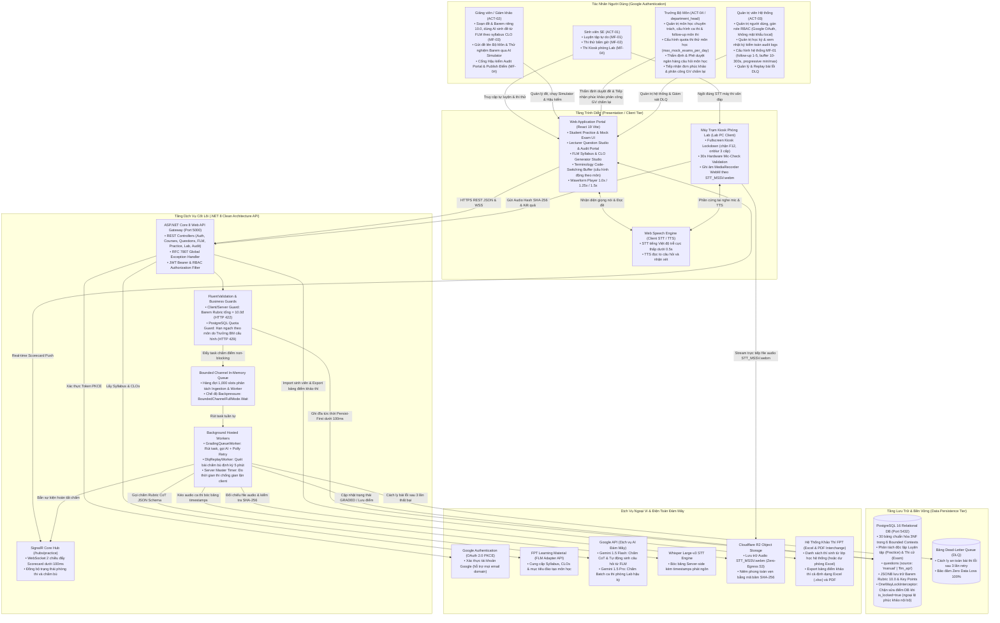

### <a id="phan-22"></a>2.2. Phân Tích Ranh Giới Kỹ Thuật & Nguyên Tắc Zero-Trust
1. **Nguyên tắc Xác thực Zero-Trust & Zero Guest Access:** Hệ thống không chấp nhận người dùng nặc danh. 100% người dùng bắt buộc xác thực qua Google OAuth 2.0 Authorization Code Flow kèm mã kiểm chứng PKCE. Hệ thống hỗ trợ tài khoản Google thuộc mọi email domain (không giới hạn cứng đuôi `@fpt.edu.vn`, không sử dụng mật khẩu local `password_hash`). Sinh viên tự đăng ký hoặc đăng nhập qua Google.
2. **Phân tách Rạch Ròi Ingestion & Processing:** Tầng Web API chỉ đóng vai trò tiếp nhận, kiểm tra dữ liệu đầu vào (Validation), ghi nhận đĩa tức thì (Persist-First < 100ms) và trả về `HTTP 202 Accepted`. Mọi tác vụ nặng (gọi LLM, bóc băng giọng nói) đều được đẩy sang tiến trình nền thông qua hàng đợi `BoundedChannel`, giải phóng hoàn toàn các luồng xử lý của Web Server.
3. **Phân Vùng Bền Vững Đa Cấp:** Dữ liệu có cấu trúc lưu trữ tại PostgreSQL 16 với ràng buộc toàn vẹn khóa ngoại 3NF; dữ liệu file âm thanh dung lượng lớn được phân luồng trực tiếp từ Client lên Cloudflare R2 qua Presigned URL, hoàn toàn không đi qua máy chủ Backend để tiết kiệm băng thông CPU/RAM.

---

## <a id="phan-3"></a>🧱 PHẦN 3: SƠ ĐỒ KIẾN TRÚC HỆ THỐNG TỔNG THỂ THEO CHIỀU DỌC (TOP-TO-BOTTOM FLOWCHART TD)

### <a id="phan-31"></a>3.1. Sơ Đồ Kiến Trúc Hệ Thống 5 Tầng Chiều Dọc (Mermaid)

Sơ đồ được thiết kế nghiêm ngặt theo chiều dọc (`flowchart TD`), thể hiện mạch lạc hành trình dữ liệu từ ngoài vào trong, loại bỏ hoàn toàn đan chéo rối dây:

```mermaid
flowchart TD
    %% =========================================================================
    %% TẦNG 1: TẦNG CLIENT & PHÒNG LAB (Presentation Tier - React 19 Vite - Port 3000)
    %% =========================================================================
    subgraph T1_Client ["1. TẦNG CLIENT & PHÒNG LAB (Presentation Tier - React 19 Vite - Port 3000)"]
        direction TB
        subgraph C_Actors ["Tác Nhân Người Dùng (Google Authentication)"]
            direction LR
            Actor_SV["Sinh viên SE (ACT-01)<br>• MF-01: Luyện tập tự do<br>• MF-02: Thi thử bấm giờ (Quota theo môn)<br>• MF-04: Thi vấn đáp phòng Lab"]
            Actor_GV["Giảng viên / Giám thị (ACT-02)<br>• MF-03: Soạn đề & dùng AI sinh câu hỏi FLM theo syllabus CLO<br>• MF-03: Gửi Bộ Môn thẩm định & Hiệu chuẩn AI Simulator<br>• MF-04: Hậu kiểm, sửa điểm có lý do & One-Way Lock"]
            Actor_DeptHead["Trưởng Bộ Môn (ACT-04 / department_head)<br>• MF-03: Thẩm định & Phê duyệt câu hỏi từ Giảng viên / FLM<br>• MF-04: Tiếp nhận phúc khảo AppealRequest & phân công GV chấm lại<br>• Quản trị môn học, cấu hình ca thi, follow-up & quota thi thử"]
            Actor_Admin["Quản trị viên (ACT-03)<br>• Quản trị người dùng (Google OAuth), phân quyền RBAC<br>• Quản trị học kỳ & nhật ký audit logs<br>• Cấu hình hệ thống MF-01 & Replay DLQ"]
        end

        subgraph C_Components ["Các Phân Hệ Giao Diện & Thiết Bị Client"]
            direction LR
            FE_Student["Web App Sinh Viên & Giảng Viên<br>• Web Speech STT (< 0.5s) & TTS đọc đề<br>• Màn hình đệm hiệu đính Code-Switching (cấu hình động transcript_buffer_seconds 10-300s)<br>• Instant Feedback Scorecard theo Rubric (MF-02)<br>• Question & Rubric Studio (CHECK Sum=10.0đ)<br>• Evidence Panel & Waveform Player thẩm định 1.0x, 1.25x, 1.5x"]
            FE_KioskLockdown["Máy Trạm Kiosk Phòng Lab (Lab PC Client)<br>• Định danh: STT máy = Số danh sách thi<br>• Fullscreen Lockdown: Chặn Alt+Tab, F12, onblur 3 cấp<br>• Hardware Mic-Check 30s kiểm tra tai nghe & mic<br>• Cấu hình ExamInputMode theo môn (VoiceOnly khóa phím)<br>• Thu âm WebM nén định danh: STT_MSSV.webm & Băm SHA-256<br>• Kiosk Khóa An Toàn & AI Chấm Ngầm (Background Worker)"]
        end
    end

    %% =========================================================================
    %% TẦNG 2: CỔNG KẾT NỐI, ĐỊNH TUYẾN & BẢO MẬT (Ingress, Gateway & Auth Tier)
    %% =========================================================================
    subgraph T2_Gateway ["2. CỔNG KẾT NỐI, ĐỊNH TUYẾN & BẢO MẬT (Ingress, Gateway & Auth Tier)"]
        direction TB
        Edge_Cloudflare["Cloudflare Edge Network (Global Anycast)<br>• DDoS Protection Layer 3 / 4 / 7 | WAF OWASP Top 10 | Quản lý DNS & SSL/TLS 1.3"]

        subgraph GW_Sub ["Định Tuyến, Xác Thực & Kết Nối Thời Gian Thực"]
            direction LR
            GW_Nginx["Nginx Reverse Proxy & Ingress<br>• Port 80: HTTP 301 Redirect sang HTTPS 443<br>• SSL Offloading & HSTS Security Headers<br>• Rate Limiting: 100 req/s/IP chống DoS & Spam<br>• Phân luồng: / -> :3000, /api/v1/* -> :5000"]
            GW_Auth["Cơ Chế Xác Thực Định Danh (Google IdP)<br>• Google Authentication OAuth 2.0 PKCE (Mở mọi email domain)<br>• Zero Guest Access (Chặn truy cập nặc danh)<br>• JWT Bearer Token kèm Claims phân quyền RBAC"]
            GW_SignalR["SignalR Core Real-Time Hubs (WSS)<br>• /hubs/practice: Đẩy Scorecard tức thời (< 100ms)<br>• /hubs/exam-proctor: Đồng bộ lệnh ca thi Lab<br>• WebSocket Upgrade tự động từ Port 5000"]
        end
    end

    %% =========================================================================
    %% TẦNG 3: LÕI BACKEND (.NET 8 CLEAN ARCHITECTURE) - Port 5000
    %% =========================================================================
    subgraph T3_Backend ["3. LÕI BACKEND (.NET 8 CLEAN ARCHITECTURE) - Port 5000"]
        direction TB
        subgraph BE_API ["API Tier: Controllers & Middleware"]
            direction LR
            API_Controllers["RESTful API Controllers (/api/v1/*)<br>• AuthController: Đổi mã Auth Code PKCE lấy JWT<br>• PracticeController: Nộp bài, trả ngay HTTP 202 Accepted<br>• MockExamController: PostgreSQL Quota Guard (HTTP 429)<br>• ExamLabController: Nộp STT_MSSV.webm & mã băm SHA-256<br>• ExamAuditController: Sửa điểm giải trình & One-Way Lock<br>• AdminController: Giám sát Dead-Letter Queue & Replay"]
            API_Middleware["Middleware Pipeline & Global Handlers<br>• RFC 7807 Global Exception Handler: ProblemDetails<br>• Server Master Timer: Đồng hồ ca thi, Grace Period 10s<br>• JwtBearerAuthMiddleware & RBAC Authorization Filter"]
        end

        subgraph BE_AppCQRS ["Application Tier: MediatR CQRS & Business Services"]
            direction LR
            APP_MediatR["MediatR CQRS Pipeline Behaviors<br>• ValidationBehavior: FluentValidation ∑ Barem == 10.0đ (HTTP 422)<br>• LoggingBehavior & PerformanceTrackingBehavior (> 500ms)<br>• Commands: SubmitAnswerCommand, StartMockExam, LockGrade<br>• Queries: GetScorecardQuery, GetBloomAnalytics, GetAuditSession"]
            APP_Services["Core Application Business Services<br>• PostgreSqlQuotaService: Đếm nguyên tử hạn ngạch ngày theo môn<br>• ExamGeneratorService: Bốc đề theo cấu trúc Bloom do Trưởng BM cấu hình<br>• AudioVerificationService: Kiểm tra WebM & SHA-256"]
        end

        subgraph BE_Resilience ["Cơ Chế Chịu Tải RAM & Background Workers (Zero Data Loss)"]
            direction LR
            RAM_Queue["System.Threading.Channels Bounded Channel<br>• Dung lượng hàng đợi: 1,000 slots trong RAM<br>• Cơ chế Backpressure: BoundedChannelFullMode.Wait<br>• Phân tách Ingestion & Worker chống tràn bộ nhớ"]
            Worker_Grading["GradingQueueWorker (IHostedService Background Worker)<br>• Rút task tuần tự, điều phối Whisper STT & Gemini AI<br>• Polly Retry Policy: Exponential Backoff 2s -> 4s -> 8s (Max 3)<br>• Cập nhật điểm & thông báo hoàn tất qua SignalR"]
            Worker_DLQ["DlqReplayWorker (Background Recovery Worker)<br>• Định kỳ 5 phút quét bảng dead_letter_queues<br>• Tự động kích hoạt chấm bù, cách ly bài hỏng nặng"]
        end
    end

    %% =========================================================================
    %% TẦNG 4: TẦNG DỮ LIỆU & LƯU TRỮ (Data Persistence & Cloud Storage Tier)
    %% =========================================================================
    subgraph T4_Persistence ["4. TẦNG DỮ LIỆU & LƯU TRỮ (Persistence & Storage Tier)"]
        direction TB
        subgraph DB_PostgreSQL ["PostgreSQL 16 Relational DB (Port 5432 Internal) - 30 Bảng Chuẩn 3NF"]
            direction TB
            DB_30Core["30 Bảng Thực Thể Chuẩn Hóa (6 Bounded Contexts + Hạ tầng & Thông báo):<br>• [Ctx 1] Identity & RBAC: users<br>• [Ctx 2] Academic & Cohorts: semesters, courses, classes, class_enrollments<br>• [Ctx 3] Rubric & Assessment: rubrics, rubric_criteria (CHECK = 10.00)<br>• [Ctx 4] Practice Module (MF-01): practice_questions, practice_sessions, practice_answers, ai_evaluations, ai_evaluation_details<br>• [Ctx 5] Mock Exam Module (MF-02): exam_structures, exam_sets, exam_set_questions, mock_exam_quotas, mock_exam_sessions, mock_exam_answers<br>• [Ctx 6] Official Lab Exam, Audit & Appeals (MF-04): exam_questions, official_exam_sessions, real_exam_session_shifts, student_exam_tickets, exam_question_submissions, lecturer_audits, lecturer_audit_details, appeal_requests<br>• [Resilience, Config & Notifications]: dead_letter_queues, audit_logs, system_configs, notifications"]
            DB_Interceptors["EF Core Enterprise Database Interceptors:<br>• OneWayLockInterceptor: Chặn UPDATE/DELETE khi is_locked=true (Ném HTTP 403 Forbidden bất biến; mở ngoại lệ cho Giảng viên chấm lại đơn phúc khảo)<br>• AuditTrailInterceptor: Bắt buộc override_reason khi sửa điểm, ghi vết toàn bộ vào audit_logs"]
        end

        subgraph Storage_R2 ["Cloudflare R2 Object Storage (S3-Compatible Zero-Egress)"]
            R2_AudioStore["Bucket: oralexam-lab-audio<br>• Lưu trữ audio thi thật: STT_MSSV.webm (ví dụ: 01_SE170123.webm)<br>• Niêm phong toàn vẹn pháp lý bằng mã băm cryptographic SHA-256<br>• Cấp quyền thẩm định Waveform Player qua Presigned URL thời hạn 15 phút<br>• Chính sách Zero-Egress Fees: Tiết kiệm 100% chi phí băng thông nghe lại audio"]
        end
    end

    %% =========================================================================
    %% TẦNG 5: CỤM AI & VOICE SERVICES (External AI & Machine Learning Cluster)
    %% =========================================================================
    subgraph T5_AI ["5. CỤM AI & VOICE SERVICES (External AI & Machine Learning Cluster)"]
        direction TB
        subgraph AI_Engines ["Các Mô Hình Trí Tuệ Nhân Tạo & Bóc Băng Chuyên Trách"]
            direction LR
            AI_Whisper["Cloudflare Whisper Large-v3 STT Engine<br>• GPU Node bóc băng bài thi phòng Lab MF-04<br>• Nhận diện chuẩn xác tiếng Việt & thuật ngữ tiếng Anh<br>• Xuất timestamps_json chi tiết từng câu nói"]
            AI_GeminiFlash["Google Gemini 1.5 Flash API (1.8s - 2.5s)<br>• Phục vụ Luyện tập MF-01, Thi thử MF-02 & Simulator MF-03<br>• Chain-of-Thought (CoT) 3 bước xuất Structured JSON<br>• Chấm chi tiết tiêu chí Barem C1..Ck & tổng điểm 10.0đ"]
            AI_GeminiPro["Google Gemini 1.5 Pro API (Suy Luận Sâu)<br>• Chấm Batch ca thi phòng Lab MF-04 (hậu kỳ 1-2h sau ca thi)<br>• Phân tích sâu Barem 10.0đ & gắn Timestamp Citations"]
        end

        AI_FollowUpRules["Bộ Quy Tắc Kích Hoạt Follow-Up Phân Tầng<br>• MF-01 Luyện tập: Admin cấu hình (1-5 câu, mặc định 2); Chỉ ở [Per-Question] khi 4.0 <= Score <= 8.0; [Full-Session] không follow-up<br>• MF-02 Thi thử: SV tự chọn Có/Không; Trưởng BM cấu hình (1-5 câu, mặc định 2); AI hỏi theo nội dung ([Needs Follow-up])<br>• MF-04 Thi thật: Trưởng BM cấu hình môn trong kỳ thi (1-5 câu, mặc định 2); AI hỏi theo nội dung"]
    end

    %% =========================================================================
    %% LUỒNG KẾT NỐI XUYÊN TẦNG THEO CHIỀU DỌC THỐNG NHẤT (TOP-TO-BOTTOM)
    %% =========================================================================
    Actor_SV -->|Truy cập tự luyện & thi thử| FE_Student
    Actor_SV -->|Ngồi đúng STT máy thi Lab| FE_KioskLockdown
    Actor_GV -->|Soạn đề, chạy Simulator & Hậu kiểm| FE_Student
    Actor_DeptHead -->|Duyệt đề, cấu hình ca thi & Tiếp nhận phúc khảo| FE_Student
    Actor_Admin -->|Giám sát hệ thống & DLQ| FE_Student

    FE_Student -->|HTTPS REST & WSS Traffic| Edge_Cloudflare
    FE_KioskLockdown -->|HTTPS Kiosk Mode Traffic| Edge_Cloudflare
    FE_KioskLockdown -.->|Upload trực tiếp STT_MSSV.webm qua Presigned URL| Storage_R2

    Edge_Cloudflare -->|Proxy mã hóa TLS 1.3| GW_Nginx
    GW_Nginx -->|Xác thực OAuth 2.0 PKCE| GW_Auth
    GW_Nginx -->|Nâng cấp kết nối WSS| GW_SignalR
    GW_Nginx -->|Định tuyến REST API /api/v1/*| API_Controllers

    API_Controllers --> API_Middleware
    API_Middleware --> APP_MediatR
    APP_MediatR --> APP_Services

    %% Ghi đĩa Persist-First & Hàng đợi RAM
    APP_MediatR -->|1. Persist-First: Ghi bản ghi PENDING < 100ms| DB_PostgreSQL
    APP_MediatR -->|2. Đẩy task chấm điểm non-blocking| RAM_Queue
    RAM_Queue -->|3. Rút task tuần tự an toàn| Worker_Grading
    Worker_DLQ -.->|Quét bản ghi lỗi định kỳ 5 phút| DB_PostgreSQL
    Worker_DLQ -.->|Tự động đẩy lại task cần chấm bù| RAM_Queue

    %% Kết nối từ Worker tới Dữ liệu & AI
    Worker_Grading -->|Lấy file audio & kiểm tra SHA-256 seal| Storage_R2
    Worker_Grading -->|Gửi audio bóc băng kèm timestamps| AI_Whisper
    Worker_Grading -->|Chấm Barem 10.0đ CoT cho MF-01, MF-02, MF-03| AI_GeminiFlash
    Worker_Grading -->|Chấm Batch hậu kỳ phòng Lab MF-04| AI_GeminiPro
    AI_GeminiFlash --- AI_FollowUpRules
    AI_GeminiPro --- AI_FollowUpRules

    %% Lưu kết quả & Xử lý DLQ
    Worker_Grading -->|Cập nhật trạng thái GRADED & Điểm số| DB_PostgreSQL
    Worker_Grading -->|Cách ly bài lỗi quá 3 lần vào dead_letter_queues| DB_PostgreSQL
```

### <a id="phan-32"></a>3.2. Phân Tích Kỹ Thuật Chuyên Sâu 5 Tầng Hệ Thống

#### 3.2.1. Tầng 1: Tầng Client & Phòng Lab (Presentation & Lab Kiosk Tier)
Tầng trình diễn được xây dựng trên nền tảng **React 19 (Vite)** kết hợp **Tailwind CSS v4** và **shadcn/ui**, hoạt động tại cổng nội bộ `3000`. Tầng này đảm nhận 3 vai trò tác chiến riêng biệt:
1. **Phân hệ Sinh viên (Student Experience):**
   - **Xử lý âm thanh độ trễ thấp (< 0.5s):** Sử dụng Web Speech API native trên trình duyệt để nhận diện giọng nói tiếng Việt và đọc câu hỏi (TTS), giảm thiểu tối đa chi phí hạ tầng máy chủ khi luyện tập. Luyện tập không lưu audio (chỉ lưu transcript đã sửa).
   - **Màn hình đệm hiệu đính Code-Switching (Cấu hình động bởi Admin: `transcript_buffer_seconds`, 10-300s, mặc định 60s):** Sinh viên ngành SE thường xuyên phát âm đan xen thuật ngữ kỹ thuật tiếng Anh (ví dụ: *Interface, Polymorphism, Dependency Injection, Asynchronous*). Sau khi phát biểu, văn bản nháp hiển thị trong khoảng thời gian đệm đếm ngược (mặc định 60 giây do Admin cấu hình) để sinh viên chủ động sửa lỗi chính tả trước khi gửi chấm chính thức.
   - **Instant Feedback Scorecard chi tiết theo Rubric (MF-02):** Sau khi hoàn thành bài thi thử, sinh viên được nhận Scorecard chi tiết từng câu: phân tích Điểm mạnh (Strengths), Thiếu sót kiến thức (Weaknesses), Gợi ý cải thiện hành động (Suggestions) và lưu vào Lịch sử thi. Nguồn đề rút ngẫu nhiên từ kho câu hỏi luyện tập chung (`practice_questions`). Thi thử không lưu audio (chỉ lưu transcript).
2. **Phân hệ Trưởng Bộ Môn & Giảng viên (FLM Question Studio, Barem, Audit & Appeals):**
   - **FLM Syllabus & Question Studio (MF-03):** Không gian tác chiến dành cho Giảng viên (`lecturer`) và Trưởng Bộ Môn (`department_head`) để kết nối API FLM FPT, duyệt cây đề cương CLOs & danh mục bài học Topics phân trang, cấu hình mục tiêu Bloom 1-6 & độ khó, xem trước (Draft Preview Modal side-by-side) câu hỏi vấn đáp kèm Model Answer $\ge 50$ ký tự & Barem Rubric $\sum = 10.0$đ. AI sinh câu hỏi, rubric và sample answer từ CLO có sẵn trên syllabus của môn học (từ FLM), giảng viên không phải chọn lẻ từng CLO mà bấm sinh là dùng CLO của syllabus; muốn thu hẹp thì chọn Topic trước rồi chọn CLO. Giảng viên tùy chỉnh tiêu chí và Model Answer $\ge 50$ chars, tick chọn kho (`practice_questions` và/hoặc `exam_questions`) rồi gửi Bộ Môn thẩm định (`SUBMITTED_FOR_REVIEW`); Trưởng Bộ Môn là chốt chặn phê duyệt chính thức (`APPROVED`), yêu cầu sửa (`NEEDS_REVISION`) hoặc từ chối (`REJECTED`), hoặc trực tiếp sinh đề và phê duyệt lưu hàng loạt (Batch Approve).
   - **Question & Rubric Studio (MF-03):** Thiết kế cấu trúc câu hỏi thủ công và phân rã Barem Rubric thành danh sách tiêu chí $C_1, C_2, \dots, C_k$.
   - **Real-time Client Guard:** Bắt buộc tổng trọng số Barem $\sum \text{Tiêu chí} \equiv 10.0\text{đ}$. Nếu sai lệch dù chỉ 0.1đ, giao diện lập tức đổi màu cảnh báo đỏ và vô hiệu hóa (disabled) nút Lưu.
   - **AI Simulator Modal:** Cho phép cán bộ chuyên môn nhập câu trả lời giả định để kiểm tra độ nhạy và tính nghiêm ngặt của barem trước khi phát hành đề.
   - **Lecturer Audit Portal & Evidence Panel (MF-04):** Màn hình hậu kiểm song song, cung cấp **Evidence Panel** (AudioURL Cloudflare R2, Transcript Whisper gốc, và chuỗi suy luận AI Chain-of-Thought), hiển thị file ghi âm trên **Waveform Player** hỗ trợ tua tốc độ (1.0x, 1.25x, 1.5x) và nhấp chuột trực tiếp vào mốc thời gian (timestamp) để nghe đúng đoạn phát ngôn nghi vấn.
   - **Phân hệ Thẩm định Phúc khảo Nội bộ (Department Head Appeals - MF-04):** Màn hình dành riêng cho Trưởng Bộ Môn tiếp nhận danh sách `AppealRequest` từ sinh viên và phân công một Giảng viên vào chấm lại (`PUT /api/v1/appeals/{id}/assign-lecturer`). Giảng viên được phân công rà soát Evidence Panel và file ghi âm trên Waveform Player để chấm lại và nộp kết quả kèm giải trình; Trưởng Bộ Môn xem xét phê duyệt (`APPROVED`) cập nhật điểm chính thức hoặc bác bỏ (`REJECTED`) giữ nguyên điểm.
3. **Máy trạm Kiosk Phòng Lab (Lab PC Lockdown - MF-04):**
   - **Định danh bất biến:** `STT Máy Trạm = Số Thứ Tự Danh Sách Thi`. Sinh viên ngồi vào máy số nào sẽ tự động nạp hồ sơ thi của STT đó, triệt tiêu rủi ro nhầm lẫn phòng thi.
   - **Fullscreen Lockdown 3 cấp độ:** Kích hoạt chế độ toàn màn hình bắt buộc, chặn đứng các phím tắt hệ thống: `Alt + Tab`, `F12` (DevTools), `Ctrl + C / Ctrl + V`, chuột phải (`contextmenu`). Bắt sự kiện `window.onblur` để cảnh báo và khóa bài thi nếu cố tình chuyển cửa sổ quá 3 lần.
   - **Hardware Mic-Check 30s:** Trước khi bắt đầu thi, phần mềm bắt buộc sinh viên thử giọng trong 30 giây để đo âm lượng (Decibel Level), bảo đảm micro tai nghe hoạt động hoàn hảo.
   - **Niêm phong Audio:** Toàn bộ phát biểu được thu âm qua `MediaRecorder` chuẩn định dạng nén `WebM/Opus`, định danh độc bản `STT_MSSV.webm`.
   - **Kiosk Khóa An Toàn & AI Chấm Ngầm (Background AI Grading):** Ngay sau khi kết thúc ca thi hoặc thí sinh bấm nộp bài, máy trạm Kiosk khóa toàn màn hình bảo vệ và thông báo chính thức: *"Bài thi đã được ghi nhận và lưu trữ an toàn. Kết quả chấm sẽ được Giảng viên thẩm định và công bố trên hệ thống."* Kiosk tuyệt đối không hiển thị điểm, không cung cấp cơ chế xác nhận hay khiếu nại tại phòng thi nhằm bảo đảm an ninh trật tự khảo thí. Gemini 1.5 Pro thực hiện chấm ngầm toàn bộ bài thi theo Rubric 10.0 (đầu vào chỉ là bản transcript) trong Background Worker và cập nhật trạng thái `AI_GRADED`.
   - **Xử lý Biên & Phòng Vệ Kiosk (Lockdown & Reconnect):**
     - *Duy trì Màn hình Khóa:* Máy Kiosk giữ nguyên màn hình khóa an toàn (`isKioskLocked = true`) cho đến khi Giám thị phát lệnh đóng ca thi hoặc reset máy trạm cho ca thi kế tiếp; thí sinh ký danh sách nộp bài giấy và rời phòng thi.
     - *Khôi phục Kết nối Mạng:* Trường hợp máy Kiosk mất kết nối mạng trong quá trình nộp bài, vé thi đã được lưu an toàn ở trạng thái `SUBMITTED` tại CSDL kèm mã băm SHA-256; khi có mạng lại, Kiosk gọi `GET /api/v1/official-exams/tickets/{id}` để khôi phục trạng thái khóa an toàn tức thì.
      - *Thi Xong Không Có Điểm Liền, Công Bố Điểm Tập Trung & Phúc Khảo Nội Bộ:* Sinh viên thi xong tại Kiosk tuyệt đối **không có điểm liền**, máy trạm khóa màn hình an toàn và sinh viên ra về. Sinh viên phải đợi Giảng viên chấm hết toàn bộ các bài thi bị AI gắn cờ nghi ngờ (`is_suspicious == true` / `confidence_score < 0.70`) hoặc fail/điểm liệt trên Cổng Hậu kiểm thông qua Evidence Panel (AudioURL Cloudflare R2, Waveform Player, Whisper transcript gốc, và chuỗi suy luận AI CoT). Sau khi Giảng viên xử lý có điểm đầy đủ cho **100% sinh viên trong ca thi**, Giảng viên mới bấm **"Công Bố Điểm"** (`POST /api/v1/official-exams/shifts/{shiftId}/publish-grades`, kích hoạt One-Way Lock `is_locked = true`, HTTP 403) để gửi điểm chính thức về cho sinh viên. Xuất báo cáo điểm thi FPT cả 2 định dạng Excel (.xlsx) và PDF. Sinh viên ở nhà đăng nhập Student Portal để nhận điểm; nếu có nguyện vọng phúc khảo, sinh viên làm đơn trực tiếp tại phân hệ Phúc khảo trong hệ thống (`POST /api/v1/appeals`), hệ thống tạo `AppealRequest` gửi Trưởng Bộ Môn tiếp nhận và phân công Giảng viên vào chấm lại (`PUT /api/v1/appeals/{id}/assign-lecturer`).

#### 3.2.2. Tầng 2: Cổng Kết Nối, Định Tuyến & Bảo Mật (Ingress Gateway & Auth Tier)
1. **Cloudflare Edge Network:** Hoạt động tại lớp ngoài cùng qua mạng lưới Anycast toàn cầu, cung cấp khả năng chống tấn công từ chối dịch vụ (DDoS Protection) ở cả Layer 3/4 và Layer 7. Tích hợp bộ quy tắc Web Application Firewall (WAF) ngăn chặn các lỗ hổng OWASP Top 10 và quản lý SSL/TLS 1.3 tự động.
2. **Nginx Reverse Proxy & Ingress Router:**
   - **Port 80:** Tự động chuyển hướng toàn bộ sang HTTPS qua mã trạng thái `HTTP 301 Permanent Redirect`.
   - **Port 443:** Thực hiện giải mã SSL (SSL Offloading) và gán các tiêu đề an ninh nghiêm ngặt (`HSTS`, `X-Frame-Options: SAMEORIGIN`, `X-Content-Type-Options: nosniff`).
   - **Rate Limiting:** Cấu hình trần 100 requests/giây/IP để chống brute-force và spam API.
   - **Bảng phân tuyến Upstream:**
     - `/` và static assets $\rightarrow$ Chuyển tiếp tới Container Frontend (Port `3000`).
     - `/api/v1/*` $\rightarrow$ Chuyển tiếp tới Container Backend .NET 8 (Port `5000`).
     - `/hubs/*` $\rightarrow$ Nâng cấp giao thức (Protocol Upgrade) sang WebSocket WSS phục vụ SignalR (Port `5000`).
3. **Cơ Chế Xác Thực & Phân Quyền Định Danh Duy Nhất (Identity & RBAC):**
   - **Zero Guest Access:** Hệ thống không cho phép người dùng nặc danh.
   - **Google Authentication (OAuth 2.0 PKCE):** Xác thực tài khoản Google (hỗ trợ mọi email domain, sinh viên tự đăng nhập hoặc tự đăng ký qua Google, không sử dụng mật khẩu local).
   - **JWT Bearer Token:** Máy chủ cấp JWT Token có thời hạn kèm Claims phân quyền nghiêm ngặt theo 5 vai trò chuẩn: `student`, `lecturer`, `department_head`, `proctor`, `admin`.
4. **SignalR Core Hubs (Real-Time Communication):**
   - Hub `/hubs/practice`: Đẩy bảng điểm Scorecard về trình duyệt ngay khi Worker hoàn tất chấm điểm với độ trễ dưới 100ms.
   - Hub `/hubs/exam-proctor`: Phục vụ giám thị điều khiển ca thi phòng lab, đồng bộ lệnh bắt đầu/kết thúc làm bài và theo dõi trạng thái trực tuyến của 40 máy trạm.

#### 3.2.3. Tầng 3: Lõi Backend .NET 8 Clean Architecture (Application & Core Processing)
Vận hành tại cổng nội bộ `5000`, triển khai theo kiến trúc 4 tầng chuẩn mực:
1. **Phân định trách nhiệm CQRS qua MediatR:**
   - Mọi thao tác thay đổi trạng thái (Nộp bài, Khóa điểm, Tạo đề) đều đi qua **Commands** có kiểm tra giao dịch ACID.
   - Mọi thao tác truy vấn (Xem lịch sử, Tra cứu Scorecard, Thẩm định) đi qua **Queries** tối ưu `.AsNoTracking()`.
2. **MediatR Pipeline Behaviors:**
   - `ValidationBehavior`: Tích hợp `FluentValidation`, tự động chặn đứng các command vi phạm quy tắc nghiệp vụ (ví dụ: Barem Rubric khác 10.0đ trả về mã lỗi `HTTP 422 Unprocessable Entity`).
   - `Logging & PerformanceBehavior`: Ghi log có cấu trúc và phát cảnh báo với mọi truy vấn xử lý vượt quá ngưỡng 500ms.
3. **Cơ chế Hàng đợi Chịu tải RAM (In-Memory Bounded Channel):**
   - Khởi tạo qua thư viện chuẩn `System.Threading.Channels` với dung lượng **1,000 slots**.
   - Cấu hình chế độ đẩy `BoundedChannelFullMode.Wait` tạo cơ chế áp lực ngược (Backpressure), đảm bảo máy chủ không bị tràn bộ nhớ khi toàn bộ phòng lab cùng nộp bài một lúc.
4. **Hệ thống Tiến trình Chạy nền (Background Hosted Services):**
   - `GradingQueueWorker`: Đọc tuần tự các task chấm điểm từ Channel, gọi bóc băng Whisper và chấm điểm Gemini kèm chiến lược thử lại tự động Polly.
   - `DlqReplayWorker`: Chạy nền định kỳ mỗi 5 phút, quét các bản ghi gặp sự cố quá tải mạng để thực hiện chấm bù tự động.

#### 3.2.4. Tầng 4: Tầng Dữ Liệu & Lưu Trữ Bền Vững (Data Persistence & Cloud Storage)
1. **Hệ Quản Trị Cơ Sở Dữ Liệu PostgreSQL 16 (Port 5432 Internal):**
   - Chuẩn hóa Bậc 3 (**3NF**), cấu trúc thành **30 bảng thực thể chuẩn hóa cốt lõi** phân bổ trong 6 Bounded Contexts (tương ứng các thực thể độc lập trong `ApplicationDbContext` của EF Core 8):
      - **Phân hệ 1 (Identity & RBAC - 1 bảng):** `users` (Định danh UUID duy nhất, email tài khoản Google không giới hạn domain, xác thực Google OAuth 2.0 PKCE không dùng password local, 5 vai trò: `admin`, `department_head`, `lecturer`, `proctor`, `student`).
     - **Phân hệ 2 (Academic & Cohorts - 4 bảng):** `semesters`, `courses`, `classes`, `class_enrollments` (Quản trị học kỳ FA26, môn học PRN231 có cờ `has_follow_up`, lớp học SE1801-NET và sinh viên ghi danh).
     - **Phân hệ 3 (Rubric & Assessment - MF-03 - 2 bảng):** `rubrics`, `rubric_criteria` (Barem đánh giá bắt buộc `CHECK (total_max_score = 10.00)` và các tiêu chí gắn với 6 bậc Bloom).
     - **Phân hệ 4 (Practice Module - MF-01 - 5 bảng):** `practice_questions`, `practice_sessions`, `practice_answers`, `ai_evaluations`, `ai_evaluation_details` (Kho câu hỏi tự luyện mở, phiên làm bài, câu trả lời, liên kết câu hỏi phụ `parent_answer_id`, và bảng điểm chi tiết AI).
      - **Phân hệ 5 (Mock Exam Module - MF-02 - 6 bảng):** `exam_structures`, `exam_sets`, `exam_set_questions`, `mock_exam_quotas`, `mock_exam_sessions`, `mock_exam_answers` (Ma trận cấu trúc Bloom do Trưởng BM cấu hình, bộ đề bốc ngẫu nhiên, hạn ngạch ngày theo môn `max_mock_exams_per_day` do Trưởng BM cấu hình, và đo lường thời gian thi Master Timer).
      - **Phân hệ 6 (Official Lab Exam, Audit & Appeals - MF-04 - 8 bảng):** `exam_questions`, `official_exam_sessions`, `real_exam_session_shifts`, `student_exam_tickets`, `exam_question_submissions`, `lecturer_audits`, `lecturer_audit_details`, `appeal_requests` (Kho câu hỏi thi bảo mật cần `approved_by`, ca thi phòng Lab ghi trực tiếp phòng thi trên ca, 40 vé máy trạm Kiosk, nộp bài âm thanh R2 + SHA-256, và cổng thẩm định sửa điểm bắt buộc giải trình `override_reason`, kèm đơn phúc khảo nội bộ `appeal_requests` do Trưởng Bộ Môn tiếp nhận và phân công Giảng viên chấm lại).
     - **Phân hệ Chịu Lỗi, Cấu Hình & Thông Báo (4 bảng):** `dead_letter_queues` (Cứu hộ Zero Data Loss sau 3 lần retry), `audit_logs` (Nhật ký không thể chối bỏ lưu vết mọi thao tác can thiệp dữ liệu), `system_configs` (Cấu hình động hệ thống: Min/Max Practice Questions, TranscriptBufferSeconds), `notifications` (Hộp thư thông báo trong hệ thống).
     - **Tổng cộng 30 bảng chuẩn hóa 3NF:** $1 + 4 + 2 + 5 + 6 + 8 + 4 = \mathbf{30\text{ bảng thực thể nghiệp vụ}}$.
    - **OneWayLockInterceptor (Bảo vệ pháp lý điểm thi):** Can thiệp vào pipeline `SaveChanges` của EF Core. Khi bản ghi có cờ `is_locked = true`, interceptor sẽ hủy bỏ ngay lập tức và ném ngoại lệ `ScoreSheetLockedException`, tương ứng với mã lỗi **`HTTP 403 Forbidden`**. Không một ai (kể cả Giảng viên hay Admin) có thể cập nhật hoặc xóa dữ liệu điểm số sau khi đã khóa sổ. Ngoại lệ hợp lệ duy nhất: Khi có đơn Phúc khảo nội bộ (`AppealRequest`) được Trưởng Bộ Môn giao cho Giảng viên chấm lại, Giảng viên được phân công mới có quyền cập nhật điểm phúc khảo kèm lý do giải trình.
   - **AuditTrailInterceptor:** Tự động ghi lại toàn bộ lịch sử can thiệp điểm thi của Giảng viên (Điểm AI cũ, Điểm mới thay đổi, Lý do giải trình bắt buộc `override_reason`, Thời điểm thực hiện) vào bảng `audit_logs`.
2. **Lưu Trữ Đối Tượng Đám Mây Cloudflare R2 (S3-Compatible Zero-Egress):**
   - Bucket: `oralexam-lab-audio`.
   - Chính sách **Zero-Egress Fees**: Không tính phí tải dữ liệu ra ngoài, giúp nhà trường tiết kiệm 100% chi phí băng thông khi Giảng viên nghe lại audio bài thi để chấm hậu kiểm.
   - **Quy tắc đặt tên file bất biến:** `STT_MSSV.webm` (Ví dụ: `01_SE170123.webm`).
   - **Niêm phong toàn vẹn bằng mã băm SHA-256:** Client tạo mã băm ngay khi thu âm xong; Backend kiểm tra đối chiếu mã băm này trước khi ghi nhận tính hợp lệ của bài nộp.
   - **Presigned URL:** Client đẩy trực tiếp file lên Cloudflare R2 qua Presigned URL thời hạn 15 phút, giải phóng hoàn toàn băng thông cho máy chủ Backend.

#### 3.2.5. Tầng 5: Cụm AI & Voice Services (External AI & Voice Cluster)
1. **Cloudflare Whisper STT Engine (Whisper Large-v3 GPU Node):** Chuyên trách bóc băng các bài thi nói phòng Lab (MF-04). Mô hình xử lý xuất sắc khả năng nhận diện tiếng Việt và thuật ngữ chuyên ngành phần mềm tiếng Anh. Trả về cấu trúc `timestamps_json` chi tiết đến từng mili-giây cho từng đoạn phát ngôn, làm bằng chứng đối chiếu cho Giảng viên trên Waveform Player.
2. **Google Gemini 1.5 Flash API (Tốc độ cao 1.8s - 2.5s):** Sử dụng cho: Luyện tập tự do (MF-01), Thi thử bấm giờ (MF-02), AI Simulator hiệu chuẩn Barem (MF-03). Áp dụng kỹ thuật **Chain-of-Thought (CoT) Prompting 3 bước**:
   - *Bước 1:* Phân tích ngữ nghĩa câu trả lời của sinh viên, trích xuất các luận điểm chính.
   - *Bước 2:* So sánh từng luận điểm với các tiêu chí trong Barem Rubric 10.0đ.
   - *Bước 3:* Xuất bảng điểm định dạng **Structured JSON** gồm: Điểm từng tiêu chí, Điểm tổng, Phân tích điểm mạnh, Điểm cần khắc phục và Gợi ý đáp án chuẩn.
3. **Google Gemini 1.5 Pro API (Suy luận phân tích sâu):** Sử dụng cho: Chấm điểm hàng loạt (Batch Grading) các ca thi phòng Lab (MF-04) chạy ngầm hậu kỳ 1 - 2 giờ sau ca thi. Kết hợp văn bản transcript của Whisper kèm mốc thời gian để đưa ra các trích dẫn bằng chứng (Timestamp Citations) trong nhận xét đánh giá.
4. **Bộ Quy Tắc Kích Hoạt Follow-Up Phân Tầng (Hierarchical Follow-up Rules):**
   - **Đối với Luồng 1 (Luyện tập tự do - MF-01):**
     $$\text{Kích hoạt} \iff (\text{Mode} == \mathbf{[Per\text{-}Question]}) \;\mathbf{AND}\; (4.0 \le \text{AI\_Score} \le 8.0)$$
     *Ý nghĩa:* Giảng viên KHÔNG cấu hình follow-up trong MF-01. Admin cấu hình số câu follow-up (1–5 câu, mặc định 2 câu). Nếu sinh viên chọn [Per-Question]: kích hoạt câu hỏi follow-up đào sâu khi điểm ranh giới $4.0 \le \text{Score} \le 8.0$; bỏ qua khi $<4.0$ (cung cấp đáp án mẫu) hoặc $>8.0$ (đã xuất sắc). Nếu chọn [Full-Session]: KHÔNG có câu hỏi follow-up. Luyện tập không lưu audio (chỉ lưu transcript đã sửa).
   - **Đối với Luồng 2 (Thi thử - MF-02):**
     $$\text{Kích hoạt} \iff (\text{Student\_Choice} == \mathbf{true}) \;\mathbf{AND}\; (\text{Phát hiện luận điểm cần phản biện trong Text})$$
     *Ý nghĩa:* Sinh viên chủ động tự chọn Có/Không Follow-up trước khi thi thử. Nếu chọn có, AI hỏi chuyên sâu ngữ cảnh (`[Needs Follow-up]`) theo nội dung thực tế, hoàn toàn **KHÔNG phụ thuộc vào mốc điểm số**. Trưởng Bộ Môn cấu hình số câu follow-up (1–5 câu, mặc định 2 câu) và thời lượng ca thi có follow-up. Thi thử không lưu audio (chỉ lưu transcript).
   - **Đối với Luồng 4 (Thi thật phòng Lab - MF-04):**
     $$\text{Kích hoạt} \iff (\text{ExamCourse.has\_follow\_up} == \mathbf{true}) \;\mathbf{AND}\; (\text{Phát hiện luận điểm cần phản biện trong Text})$$
     *Ý nghĩa:* Trưởng Bộ Môn cấu hình tính năng hỏi chuyên sâu (`has_follow_up`) và số câu follow-up (1–5 câu, mặc định 2 câu) theo môn thi trong kỳ thi. AI hỏi chuyên sâu theo nội dung thực tế (`[Needs Follow-up]`), KHÔNG phụ thuộc vào điểm số. Thi thật bắt buộc lưu audio Cloudflare R2 (`STT_MSSV.webm` + SHA-256) phục vụ hậu kiểm.

---

## <a id="phan-4"></a>🏛️ PHẦN 4: KIẾN TRÚC PHÂN TẦNG CLEAN ARCHITECTURE 4 TẦNG & REACT 19 FRONTEND

### <a id="phan-41"></a>4.1. Sơ Đồ Phân Tầng Clean Architecture (.NET 8 + React 19)

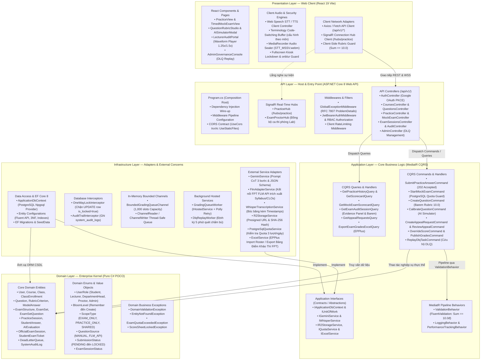

### <a id="phan-42"></a>4.2. Ranh Giới 4 Tầng & Nguyên Lý Đảo Ngược Phụ Thuộc (DIP)
- **Domain Layer (Hạt nhân bất biến):** Chứa 100% C# POCO thuần túy, tuyệt đối không phụ thuộc bất kỳ framework hay ORM nào. Nắm giữ quy tắc nghiệp vụ cốt lõi: các trạng thái bài thi (`SubmissionStatus`), phân loại Bloom, và ngoại lệ nghiệp vụ (`ScoreSheetLockedException`).
- **Application Layer (Điều phối nghiệp vụ):** Độc lập với cơ sở dữ liệu và công nghệ bên ngoài. Triển khai mẫu thiết kế CQRS qua MediatR; mọi thao tác ghi dữ liệu đều đóng gói trong Command, thao tác đọc trong Query. Toàn bộ nghiệp vụ kiểm tra tính hợp lệ của Barem Rubric 10.0đ được kiểm soát tập trung qua `FluentValidation` và `ValidationBehavior`.
- **Infrastructure Layer (Triển khai kỹ thuật):** Chịu trách nhiệm thực thi các Interfaces định nghĩa tại Application: kết nối PostgreSQL 16 qua EF Core 8, điều phối hàng đợi bộ nhớ `System.Threading.Channels`, giao tiếp Google Gemini API, bóc băng Whisper STT, lưu trữ Cloudflare R2, và chốt chặn khóa điểm bất biến bằng `OneWayLockInterceptor`.
- **API Layer (Cổng tiếp nhận & Host):** Chịu trách nhiệm khởi tạo Composition Root (`Program.cs`), tiếp nhận HTTP Request, đóng gói mã lỗi thống nhất theo chuẩn RFC 7807 (`ProblemDetails`), và duy trì kết nối thời gian thực SignalR Hub.

---

## <a id="phan-5"></a>🌐 PHẦN 5: SƠ ĐỒ HẠ TẦNG MẠNG & TRIỂN KHAI DOCKER/NGINX TOPOLOGY

### <a id="phan-51"></a>5.1. Sơ Đồ Mạng & Containerization Topology (Mermaid)

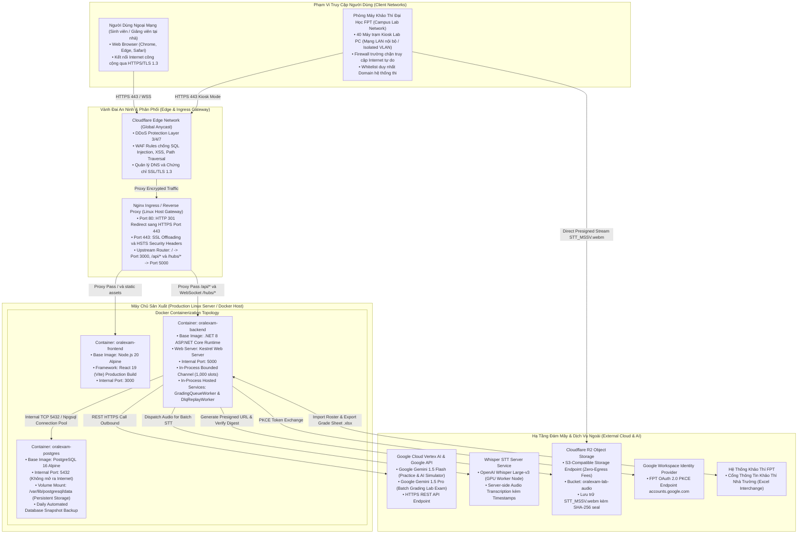

### <a id="phan-52"></a>5.2. Bảng Phân Bổ Cổng Mạng, Vùng Cách Ly & Chính Sách Tường Lửa

| Vùng mạng (Zone) | Thành phần hệ thống | Cổng tiếp nhận (Port) | Giao thức | Chính sách truy cập & Ranh giới bảo mật |
|:---|:---|:---:|:---:|:---|
| **Public Edge** | Cloudflare Edge Network | `80`, `443` | HTTP, HTTPS / TLS 1.3 | Tiếp nhận toàn bộ lưu lượng công cộng, lọc DDoS Layer 3/4/7, tự động cấp chứng chỉ SSL. |
| **Ingress Gateway** | Nginx Reverse Proxy | `80`, `443` | HTTPS / WSS | Chuyển hướng 80 $\rightarrow$ 443, Rate Limiting 100 req/s, SSL Offloading, chặn IP nghi vấn. |
| **Presentation Tier** | `oralexam-frontend` (React 19) | `3000` (Nội bộ) | HTTP | Chỉ lắng nghe các gói tin từ Nginx trong mạng Docker bridge `oralexam-net`. |
| **Application Tier** | `oralexam-backend` (.NET 8) | `5000` (Nội bộ) | HTTP / WSS | Nhận API call từ Nginx và kết nối thời gian thực WebSocket SignalR `/hubs/*`. |
| **Database Tier** | `oralexam-postgres` (PostgreSQL 16) | `5432` (Nội bộ) | TCP / PostgreSQL | **CẤM TUYỆT ĐỐI mở ra Internet**. Chỉ Backend được kết nối qua thông tin xác thực mã hóa. |
| **Object Storage** | Cloudflare R2 | `443` | S3 API HTTPS | Zero-Egress, phân quyền upload/download qua Presigned URL thời hạn 15 phút. |
| **External AI** | Gemini 1.5 Flash/Pro & Whisper | `443` | HTTPS REST | Gọi ra ngoài (Outbound Call) từ Backend Hosted Workers qua API Key bảo mật. |

### <a id="phan-53"></a>5.3. Cấu Hình Reverse Proxy & Docker Compose Chuẩn Mực

#### Cấu hình Nginx Upstream & SignalR WebSocket Upgrade (`nginx.conf`):
```nginx
upstream frontend_upstream {
    server oralexam-frontend:3000;
}

upstream backend_upstream {
    server oralexam-backend:5000;
}

server {
    listen 80;
    server_name oralexam.fpt.edu.vn;
    return 301 https://$host$request_uri;
}

server {
    listen 443 ssl http2;
    server_name oralexam.fpt.edu.vn;

    ssl_certificate /etc/nginx/certs/fullchain.pem;
    ssl_certificate_key /etc/nginx/certs/privkey.pem;
    ssl_protocols TLSv1.2 TLSv1.3;

    # Security Headers
    add_header X-Frame-Options "SAMEORIGIN" always;
    add_header X-Content-Type-Options "nosniff" always;
    add_header Strict-Transport-Security "max-age=31536000; includeSubDomains" always;

    # Rate Limiting
    limit_req zone=api_limit burst=20 nodelay;

    # Frontend Route
    location / {
        proxy_pass http://frontend_upstream;
        proxy_set_header Host $host;
        proxy_set_header X-Real-IP $remote_addr;
    }

    # Backend API Route
    location /api/v1/ {
        proxy_pass http://backend_upstream;
        proxy_set_header Host $host;
        proxy_set_header X-Real-IP $remote_addr;
        proxy_set_header X-Forwarded-For $proxy_add_x_forwarded_for;
        proxy_set_header X-Forwarded-Proto $scheme;
    }

    # SignalR WebSocket Route
    location /hubs/ {
        proxy_pass http://backend_upstream;
        proxy_http_version 1.1;
        proxy_set_header Upgrade $http_upgrade;
        proxy_set_header Connection "upgrade";
        proxy_set_header Host $host;
        proxy_cache_bypass $http_upgrade;
        proxy_read_timeout 300s;
    }
}
```

---

## <a id="phan-6"></a>🔄 PHẦN 6: LUỒNG DỮ LIỆU TƯƠNG TÁC CỦA 4 CORE MAIN FLOWS & BỘ QUY TẮC FOLLOW-UP KÉP

### <a id="phan-61"></a>6.1. Sơ Đồ Tổng Quan Luồng Dữ Liệu 4 Main Flows (Mermaid)

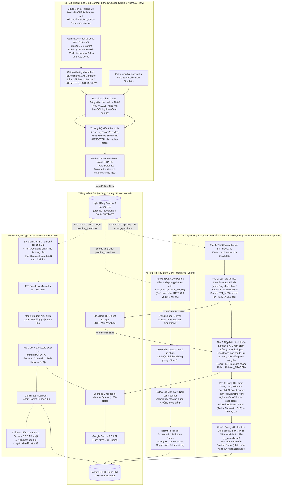

### <a id="phan-62"></a>6.2. Ma Trận So Sánh Toàn Diện 4 Core Main Flows

| Tiêu chí so sánh | MF-01: Luyện tập tự do | MF-02: Thi thử bấm giờ | MF-03: Ngân hàng đề & Barem | MF-04: Thi thật phòng Lab |
|:---|:---|:---|:---|:---|
| **Tác nhân chính** | Sinh viên SE (`ACT-01`) | Sinh viên SE (`ACT-01`) | Giảng viên (`ACT-02`) & Trưởng Bộ Môn (`ACT-04`) | Sinh viên (`ACT-01`) & Giảng viên (`ACT-02`) |
| **Mục tiêu sư phạm** | Formative Assessment (Rèn luyện phản xạ) | Mock Pressure (Tập dượt áp lực thời gian) | Governance & Accreditation (Chuẩn hóa CLOs) | Summative Assessment (Đánh giá học phần lấy điểm) |
| **Cơ chế kiểm soát** | Per-Question: On-Demand chọn đơn/tổ hợp mức độ, không ép số câu, thuật toán Anti-3-Consecutive (tối đa 2 câu cùng mức trong 3 câu liên tiếp). Full-Session: Progressive 3-10 câu do Admin cấu hình (MinMixedPracticeQuestions=3, MaxMixedPracticeQuestions=10), chia đều Dễ -> TB -> Khó, KHÔNG có follow-up. Inactivity Timeout 10 phút (SessionInactivityTimeoutMinutes=10), HTTP 410 Gone, bảo toàn điểm. | Daily Quota Guard (hạn ngạch theo môn `max_mock_exams_per_day` do Trưởng BM cấu hình); Voice-First Gate; Instant Feedback Scorecard & Lịch sử thi (kho `practice_questions`) | Giảng viên AI Gen + Barem riêng; $\sum \text{Barem} \equiv 10.0$đ; Model Answer $\ge 50$ ký tự; Gửi duyệt Bộ môn (`SUBMITTED_FOR_REVIEW`); Trưởng Bộ Môn Thẩm định & Phê duyệt (`APPROVED`) / Yêu cầu sửa (`NEEDS_REVISION`) / Từ chối (`REJECTED`) | Kiosk Lockdown, Hardware Mic-Check 30s, ExamInputMode, Kiosk khóa an toàn, AI Chấm ngầm chỉ dựa trên transcript, AI Doubt Guard phân 2 nhóm nghi ngờ vs tin cậy, Evidence Panel (AudioURL, Transcript Whisper gốc, AI CoT), Giảng viên Publish Điểm khi 100% sinh viên có điểm, One-Way Lock, Phúc khảo Nội Bộ `AppealRequest` |
| **Xử lý âm thanh** | Web Speech STT/TTS (dưới 0.5s) | Voice-First Gate (Bắt buộc nói) | Text-based Barem & Audio Preview | Whisper Large-v3 STT bóc băng có timestamps |
| **Lưu trữ âm thanh** | Không lưu trữ (tối ưu chi phí) | Không lưu trữ (tối ưu chi phí) | Không áp dụng | Cloudflare R2 (`STT_MSSV.webm`) kèm SHA-256 |
| **Mô hình AI** | Gemini 1.5 Flash (CoT 3 bước) | Gemini 1.5 Flash (Dual-Path) | Gemini 1.5 Flash (Sinh từ FLM & AI Simulator) | Gemini 1.5 Pro (Chấm ngầm toàn bộ bài thi & Doubt Guard phân loại bài nghi ngờ) |
| **Quy tắc Follow-up** | **Admin cấu hình (1–5 câu, mặc định 2 câu); [Per-Question] kích hoạt khi $4.0 \le \text{Score} \le 8.0$, [Full-Session] KHÔNG có** | **Sinh viên chủ động tự chọn Có/Không Follow-up; AI hỏi theo ngữ cảnh [Needs Follow-up]** | Không áp dụng | **Trưởng Bộ Môn cấu hình môn thi trong kỳ thi (1–5 câu, mặc định 2 câu); AI hỏi theo ngữ cảnh [Needs Follow-up]** |
| **Tính năng độc bản** | Màn hình đệm sửa Code-Switching (cấu hình động `transcript_buffer_seconds`, 10-300s, mặc định 60s); Admin cấu hình số câu follow-up hệ thống (1–5 câu, mặc định 2 câu) | Nguồn đề kho `practice_questions`, Sinh viên tự chọn Có/Không Follow-up trước khi thi, Instant Feedback Scorecard chi tiết từng câu theo Rubric và lưu Lịch sử thi | FLM Adapter sinh đề tự động từ CLOs; Giảng viên thiết kế Barem riêng 10.0; Model Answer; AI Calibration Simulator; Quy trình Gửi duyệt Bộ môn & Phê duyệt chính thức | Trưởng Bộ Môn tạo kỳ thi, gán môn thi, chỉnh ca thi & cấu hình follow-up môn thi; Cấu hình ExamInputMode, Kiosk Safe Lock Notice, AI Chấm ngầm (transcript input), Evidence Panel (AudioURL, Transcript Whisper gốc, AI CoT), Chốt chặn Doubt Guard phân loại 2 nhóm, Cổng Hậu kiểm Waveform Player, Giảng viên Publish Điểm một lần duy nhất khi 100% sinh viên có điểm, One-Way Lock, Sinh viên xem điểm Student Portal & Phúc khảo Nội Bộ `AppealRequest` gán cho Trưởng Bộ Môn |

### <a id="phan-63"></a>6.3. Đặc Tả Chuyên Sâu Cơ Chế Follow-up & Bộ Quy Tắc Kích Hoạt Follow-up Chuẩn Hóa

#### 1. Định nghĩa Cơ Chế Follow-up trong Cơ Sở Dữ Liệu 30 Bảng
* **Khái niệm:** Câu hỏi phụ / câu hỏi phản biện do AI Gemini tự động sinh ra sau khi phân tích câu trả lời của sinh viên.
* **Liên kết dữ liệu chuẩn hóa trong CSDL 30 bảng:**
  - Trong **MF-01 (Luyện tập)**: Thực hiện qua cơ chế **Self-Referencing** trong bảng `practice_answers`. Câu trả lời phụ lưu bản ghi riêng trong `practice_answers` với `is_follow_up = true`, `parent_answer_id` liên kết về `id` của câu trả lời gốc (`practice_answers.id`). Câu hỏi luyện tập trong `practice_questions` chứa gợi ý `follow_up_prompt`. Kết quả chấm AI lưu vào `ai_evaluations` trỏ `practice_answer_id`.
  - Trong **MF-02 (Thi thử)**: Lưu câu trả lời trong bảng `mock_exam_answers`. Lưu cờ tùy chọn của sinh viên tại `mock_exam_sessions.has_follow_up`. Khi sinh viên chọn Có Follow-up, AI phân tích trực tiếp ngữ cảnh câu nói (`[Needs Follow-up]`) để phát vấn câu hỏi phụ.
  - Trong **MF-04 (Thi thật)**: Kiểm tra cấu hình Follow-up do Trưởng Bộ Môn thiết lập cho Môn thi trong kỳ thi `official_exam_sessions.has_follow_up = true` và `official_exam_sessions.max_follow_up_questions` (1–5 câu, mặc định 2 câu). Bản nộp âm thanh lưu tại `exam_question_submissions` ghi nhận trọn vẹn âm thanh của cả câu gốc và câu phụ vào file `STT_MSSV.webm` trên Cloudflare R2 kèm mã băm SHA-256. Bóc băng Whisper lưu transcript và timestamps tại `transcript_whisper` và `timestamps_whisper`.

#### 2. Bộ Quy Tắc Kích Hoạt Follow-up Chuẩn Hóa (R1, R2, R4):
- 🎯 **Đối với Luồng 1 — Luyện tập tự do (MF-01):**
  - **Giảng viên KHÔNG cấu hình follow-up** trong MF-01.
  - **Admin cấu hình hệ thống:** Admin là người duy nhất cấu hình số lượng câu hỏi follow-up cho hệ thống luyện tập (`max_follow_up_questions` từ 1–5 câu, mặc định **2 câu**); số câu tiến trình `progressive` (`MinMixedPracticeQuestions = 3`, `MaxMixedPracticeQuestions = 10`); và thời gian timeout không tương tác (`SessionInactivityTimeoutMinutes = 10`, mặc định 10 phút).
  - **Quy tắc chi tiết theo 2 chế độ làm bài:**
    1. **Luyện từng câu theo yêu cầu (`[Per-Question On-Demand]`):**
       - Sinh viên chọn mức độ đơn lẻ (`easy`, `medium`, `hard`) HOẶC bất kỳ tổ hợp nào (`["easy", "medium"]`, `["easy", "hard"]`, `["medium", "hard"]`, `["easy", "medium", "hard"]`).
       - **Không ép chốt trước số câu**: Hệ thống cấp câu 1 khi tạo phiên, sau đó sinh viên trả lời và gọi lấy câu tiếp theo theo nhu cầu (On-Demand qua `POST /api/v1/practice/sessions/{id}/next-question`) đến khi chủ động kết thúc phiên.
       - **Thuật toán Anti-3-Consecutive**: Trong bất kỳ 3 câu hỏi chính liên tiếp nào, tối đa chỉ có 2 câu cùng mức độ (nếu 2 câu liền trước cùng mức $D$, lần bốc tiếp theo loại trừ $D$, chuyển sang mức khác trong danh sách đã chọn). Không lặp lại câu đã làm trong phiên (`Id NOT IN (...)`).
       - Kích hoạt câu hỏi chuyên sâu đào sâu (A2) khi điểm câu trả lời rơi vào khoảng ranh giới **$4.0 \le \text{Score} \le 8.0$** (1–5 câu do Admin cấu hình, mặc định 2 câu). Bỏ qua khi $\text{Score} < 4.0$ hoặc $\text{Score} > 8.0$.
    2. **Luyện trọn gói theo tiến trình (`[Full-Session Progressive]`):**
       - Sinh viên nhập số lượng từ **3 đến 10 câu** (ràng buộc bởi `MinMixedPracticeQuestions = 3` và `MaxMixedPracticeQuestions = 10`).
       - Hệ thống tự động chia đều số câu cho 3 mức (Dễ, Trung bình, Khó), bốc trọn gói toàn bộ ngay khi khởi tạo phiên và sắp xếp thứ tự phát vấn tăng dần từ Dễ $\to$ Trung bình $\to$ Khó.
       - **TUYỆT ĐỐI KHÔNG có câu hỏi follow-up**. Hỗ trợ nộp từng câu hoặc nộp trọn gói qua `batch-answers` để AI chấm tổng thể và trả bảng điểm tổng kết.
    3. **Cơ chế Timeout 10 phút không tương tác (Session Inactivity Timeout):**
       - Quản lý qua `system_configs` với `SessionInactivityTimeoutMinutes = 10` (mặc định 10 phút).
       - Cập nhật `last_activity_at` (TIMESTAMPTZ) sau mỗi tương tác (tạo phiên, nộp câu trả lời, lấy câu tiếp theo).
       - Quá 10 phút không tương tác: Hệ thống tự động hoàn tất phiên an toàn (`status = 'completed'`), bảo toàn điểm các câu đã làm (với Full-Session: các câu chưa làm tính là 0 điểm). Mọi request tiếp theo trả về **HTTP 410 Gone** (Session Timed Out).
- ⏱️ **Đối với Luồng 2 — Thi thử tính giờ (MF-02):**
  - Sinh viên truy cập Student Portal, chọn môn học để thi thử.
  - Trước khi bấm bắt đầu làm bài, sinh viên được **chủ động tự chọn chế độ**:
    1. `Có Follow-up` (AI hỏi chuyên sâu ngữ cảnh đào sâu).
    2. `Không Follow-up` (Làm đề thi thẳng tính giờ bình thường).
  - Nếu chọn có follow-up, AI sẽ phát vấn thêm câu hỏi phụ qua TTS và micro trong quá trình làm bài khi phát hiện ngữ cảnh cần đào sâu (`[Needs Follow-up]`). Hạn ngạch thi thử theo môn `max_mock_exams_per_day` do Trưởng Bộ Môn cấu hình (vượt hạn ngạch trả `HTTP 429 Too Many Requests`). Nguồn đề rút từ kho `practice_questions`.
- 🏛️ **Đối với Luồng 4 — Thi thật phòng Lab Kiosk (MF-04):**
  - **Chu trình Quản trị Kỳ thi của Trưởng Bộ Môn (`department_head`):**
    1. **Khởi tạo kỳ thi:** Trưởng Bộ Môn tạo Kỳ thi (`OfficialExamSession` / Exam Season, ví dụ Kỳ thi Kết thúc môn FA26).
    2. **Gán môn thi vào kỳ thi:** Đưa danh sách các môn thi thuộc kỳ thi đó vào hệ thống.
    3. **Cấu hình môn thi trong kỳ thi:** Khi ấn vào từng môn thi đã tạo trong kỳ thi, Trưởng Bộ Môn thực hiện:
        - Cấu hình danh sách **Ca thi** (`RealExamSessionShift`: phòng máy lab, kíp thi, thời gian bắt đầu/kết thúc, phân công giám thị).
        - **Cấu hình Follow-up:** Bật/tắt hỏi chuyên sâu (`has_follow_up`) và số lượng câu hỏi follow-up áp dụng chung cho Môn thi đó trong kỳ thi (`max_follow_up_questions` từ 1–5 câu, mặc định 2 câu, đồng bộ cho tất cả các ca thi của môn).
        - Cấu hình phương thức làm bài `ExamInputMode` (`VoiceOnly`, `VoiceWithTranscriptEdit`) và thời gian đệm `TranscriptBufferSeconds` (10–300s).
  - **Quy tắc hỏi phụ:** Kích hoạt khi môn thi trong kỳ thi bật `has_follow_up = true` VÀ AI phát hiện câu trả lời của thí sinh có luận điểm cần đào sâu phản biện trong văn bản transcript (`[Needs Follow-up]`), tối đa 1–5 câu (mặc định 2 câu) do Trưởng Bộ Môn thiết lập. Không phụ thuộc điểm số.

---

### <a id="phan-64"></a>6.4. Sơ Đồ Chi Tiết Từng Luồng Nghiệp Vụ (Flowchart TD Độc Lập)

#### 6.4.1. MF-01: Luyện Tập Tự Do (Interactive Practice Flowchart TD)

```mermaid
flowchart TD
    M1_Start["1. Sinh viên chọn Môn học & Chế Độ Làm Bài<br>• [Per-Question On-Demand]: Chọn đơn/tổ hợp mức độ (cấp câu 1, lấy tiếp on-demand)<br>• [Full-Session Progressive]: Nhập 3-10 câu chia đều Dễ -> TB -> Khó"]
    M1_Audio["2. Web Speech Engine tương tác hai chiều<br>• TTS đọc to câu hỏi và nhận diện câu trả lời<br>• Thu âm giọng nói trực tiếp qua trình duyệt"]
    M1_Buffer["3. Màn hình đệm hiệu đính Code-Switching (mặc định 60s)<br>• Bóc băng nháp tức thì dưới 0.5s<br>• Cho phép sinh viên sửa thuật ngữ tiếng Anh trước khi nộp"]
    M1_Persist["4. Backend tiếp nhận & Phòng thủ 4 tầng Zero Data Loss<br>• Cập nhật last_activity_at = NOW()<br>• Persist-First: Ghi PENDING vào PostgreSQL dưới 100ms<br>• Đẩy task vào RAM Bounded Channel 1,000 slots"]
    M1_AI["5. Gemini 1.5 Flash chấm Barem Rubric 10.0đ<br>• Chain-of-Thought 3 bước phân tích luận điểm<br>• Trả kết quả Structured JSON trong 1.8s - 2.5s"]
    M1_FollowUp{"6. Kiểm tra Điều Kiện Follow-up:<br>Chế độ [Per-Question] VÀ 4.0 <= Score <= 8.0?<br>(Full-Session không có follow-up)"}
    M1_A2["7. Kích hoạt Câu Hỏi Follow-up Đào Sâu<br>• AI đào sâu luận điểm yếu của sinh viên (1-5 câu do Admin cấu hình, mặc định 2 câu)"]
    M1_Push["8. SignalR Hub /hubs/practice đẩy Scorecard<br>• Hiển thị điểm từng tiêu chí, nhận xét và Model Answer"]
    M1_Next{"9. Hành động tiếp theo Per-Question:<br>Bấm 'Câu tiếp theo' hoặc Kết thúc?"}
    M1_Timeout{"10. Kiểm tra Inactivity Timeout:<br>Thời gian chờ > 10 phút?"}
    M1_Gone["11. Trả HTTP 410 Gone (Session Timed Out)<br>• Tự động hoàn tất phiên an toàn<br>• Bảo toàn 100% điểm các câu đã làm"]
    M1_FetchNext["12. POST /next-question (Anti-3-Consecutive)<br>• Bốc câu tiếp theo loại trừ trùng mức 2 câu liền trước<br>• Cập nhật last_activity_at = NOW()"]
    M1_End["13. Hoàn tất phiên luyện tập<br>• Bảng điểm tổng kết Scorecard"]

    M1_Start --> M1_Audio --> M1_Buffer --> M1_Persist --> M1_AI --> M1_FollowUp
    M1_FollowUp -- Thỏa mãn cả 2 điều kiện --> M1_A2 --> M1_Push
    M1_FollowUp -- Không thỏa mãn --> M1_Push
    M1_Push --> M1_Next
    M1_Next -- Bấm Kết thúc / Full-Session xong --> M1_End
    M1_Next -- Bấm 'Câu tiếp theo' --> M1_Timeout
    M1_Timeout -- Quá 10 phút --> M1_Gone --> M1_End
    M1_Timeout -- Trong hạn 10 phút --> M1_FetchNext --> M1_Audio
```

#### 6.4.2. MF-02: Thi Thử Bấm Giờ (Timed Mock Exam Flowchart TD)

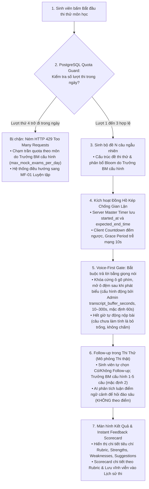

#### 6.4.3. MF-03: Ngân Hàng Đề, Barem Rubric 10.0 & Quy Trình Duyệt Bộ Môn (Question Studio Flowchart TD)

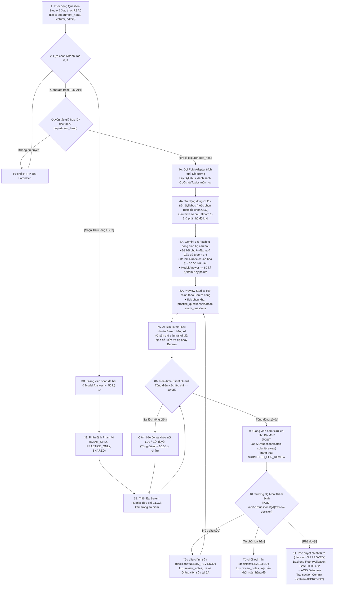

#### 6.4.4. MF-04: Thi Thật Phòng Lab, Công Bố Điểm & Phúc Khảo Nội Bộ (Lab Exam Flowchart TD)

```mermaid
flowchart TD
    M4_P1["Pha 1: Thiết Lập Ca Thi & Chuẩn Hóa Máy Trạm<br>• Ca thi ghi phòng Lab trực tiếp, gán Giám thị (GV hoặc proctor)<br>• Điểm danh đối chiếu CCCD/Thẻ SV; Sinh viên ngồi đúng STT máy<br>• Kích hoạt Kiosk Fullscreen Lockdown, chặn Alt+Tab, F12, onblur 3 cấp độ<br>• Bắt buộc Mic-Check 30s kiểm tra phần cứng âm thanh"]
    M4_P2["Pha 2: Vấn Đáp theo ExamInputMode & Niêm Phong SHA-256<br>• Cấu hình ExamInputMode: VoiceOnly / VoiceWithTranscriptEdit<br>• TTS đọc đề thi, sinh viên trả lời vào mic (hỏi phụ 1-5 câu do Trưởng BM cấu hình, mặc định 2 câu)<br>• Đóng gói âm thanh STT_MSSV.webm, băm SHA-256, stream lên Cloudflare R2<br>• Gửi bài nộp lên Backend, Persist First lưu đĩa cứng < 100ms trạng thái SUBMITTED"]
    M4_P3["Pha 3: Kiosk Khóa An Toàn, Hàng Đợi BoundedChannel & AI Chấm Ngầm<br>• Kiosk khóa an toàn < 100ms, thông báo bài đã lưu an toàn, chờ Giảng viên thẩm định & công bố<br>• Thí sinh ký biên bản nộp bài giấy và rời phòng thi (Kiosk 0% điểm liền, 0% khiếu nại tại chỗ)<br>• Đẩy task vào BoundedChannel 1,000 slots RAM (Polly Retry 2-4-8s & DLQ 5m khi quá tải)<br>• Gemini 1.5 Pro chấm ngầm theo Rubric 10.0 (chỉ nhận transcript input)"]
    M4_Doubt{"Pha 4: Cổng Hậu Kiểm Giảng Viên & AI Doubt Guard<br>Phân loại 2 nhóm bài thi qua Evidence Panel?"}
    M4_Suspicious["Nhóm 1 (Đáng nghi ngờ / Cần can thiệp):<br>is_suspicious == true HOẶC confidence_score < 0.70<br>• Giảng viên BẮT BUỘC đối soát Evidence Panel (Audio, Transcript, AI CoT)<br>• Chấm và điều chỉnh lại điểm (bắt buộc nhập override_reason)"]
    M4_HighConf["Nhóm 2 (Độ tin cậy cao):<br>confidence_score >= 0.70 và is_suspicious == false<br>• Giảng viên rà soát nhanh tổng quan qua Evidence Panel"]
    M4_AuditDone["Hoàn tất thẩm định ca thi (status: AUDITED)"]
    M4_Publish["Pha 5: Giảng Viên Công Bố Điểm (Publish Grades)<br>• Kiểm tra 100% sinh viên ca thi đã có điểm hoàn chỉnh (HTTP 422 nếu thiếu)<br>• POST /api/v1/official-exams/shifts/{shiftId}/publish-grades<br>• Cập nhật PUBLISHED & One-Way Lock khóa DB (LOCKED, HTTP 403; chừa ngoại lệ phúc khảo)<br>• Xuất file bảng điểm khảo thí cả 2 định dạng Excel (.xlsx) và PDF"]
    M4_StudentView["Sinh Viên Xem Bảng Điểm trên Student Portal<br>• Xem điểm chính thức, chi tiết từng tiêu chí & nhận xét"]
    M4_Decision{"Sinh viên đồng ý với điểm thi?"}
    M4_Accept["Chấp nhận điểm: Bấm 'Xác Nhận Nhận Điểm'<br>(student_acknowledgement_status = 'ACKNOWLEDGED')"]
    M4_InternalAppeal["Không chấp nhận điểm (Phúc khảo):<br>Sinh viên nộp đơn phúc khảo nội bộ trực tiếp trên Student Portal<br>(POST /api/v1/appeals) kèm lý do → Trưởng Bộ Môn tiếp nhận & phân công GV chấm lại (PUT /api/v1/appeals/{id}/assign-lecturer)"]

    M4_P1 --> M4_P2 --> M4_P3 --> M4_Doubt
    M4_Doubt -- "[Nghi vấn]" --> M4_Suspicious --> M4_AuditDone
    M4_Doubt -- "[Tin cậy cao]" --> M4_HighConf --> M4_AuditDone
    M4_AuditDone --> M4_Publish --> M4_StudentView --> M4_Decision
    M4_Decision -- "[Đồng ý]" --> M4_Accept
    M4_Decision -- "[Phúc khảo]" --> M4_InternalAppeal
```

---

### <a id="phan-65"></a>6.5. Sơ Đồ Tuần Tự Tương Tác Chi Tiết 4 Core Main Flows (Sequence Diagrams)

#### <a id="phan-651"></a>6.5.1. Sơ Đồ Tuần Tự MF-01: Luyện Tập Vấn Đáp Tự Do (Interactive Practice Sequence Diagram)

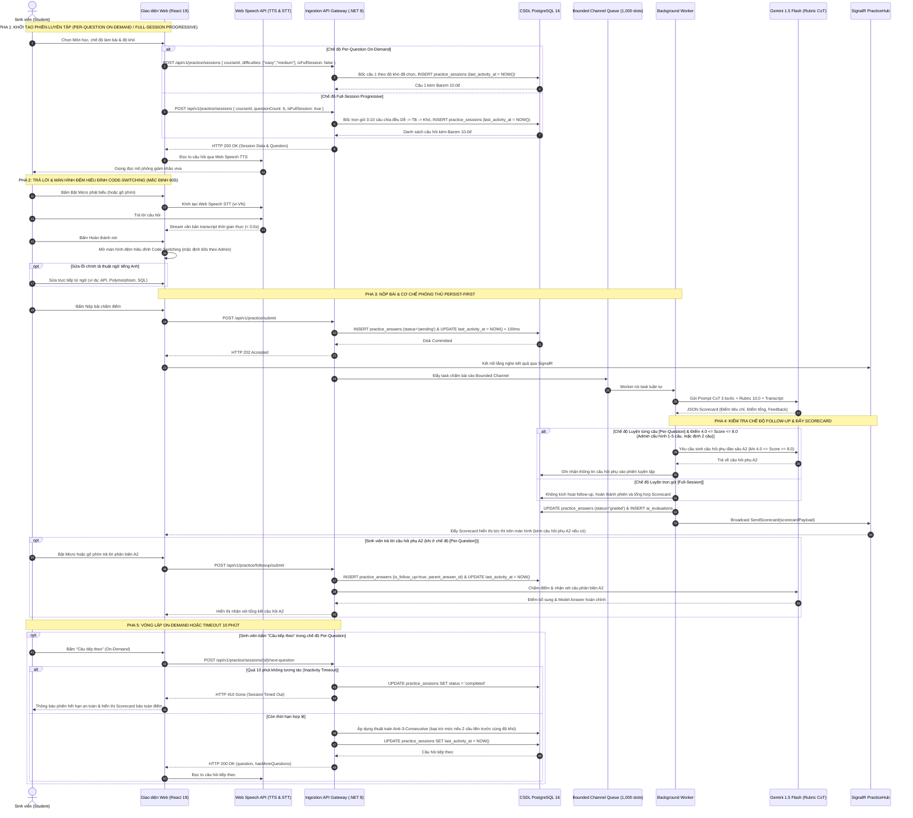

#### <a id="phan-652"></a>6.5.2. Sơ Đồ Tuần Tự MF-02: Thi Thử Vấn Đáp Bấm Giờ (Timed Mock Exam Sequence Diagram)

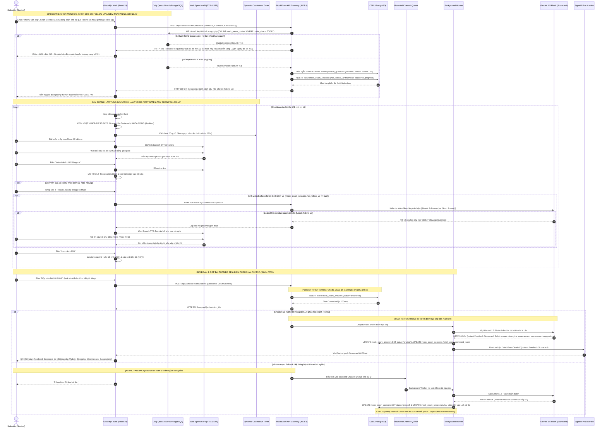

#### <a id="phan-653"></a>6.5.3. Sơ Đồ Tuần Tự MF-03: Quản Lý Ngân Hàng Câu Hỏi, AI Sinh Đề & Duyệt Bộ Môn (Question Studio Sequence Diagram)

```mermaid
sequenceDiagram
    autonumber
    actor GV as Giảng viên (Instructor)
    actor DH as Trưởng Bộ Môn (Dept Head)
    participant UI as Portal Web (React 19)
    participant FLM as FPT FLM Adapter API
    participant Guard as Client Rubric Guard
    participant API as Question & Review API (.NET 8)
    participant DB as CSDL PostgreSQL & AuditLog
    participant AI as Gemini 1.5 Flash (AI Engine)

    Note over GV,DB: GIAI ĐOẠN 1: GIẢNG VIÊN SỬ DỤNG AI SINH CÂU HỎI TỪ FLM SYLLABUS THEO CLO
    GV->>UI: Đăng nhập JWT Role lecturer & Mở Question Studio
    GV->>UI: Chọn môn học (CourseId) cần soạn đề
    UI->>API: GET /api/v1/flm/courses/{courseId}/syllabus
    API->>FLM: Gọi API trích xuất Đề cương, CLOs & Topics môn học
    FLM-->>API: JSON Syllabus (CLO1..CLOn, Topics, Bloom mục tiêu)
    API-->>UI: HTTP 200 OK (Cây Đề cương & CLOs)
    UI-->>GV: Hiển thị danh sách CLOs và Topics
    GV->>UI: Tự động dùng CLOs trên Syllabus (hoặc chọn Topic rồi chọn CLO), cấu hình số câu, phân bổ độ khó & Bloom 1-6; tick chọn kho practice_questions và/hoặc exam_questions
    GV->>UI: Bấm "Kích hoạt AI Sinh Câu Hỏi"
    UI->>API: POST /api/v1/questions/generate-from-flm (CourseId, SelectedCLOs, Distribution)
    API->>AI: Gửi Prompt CoT + Chuẩn đầu ra CLOs + Cấu trúc Syllabus
    AI-->>API: JSON Structured Questions (Đề bài, Bloom 1-6, Barem Rubric ∑=10.0đ, Model Answer >= 50 chars, Key points)
    API-->>UI: HTTP 200 OK (Danh sách Draft Questions & Rubrics)
    UI-->>GV: Hiển thị Draft Preview Studio: Cho phép Giảng viên tự thiết kế theo Barem riêng
    
    Note over GV,Guard: GIAI ĐOẠN 2: TINH CHỈNH BAREM RIÊNG, CLIENT GUARD & AI SIMULATOR
    GV->>UI: Tùy chỉnh nội dung câu hỏi, điều chỉnh tiêu chí Barem riêng & Model Answer
    loop Kiểm tra tính toàn vẹn tổng điểm tức thời (Real-time Client Guard)
        UI->>Guard: Tính tổng điểm: S = Sum(criteria_max_score)
        alt Tổng điểm lệch S != 10.0đ
            Guard-->>UI: Khóa nút "Gửi lên cho Bộ Môn", cảnh báo đỏ: Tổng điểm phải = 10.0đ
        else Tổng điểm hợp lệ S == 10.0đ
            Guard-->>UI: Mở khóa nút "Gửi lên cho Bộ Môn" & mở nút "Chạy AI Simulator"
        end
    end

    opt Giảng viên kiểm chứng Barem qua AI Calibration Simulator
        GV->>UI: Nhập câu trả lời giả định & Bấm "Chạy AI Simulator"
        UI->>API: POST /api/v1/questions/simulate-grading (Question, ModelAnswer, Rubric, SimulatedAnswer)
        API->>AI: Gemini Flash chấm thử nghiệm theo Barem
        AI-->>API: JSON Scorecard & phản biện độ nhạy Barem
        API-->>UI: HTTP 200 OK (Báo cáo thẩm định giả lập)
        UI-->>GV: Hiển thị kết quả chấm thử để GV tinh chỉnh lại nếu cần
    end

    Note over GV,DH: GIAI ĐOẠN 3: GIẢNG VIÊN GỬI LÊN CHO BỘ MÔN (SUBMIT TO DEPT HEAD)
    GV->>UI: Bấm nút "Gửi lên cho Bộ Môn" (Submit to Department Head)
    UI->>API: POST /api/v1/questions/batch-submit-review (SubmittedQuestionsDto[])
    API->>API: FluentValidation kiểm tra ∑ Barem == 10.0đ & Model Answer >= 50 chars
    API->>DB: INSERT / UPDATE questions (approval_status='SUBMITTED_FOR_REVIEW', submitted_by=GV_id)
    DB-->>API: Ghi thành công trạng thái chờ duyệt
    API-->>UI: HTTP 200 OK (Submitted For Review Successfully)
    UI-->>GV: Thông báo: "Đã gửi câu hỏi lên Trưởng Bộ Môn thẩm định và phê duyệt!"

    Note over DH,DB: GIAI ĐOẠN 4: TRƯỞNG BỘ MÔN THẨM ĐỊNH & PHÊ DUYỆT / YÊU CẦU CHỈNH SỬA
    DH->>UI: Đăng nhập JWT Role department_head & Mở Cổng Thẩm định (Approval Studio)
    UI->>API: GET /api/v1/questions/pending-review?courseId={courseId}
    API->>DB: Query các câu hỏi có approval_status='SUBMITTED_FOR_REVIEW'
    DB-->>API: Danh sách câu hỏi chờ duyệt
    API-->>UI: HTTP 200 OK (Danh sách câu hỏi kèm Barem riêng và Model Answer)
    UI-->>DH: Hiển thị chi tiết từng câu hỏi để Trưởng Bộ Môn đánh giá
    
    alt Trưởng Bộ Môn chấp thuận (Phê duyệt chính thức)
        DH->>UI: Bấm "Phê duyệt" (Approve)
        UI->>API: POST /api/v1/questions/{id}/review-decision (decision='APPROVED')
        API->>DB: UPDATE questions SET approval_status='APPROVED', approved_by=DH_id
        API->>DB: INSERT INTO audit_logs (dh_id, action='APPROVE_QUESTION', timestamp)
        DB-->>API: Commit Transaction thành công
        API-->>UI: HTTP 200 OK
        UI-->>DH: Thông báo: "Câu hỏi đã được phê duyệt chính thức vào Ngân hàng Đề!"
    else Trưởng Bộ Môn yêu cầu chỉnh sửa (Request Revision)
        DH->>UI: Bấm "Yêu cầu chỉnh sửa" & nhập góp ý (review_notes)
        UI->>API: POST /api/v1/questions/{id}/review-decision (decision='NEEDS_REVISION', reviewNotes)
        API->>DB: UPDATE questions SET approval_status='NEEDS_REVISION', review_notes=reviewNotes
        DB-->>API: Ghi nhận trạng thái yêu cầu chỉnh sửa
        API-->>UI: HTTP 200 OK
        UI-->>DH: Thông báo: "Đã gửi yêu cầu chỉnh sửa kèm góp ý về cho Giảng viên!"
        API-->>GV: Gửi thông báo cho Giảng viên mở lại câu hỏi để sửa và gửi lại
    else Trưởng Bộ Môn từ chối loại hẳn (Reject)
        DH->>UI: Bấm "Từ chối" & nhập lý do (review_notes)
        UI->>API: POST /api/v1/questions/{id}/review-decision (decision='REJECTED', reviewNotes)
        API->>DB: UPDATE questions SET approval_status='REJECTED', review_notes=reviewNotes
        DB-->>API: Ghi nhận trạng thái loại hẳn khỏi ngân hàng đề
        API-->>UI: HTTP 200 OK
        UI-->>DH: Thông báo: "Đã loại hẳn câu hỏi khỏi danh sách đề!"
    end
```

#### <a id="phan-654"></a>6.5.4. Sơ Đồ Tuần Tự MF-04: Thi Thật Phòng Lab, Công Bố Điểm & Phúc Khảo Nội Bộ (Lab Exam Sequence Diagram)

```mermaid
sequenceDiagram
    autonumber
    actor DH as Trưởng Bộ Môn (Department Head)
    actor GV as Giảng viên (Giám thị / Hậu kiểm)
    actor SV as Thí sinh (Tại Máy Lab Kiosk)
    participant LabPC as Máy trạm Kiosk (Lab PC UI)
    participant Cloud as Cloudflare R2 Audio Storage
    participant API as Backend Exam API (.NET 8)
    participant DB as CSDL PostgreSQL & AuditLog
    participant Worker as Background Worker (Whisper + Gemini Pro)
    participant AuditUI as Lecturer Audit Portal
    participant Portal as Student Portal (Web UI)

    Note over DH,DB: PHA 0: TRƯỞNG BỘ MÔN KHỞI TẠO KỲ THI & CẤU HÌNH MÔN THI
    DH->>API: POST /api/v1/official-exams/sessions (Khởi tạo kỳ thi OfficialExamSession)
    DH->>API: Đưa danh sách các môn thi thuộc kỳ thi vào hệ thống
    DH->>API: Cấu hình môn thi: Ca thi (Shifts), Follow-up (has_follow_up, max_follow_up 1–5 câu, mặc định 2 câu), ExamInputMode & BufferSeconds
    API->>DB: INSERT INTO official_exam_sessions, real_exam_session_shifts
    DB-->>API: Ghi nhận cấu hình kỳ thi & ca thi thành công
    API-->>DH: HTTP 201 Created

    Note over GV,LabPC: PHA 1: THIẾT LẬP CA THI, ĐIỂM DANH STT & MIC-CHECK 30S
    GV->>API: Mở ca thi trên Proctor Console: Gán STT máy = Số danh sách thi
    API->>DB: Khởi tạo ca thi phòng lab (status: SCHEDULED), gán thí sinh vào Booth 1-40
    SV->>LabPC: Ngồi đúng máy theo STT, đăng nhập MSSV
    LabPC->>LabPC: Fullscreen Kiosk Lockdown (chặn F12, Alt+Tab, Ctrl+C/V, window.onblur)
    LabPC->>LabPC: Bắt buộc Mic-Check 30s kiểm tra phần cứng âm thanh (>= 60dB)
    
    Note over GV,LabPC: PHA 2: THI VẤN ĐÁP THEO EXAM_INPUT_MODE & NIÊM PHONG AUDIO
    GV->>API: Phát lệnh bắt đầu ca thi toàn phòng Lab
    API->>LabPC: SignalR đồng bộ mở đề thi kèm cấu hình ExamInputMode & Follow-up của Môn thi
    loop Cho từng câu hỏi thứ i (1 ≤ i ≤ N)
        LabPC->>LabPC: TTS đọc đề thi qua tai nghe & bật đồng hồ đếm ngược
        SV->>LabPC: Phát biểu câu trả lời vào micro (MediaRecorder thu âm webm/opus)
        opt Môn thi có cấu hình Follow-up ([OfficialExamSession.has_follow_up == true])
            LabPC->>API: AI Quick Context Evaluation (Phân tích luận điểm [Needs Follow-up])
            API-->>LabPC: Cấp câu hỏi phụ theo ngữ cảnh câu trả lời (tối đa 1–5 câu, mặc định 2 câu)
            LabPC->>LabPC: Phát audio câu hỏi phụ & SV trả lời vào micro
        end
        Note over LabPC,Cloud: Đóng gói STT_MSSV.webm, tính SHA-256 seal
        LabPC->>Cloud: Stream file audio STT_MSSV.webm lên Cloudflare R2 qua Presigned URL
        LabPC->>API: POST /api/v1/exam-lab/submit-question (STT_MSSV, audio_r2_url, sha256_hash)
        API->>DB: Lưu bản ghi nộp bài (status='SUBMITTED', audio_r2_url, sha256_hash)
    end

    Note over SV,LabPC: PHA 3: KIOSK KHÓA AN TOÀN, PERSIST FIRST (<100ms) & HÀNG ĐỢI CHỊU TẢI
    SV->>LabPC: Bấm nút xác nhận nộp toàn bài (hoặc hết giờ tự thu bài)
    LabPC->>API: POST /api/v1/official-exams/submissions (Hoàn tất bài thi)
    Note over API,DB: Persist-First Ingestion (< 100ms)
    API->>DB: INSERT exam_question_submissions & UPDATE student_exam_tickets SET status='SUBMITTED'
    LabPC-->>SV: Màn hình Kiosk KHÓA AN TOÀN (< 100ms), thông báo bài đã lưu an toàn, điểm do GV công bố
    SV->>LabPC: Ký biên bản giấy tại bàn giám thị, tháo tai nghe và trật tự rời phòng thi
    
    API->>Worker: Enqueue vào BoundedChannel 1,000 slots RAM (FullMode.Wait)
    Worker->>Worker: Gemini 1.5 Pro chấm Rubric 10.0, tính conf & is_suspicious (Polly Retry 3 lần, DLQ 5m khi lỗi)
    Worker->>DB: UPDATE student_exam_tickets SET status='AI_GRADED', ai_score=score, ai_confidence_score=conf, is_suspicious=suspicious
    Note over Worker,DB: Toàn bộ bài thi đã sẵn sàng ở trạng thái AI_GRADED cho Giảng viên hậu kiểm

    Note over GV,AuditUI: PHA 4: CỔNG HẬU KIỂM GIẢNG VIÊN & PHÂN LOẠI BÀI NGHI NGỜ (AI DOUBT GUARD)
    GV->>AuditUI: Đăng nhập Cổng Hậu kiểm, chọn ca thi phòng Lab cần thẩm định
    AuditUI->>API: GET /api/v1/audit/submissions?shiftId={shiftId}
    API->>DB: Truy vấn dữ liệu ca thi
    DB-->>API: Danh sách bài thi kèm chỉ số AI chấm
    API-->>AuditUI: Dữ liệu phân loại 2 nhóm:
    AuditUI-->>GV: Nhóm 1 (Đáng nghi ngờ / Cần can thiệp: is_suspicious==true HOẶC confidence_score < 0.70) xếp lên đầu ưu tiên; Nhóm 2 (Độ tin cậy cao)
    
    loop Giảng viên thẩm định các bài thuộc Nhóm 1 (Đáng nghi ngờ)
        GV->>AuditUI: Chọn bài thi nghi ngờ, nghe lại STT_MSSV.webm trên Waveform Player (1.0x-1.5x)
        GV->>AuditUI: Bấm vào timestamp citations để nghe chính xác đoạn phát âm nghi vấn
        alt Giảng viên đồng ý với điểm AI
            GV->>AuditUI: Giữ nguyên điểm đề xuất
        else AI chấm chưa sát do tiếng ồn / nói ngập ngừng
            GV->>AuditUI: Điều chỉnh điểm tiêu chí & Bắt buộc nhập lý do giải trình (override_reason)
        end
        AuditUI->>API: POST /api/v1/exam-audit/save-audit (status='AUDITED')
    end

    Note over GV,Portal: PHA 5: GIẢNG VIÊN CÔNG BỐ ĐIỂM (PUBLISH), ONE-WAY LOCK & PHÚC KHẢO NỘI BỘ
    GV->>AuditUI: Sau khi hoàn tất kiểm tra ca thi, bấm nút "Công Bố Điểm" (Publish Grades)
    AuditUI->>API: POST /api/v1/official-exams/shifts/{shiftId}/publish-grades
    Note over API: Kiểm tra 100% sinh viên ca thi đã có điểm hoàn chỉnh (HTTP 422 nếu thiếu)
    API->>DB: BEGIN TRANSACTION
    API->>DB: UPDATE student_exam_tickets SET status='PUBLISHED', is_locked=true
    API->>DB: UPDATE official_exam_sessions SET status='LOCKED'
    API->>DB: INSERT INTO audit_logs (gv_id, action='PUBLISH_GRADES', timestamp)
    API->>DB: COMMIT TRANSACTION
    Note over API,DB: OneWayLockInterceptor kích hoạt vĩnh viễn (Chặn mọi UPDATE/DELETE bằng HTTP 403 Forbidden; mở ngoại lệ cho Giảng viên chấm lại đơn phúc khảo)
    
    par Xuất bảng điểm cho Phòng Khảo thí
        API->>AuditUI: Xuất file bảng điểm Excel định dạng chuẩn FPT & PDF có chữ ký số
        AuditUI-->>GV: Tải file nộp về Phòng Khảo thí Đại học FPT
    and Sinh viên xem điểm trên Student Portal
        SV->>Portal: Đăng nhập Student Portal xem bảng điểm chính thức do Giảng viên công bố
        Portal->>API: GET /api/v1/student/official-exams/{ticketId}/grade
        API-->>Portal: Bảng điểm chính thức: Tổng điểm, điểm chi tiết rubric, nhận xét
        Portal-->>SV: Hiển thị bảng điểm chính thức
        alt Sinh viên chấp nhận điểm
            SV->>Portal: Bấm nút "Xác Nhận Nhận Điểm"
            Portal->>API: POST /api/v1/student/official-exams/{ticketId}/acknowledge-grade
            API->>DB: UPDATE student_exam_tickets SET student_acknowledgement_status='ACKNOWLEDGED'
            Portal-->>SV: "Xác nhận nhận điểm thành công. Chúc mừng bạn đã hoàn thành kỳ thi môn học!"
        else Sinh viên không chấp nhận điểm (Phúc khảo Nội Bộ)
            SV->>Portal: Bấm nút "Nộp Đơn Phúc Khảo" trực tiếp trên Student Portal, nhập lý do
            Portal->>API: POST /api/v1/appeals (TicketId, Reason)
            API->>DB: INSERT INTO appeal_requests (ticket_id, student_id, reason, status='PENDING')
            API-->>Portal: HTTP 201 Created (Đơn phúc khảo đã gửi tới Trưởng Bộ Môn)
            Portal-->>SV: Thông báo: "Đã nộp đơn phúc khảo thành công. Trưởng Bộ Môn sẽ tiếp nhận và phân công Giảng viên chấm lại bài thi."
            Note over DH,GV: TRƯỞNG BỘ MÔN PHÂN CÔNG GIẢNG VIÊN CHẤM LẠI
            DH->>API: PUT /api/v1/appeals/{id}/assign-lecturer (AssignedLecturerId)
            API->>DB: UPDATE appeal_requests SET assigned_to=assigned_lecturer_id, status='ASSIGNED'
            GV->>Portal: Giảng viên được phân công rà soát Evidence Panel, chấm lại và nộp biên bản regrade
            DH->>API: PUT /api/v1/appeals/{id}/review-decision (APPROVED | REJECTED)
        end
    end
```

---

## <a id="phan-7"></a>🛡️ PHẦN 7: KIẾN TRÚC PHÒNG THỦ 4 TẦNG CHỊU TẢI & CHỐNG MẤT DỮ LIỆU (ZERO DATA LOSS)

### <a id="phan-71"></a>7.1. Sơ Đồ Cơ Chế Phòng Thủ 4 Tầng Liên Hoàn (Mermaid)

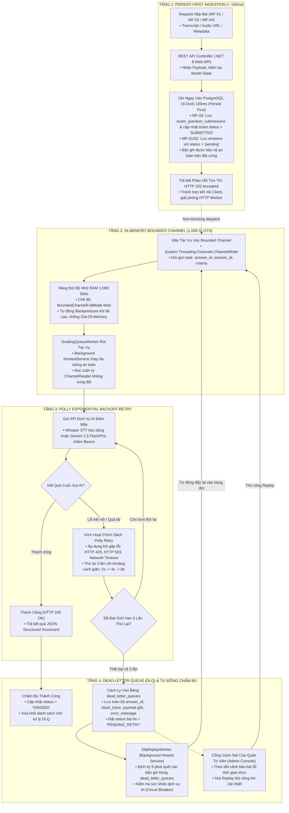

### <a id="phan-72"></a>7.2. Phân Tích Kỹ Thuật Từng Tầng Chống Chịu Sự Cố

1. **Tầng 1: Persist-First Ingestion (< 100ms):**
   - Khi bài nộp từ Client gửi lên Backend (đặc biệt là bài thi thật phòng Lab MF-04 qua `POST /api/v1/official-exams/submissions`), Controller không gọi AI ngay mà chỉ thực hiện validate cú pháp, ghi ngay bản ghi vào `exam_question_submissions` và cập nhật `student_exam_tickets` với trạng thái **`SUBMITTED` trong $< 100$ms** (đối với MF-01/02 là lưu `practice_answers` / `mock_exam_answers` với trạng thái `pending`).
   - Ngay sau khi bản ghi được `SaveChanges` xuống đĩa cứng, hệ thống trả về ngay phản hồi tức thì: mã `HTTP 200 OK` hiển thị màn hình khóa an toàn trên máy Kiosk MF-04 (hoặc mã `HTTP 202 Accepted` cho MF-01/02). Thời gian thực thi toàn bộ luồng này đo lường thực tế đạt dưới 100ms. Thí sinh và máy trạm Kiosk được giải phóng kết nối ngay lập tức, bảo đảm Zero Data Loss 100%.
2. **Tầng 2: In-Memory Bounded Channel (1,000 Slots):**
   - Sử dụng thư viện chuẩn hiệu năng cao `System.Threading.Channels` của .NET 8.
   - Dung lượng hàng đợi cố định ở mức **1,000 tasks**. Cấu hình cờ `BoundedChannelFullMode.Wait`. Nếu lưu lượng đột biến vượt quá 1,000 bài nộp đang chờ, luồng ghi sẽ tạm hoãn an toàn thay vì tiếp tục cấp phát RAM, ngăn ngừa triệt để lỗi Out-Of-Memory (OOM) làm sập container.
3. **Tầng 3: Polly Exponential Backoff Retry & Quy Chuẩn Timeout Hai Tầng:**
   - Dịch vụ AI đám mây (Google Gemini API) và cổng tích hợp FPT FLM API có thể gặp lỗi tạm thời như nghẽn mạng, lỗi `HTTP 429 Resource Exhausted` hoặc `HTTP 503 Service Unavailable`.
   - Hệ thống cấu hình chính sách Polly v8 tự động thử lại tối đa 3 lần với khoảng cách thời gian dãn cách theo hàm mũ: **2 giây $\rightarrow$ 4 giây $\rightarrow$ 8 giây** (tổng thời gian giãn cách chờ riêng giữa các lần thử là $2\text{s} + 4\text{s} + 8\text{s} = 14\text{s}$). Hơn 95% các sự cố nghẽn mạng tức thời đều được giải quyết tự động ở tầng này mà không cần can thiệp thủ công.
   - **Quy tắc phân định Timeout hai tầng (Two-Tier Timeout Separation):**
     - *Attempt Timeout (Thời hạn cho mỗi lượt gọi đơn lẻ):* Cấu hình `10s` cho FLM Adapter API và `30s` cho Gemini AI Question Generator (do khối lượng tạo nội dung đề bài, Barem 10.0 và Model Answer lớn).
     - *Total Request Timeout (Tổng thời hạn tối đa toàn bộ pipeline):* Cấu hình `60s` cho FLM Adapter API và `90s` cho Gemini AI Generator.
     - *Cảnh báo kỹ thuật Backend .NET 8:* Tuyệt đối **CẤM** gán cứng `HttpClient.Timeout = TimeSpan.FromSeconds(10)` toàn cục vì sẽ khiến runtime hủy kết nối trước khi Polly kịp hoàn thành chu kỳ thử lại thứ 2 và thứ 3. Bắt buộc sử dụng `AddResilienceHandler` hoặc `ResiliencePipelineBuilder` để quản lý độc lập Attempt Timeout và Total Timeout.
4. **Tầng 4: Dead-Letter Queue (DLQ) & Tự Động Chấm Bù Định Kỳ:**
   - Nếu cuộc gọi AI thất bại cả 3 lần retry, task được đưa vào bảng `dead_letter_queues` trong PostgreSQL kèm toàn bộ stack trace và payload gốc, đánh dấu trạng thái bài thi là `PENDING_RETRY`.
   - Tiến trình nền `DlqReplayWorker` được kích hoạt định kỳ **5 phút / lần**. Worker quét các bản ghi lỗi, kiểm tra sức khỏe API ngoại vi và tự động nạp lại vào Bounded Channel để chấm bù.
   - Quản trị viên cũng có thể chủ động bấm nút "Replay DLQ" trên Admin Console để kích hoạt chấm bù khẩn cấp. **Cam kết bảo đảm Zero Data Loss 100% trong mọi tình huống sự cố**.

---

## <a id="phan-8"></a>🌐 PHẦN 8: MA TRẬN CỔNG MẠNG, RANH GIỚI BẢO MẬT & DANH MỤC MÃ LỖI RFC 7807

### <a id="phan-81"></a>8.1. Ma Trận Cổng Mạng & Ranh Giới Phân Vùng Bảo Mật

```
[Public Internet / WAN / Lab PC VLAN]
                 │  HTTPS 443 / HTTP 80 (TLS 1.3 / WSS)
                 ▼
     ┌───────────────────────┐
     │ Cloudflare Anycast WAF│  <-- DDoS Filter, Rate Limit
     └───────────┬───────────┘
                 │  Reverse Proxy Proxy-Pass
                 ▼
     ┌───────────────────────┐
     │  Nginx Ingress (Host) │  <-- SSL Offloading, HSTS, Route Split
     └─────┬───────────┬─────┘
           │ :3000     │ :5000 (REST & WSS)
           ▼           ▼
┌──────────────────┐ ┌───────────────────────────────────────────────┐
│ oralexam-frontend│ │              oralexam-backend                 │
│ (React 19 Vite)  │ │ (.NET 8 Clean Architecture - Kestrel Server)  │
└──────────────────┘ └───────┬───────────────────────────────┬───────┘
                             │ :5432 (Npgsql TCP Pool)       │ :443 (Outbound)
                             ▼                               ▼
                 ┌───────────────────────┐       ┌───────────────────────┐
                 │   oralexam-postgres   │       │   External Cloud:     │
                 │   (PostgreSQL 16)     │       │   • Gemini 1.5 Flash  │
                 │   CẤM MỞ RA NGOÀI!    │       │   • Gemini 1.5 Pro    │
                 └───────────────────────┘       │   • FPT FLM API (CLO) │
                                                 │   • Whisper STT       │
                                                 │   • Cloudflare R2     │
                                                 │   • Google OAuth PKCE │
                                                 └───────────────────────┘
```

### <a id="phan-811"></a>8.1.1. Ma Trận Phân Quyền Vai Trò Người Dùng (RBAC Authorization Matrix)

Hệ thống thiết lập cơ chế phân quyền Role-Based Access Control (RBAC) nghiêm ngặt với 5 vai trò người dùng được mã hóa trong JWT Claims:

| Tính Năng / Phân Hệ Nghiệp Vụ | `student`<br>(Sinh viên) | `lecturer`<br>(Giảng viên) | `department_head`<br>(Trưởng Bộ Môn) | `proctor`<br>(Giám thị) | `admin`<br>(Quản trị viên) |
|:---|:---:|:---:|:---:|:---:|:---:|
| **MF-01:** Luyện tập vấn đáp tương tác | ✅ | ✅ | ✅ | ❌ | ✅ |
| **MF-02:** Thi thử bấm giờ (Quota theo ngày do Trưởng BM cấu hình) | ✅ | ✅ | ✅ | ❌ | ✅ |
| **MF-03:** Soạn câu hỏi & Barem 10.0đ thủ công | ❌ | ✅ | ✅ | ❌ | ✅ |
| **MF-03:** Lấy đề cương FLM (`GET /api/v1/flm/courses/{id}/syllabus`) | ❌ | **✅** | **✅** | ❌ | **✅** |
| **MF-03:** **Kích hoạt AI sinh câu hỏi từ FLM API theo syllabus CLO & Barem 10.0đ** | ❌ | **✅** | **✅** | ❌ | **✅** |
| **MF-03:** Giảng viên gửi câu hỏi duyệt Bộ môn (`POST /api/v1/questions/batch-submit-review`) | ❌ | **✅** | ❌ | ❌ | **✅** |
| **MF-03:** Trưởng Bộ Môn thẩm định & Phê duyệt đề (`POST /api/v1/questions/{id}/review-decision`, batch-approve) | ❌ | ❌ | **✅** | ❌ | **✅** |
| **MF-04:** Điểm danh & Giám sát ca thi Lab Kiosk | ❌ | ✅ | ✅ | ✅ | ✅ |
| **MF-04:** Thẩm định điểm (AI Doubt Guard), sửa điểm & Công bố điểm (Publish Grades) | ❌ | ✅ | ✅ | ❌ | ✅ |
| **MF-04:** Sinh viên xem điểm Student Portal & Nộp đơn phúc khảo nội bộ (`POST /api/v1/appeals`, Trưởng BM giao GV chấm lại) | ✅ | ✅ | ✅ | ❌ | ✅ |
| Quản trị hệ thống, Cứu hộ DLQ Replay & Audit Logs | ❌ | ❌ | ❌ | ❌ | ✅ |

> [!IMPORTANT]
> **Quy trình Phân quyền Phê duyệt Đề thi (MF-03) & Công bố Điểm (MF-04):**
> 1. **Quyền hạn Giảng viên (`lecturer`):** Giảng viên được toàn quyền kích hoạt tính năng AI sinh câu hỏi từ FLM API theo Barem riêng của mình (`POST /api/v1/questions/generate-from-flm`), tùy chỉnh đề bài, tiêu chí barem ($\sum = 10.0$đ) và Model Answer ($\ge 50$ ký tự), chạy kiểm thử với AI Simulator; sau khi hoàn thiện, Giảng viên ấn **"Gửi lên cho Bộ Môn"** (`POST /api/v1/questions/batch-submit-review`) $\to$ Trạng thái `SUBMITTED_FOR_REVIEW`.
> 2. **Thẩm quyền của Trưởng Bộ Môn (`department_head`):** Là vai trò thẩm định và ra quyết định chính thức: Bấm **"Phê duyệt"** (`APPROVED`, lưu chính thức vào ngân hàng câu hỏi môn học) hoặc **"Yêu cầu chỉnh sửa"** (`NEEDS_REVISION` để trả về giảng viên sửa rồi gửi lại, hoặc `REJECTED` để loại hẳn, kèm lý do góp ý vào `review_notes`) qua endpoint `POST /api/v1/questions/{id}/review-decision`. Trưởng bộ môn cũng có quyền trực tiếp phê duyệt hàng loạt (`batch-approve`).
> 3. **Quy trình Thẩm định, Công bố Điểm & Phúc khảo Nội bộ (MF-04):** Sau ca thi, Kiosk khóa màn hình thông báo an toàn, sinh viên ra về và **tuyệt đối không có điểm liền**. AI chấm điểm ngầm (`AI_GRADED`). Sinh viên phải đợi Giảng viên chấm hết những bài nghi ngờ (`is_suspicious == true` / `confidence_score < 0.70`) hoặc fail trên Cổng Hậu kiểm qua Evidence Panel (AudioURL Cloudflare R2, Transcript Whisper gốc, AI CoT), nghe lại Waveform Player, sửa điểm kèm lý do bắt buộc. Sau khi Giảng viên xử lý có điểm đầy đủ cho **100% sinh viên trong ca thi**, Giảng viên ấn **"Công Bố Điểm"** (`POST /api/v1/official-exams/shifts/{shiftId}/publish-grades` $\to$ `PUBLISHED` & `One-Way Lock` niêm phong `HTTP 403`, chừa ngoại lệ cho phúc khảo). Xuất báo cáo điểm thi FPT cả 2 định dạng Excel (.xlsx) và PDF. Sinh viên ở nhà đăng nhập Student Portal để xem điểm; nếu không chấp nhận điểm, sinh viên làm đơn phúc khảo nội bộ (`POST /api/v1/appeals`) trực tiếp tại phân hệ Phúc khảo trong hệ thống kèm lý do để gửi Trưởng Bộ Môn tiếp nhận và phân công Giảng viên vào chấm lại (`PUT /api/v1/appeals/{id}/assign-lecturer`).

### <a id="phan-82"></a>8.2. Danh Mục Mã Lỗi Chuẩn Hóa RFC 7807 (ProblemDetails Matrix)

Tất cả các phản hồi lỗi từ API đều tuân thủ nghiêm ngặt định dạng chuẩn công nghiệp **RFC 7807 (`application/problem+json`)**:

```json
{
  "type": "https://oralexam.fpt.edu.vn/errors/quota-exceeded",
  "title": "Daily Mock Exam Quota Exceeded",
  "status": 429,
  "detail": "Bạn đã hoàn thành tối đa 3 lượt thi thử trong ngày đối với môn học này. Vui lòng chuyển sang chế độ Luyện tập tự do hoặc quay lại vào ngày mai.",
  "instance": "/api/v1/mock-exams/start"
}
```

#### Bảng Tra Cứu Mã Trạng Thái & Lỗi Hệ Thống:

| Mã HTTP | Tên mã lỗi | Trường hợp kích hoạt trong hệ thống | Hướng xử lý phía Client UI |
|:---:|:---|:---|:---|
| **`400`** | `Bad Request` | Dữ liệu đầu vào sai định dạng (thiếu trường bắt buộc, sai kiểu dữ liệu, JSON malformed, tỷ lệ phân bổ độ khó không khớp tổng số câu). | Hiển thị thông báo lỗi trường cụ thể bên dưới input tương ứng. |
| **`401`** | `Unauthorized` | Token JWT hết hạn, token không hợp lệ hoặc thiếu tiêu đề `Authorization: Bearer <token>`. | Tự động làm mới token hoặc điều hướng về trang đăng nhập Google Workspace. |
| **`403`** | `Forbidden` | **1.** Tài khoản không đủ quyền hạn RBAC truy cập tài nguyên.<br>**2.** Giảng viên cố ý sửa điểm khi ca thi đã bị khóa (`is_locked=true` kích hoạt `OneWayLockInterceptor`).<br>**3.** Người dùng không mang vai trò hợp lệ (`student`, `proctor`) cố ý kích hoạt endpoint AI sinh câu hỏi, duyệt đề Bộ môn hoặc công bố điểm. | Hiển thị màn hình từ chối quyền truy cập hoặc cảnh báo banner đỏ: *"Bạn không có quyền thực hiện thao tác này"* hoặc *"Ca thi đã được khóa một chiều"*. |
| **`404`** | `Not Found` | Không tìm thấy mã môn học, đề cương FLM, ID câu hỏi, ca thi hoặc sinh viên trong CSDL. | Hiển thị giao diện trạng thái 404 Not Found kèm nút quay về trang chủ. |
| **`422`** | `Unprocessable Entity` | **FluentValidation Gate:** Cán bộ lưu Barem Rubric có tổng điểm $\sum \text{Tiêu chí} \neq 10.0\text{đ}$, Model Answer $< 50$ ký tự, hoặc cập nhật điểm thẩm định mà để trống lý do giải trình. | Đánh dấu đỏ các tiêu chí điểm / ô nhập đáp án và yêu cầu cân chỉnh lại để tổng điểm đúng bằng 10.0đ và đáp án $\ge 50$ ký tự. |
| **`429`** | `Too Many Requests` | **Quota Guard:** Sinh viên thực hiện lượt thi thử vượt quá số lượt trong ngày do Trưởng BM cấu hình (`max_mock_exams_per_day`). | Hiển thị hộp thoại thông báo đã hết hạn ngạch ngày kèm nút chuyển sang chế độ Luyện tập tự do. |
| **`500`** | `Internal Server Error` | Lỗi máy chủ không mong muốn hoặc sự cố cơ sở dữ liệu nghiêm trọng. | Đưa bài thi vào cơ chế phòng thủ DLQ và hiển thị thông báo hỗ trợ kỹ thuật cho sinh viên. |
| **`502`** | `Bad Gateway` | Cổng kết nối ngoại vi bên thứ ba (FLM API Adapter, Google Gemini AI, Cloudflare Whisper STT) bị mất kết nối, từ chối TCP hoặc phản hồi sai định dạng JSON Schema sau 3 lần thử lại theo cấp số nhân (Polly Retry 2s, 4s, 8s). | Hiển thị cảnh báo: *"Dịch vụ ngoại vi tạm thời gián đoạn sau 3 lần thử lại. Vui lòng kiểm tra trạng thái kết nối mạng hoặc thử lại sau"*. |
| **`504`** | `Gateway Timeout` | Cổng FLM API hoặc Google Gemini AI không phản hồi trong thời hạn tối đa của chu trình Resilience Pipeline sau 3 lần thử lại tự động (Polly 2s, 4s, 8s). Phân định: Attempt Timeout 10s (FLM) / 30s (Gemini); Total Request Timeout 60s (FLM) / 90s (Gemini). | Hiển thị thông báo: *"Dịch vụ AI / FLM phản hồi quá thời gian chờ quy định (Total Timeout). Vui lòng giảm số lượng câu hỏi cần sinh hoặc thử lại sau"*. |


### <a id="phan-83"></a>8.3. Cam Kết Mức Độ Dịch Vụ & Mục Tiêu Hiệu Năng (SLA & Latency Targets)

Nhóm phát triển cam kết các chỉ số hiệu năng kỹ thuật định lượng (Service Level Agreements):
- **Độ trễ nhận diện giọng nói Client (Web Speech STT):** $\le 500\text{ms}$ (phản xạ tức thì).
- **Thời gian ghi nhận bài thi xuống đĩa (Persist-First Database Write):** $\le 100\text{ms}$ (trả `HTTP 202 Accepted`).
- **Thời gian phản hồi chấm điểm AI (Gemini 1.5 Flash):** $1.8\text{s} - 2.5\text{s}$ (Trần tối đa $\le 10\text{s}$).
- **Thời gian đẩy Scorecard qua SignalR Core WebSocket:** $\le 100\text{ms}$ sau khi AI chấm xong.
- **Cam kết toàn vẹn dữ liệu (Zero Data Loss Guarantee):** $100\%$ bài thi được lưu đĩa an toàn và cách ly qua DLQ khi gặp sự cố mạng ngoài.
- **Cam kết pháp lý khảo thí:** $100\%$ điểm ca thi sau khi bấm nút One-Way Lock được niêm phong bất biến qua interceptor ở cấp độ CSDL.

---
*Tài liệu kiến trúc hệ thống chính thức duy nhất (Single Source of Truth) phục vụ báo cáo Hội đồng chấm tốt nghiệp Đồ án Capstone FA26SE166 — Khoa Kỹ Thuật Phần Mềm — Đại học FPT TP.HCM (FPT SG).*
### <a id="phan-66"></a>6.6. Xử Lý 4 Cạnh Biên Nghiệp Vụ Đặc Thù (Edge-Cases Resolution)

Để bảo đảm tính ổn định tuyệt đối của hệ thống trong môi trường thi thật và thi thử, 4 cạnh biên nghiệp vụ sau đã được thiết kế và giải quyết triệt để:

1. **[Session Resumption] Phục hồi phiên thi do rớt mạng / mất điện máy Kiosk (MF-04):**
   - **Giải pháp:** Áp dụng cơ chế **Checkpoint / Heartbeat**. Backend lưu trạng thái tiến độ (question_index, câu trả lời lưu tạm) sau mỗi thao tác chuyển câu. Khi sinh viên mở lại Kiosk hoặc đăng nhập lại, hệ thống nạp lại đúng tiến độ câu hỏi hiện tại, bảo đảm không mất dữ liệu các câu đã trả lời.

2. **[R2 Direct Upload] Giải quyết nút thắt cổ chai băng thông khi nộp bài đồng loạt (MF-04):**
   - **Giải pháp:** Đổi sang kiến trúc **Presigned URL 2-bước**. Khi bắt đầu thi, Backend sinh sẵn Token và Presigned URL. Máy Kiosk sẽ upload trực tiếp file audio STT_MSSV.webm lên Cloudflare R2 qua mạng diện rộng, bỏ qua kênh mạng nội bộ của Backend. Sau khi upload thành công, Kiosk chỉ gửi mã băm SHA-256 của file về Backend để niêm phong và xác nhận nộp bài, giúp giảm 99% tải băng thông cho máy chủ .NET 8.

3. **[Booth Reassignment] Xử lý đổi máy trạm do hỏng phần cứng Micro (MF-04):**
   - **Giải pháp:** Trong giai đoạn 30s kiểm tra phần cứng (Hardware Mic-Check), nếu máy trạm không đạt chuẩn (Micro < 60dB), sinh viên báo Giám thị. Giám thị sử dụng API quyền proctor để gỡ niêm phong ip_address của vé thi cũ và cập nhật ip_address của máy trạm dự phòng. Sinh viên chuyển sang máy mới và tiếp tục thi hợp lệ.

4. **[Token Expiration] Quản lý Token hết hạn trong ca thi kéo dài 60-90 phút (MF-04/MF-02):**
   - **Giải pháp:** Tích hợp cơ chế **Silent Refresh Token** ngầm bằng Axios Interceptor tại Frontend. Khi Access Token (thường có tuổi thọ 1 giờ) sắp hết hạn, hệ thống tự động xin cấp Token mới qua Refresh Token ở chế độ nền, bảo đảm luồng thi không bị gián đoạn và không văng ra màn hình đăng nhập.

