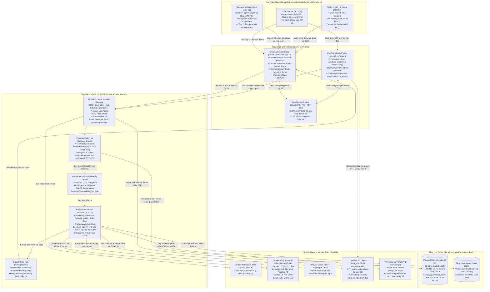
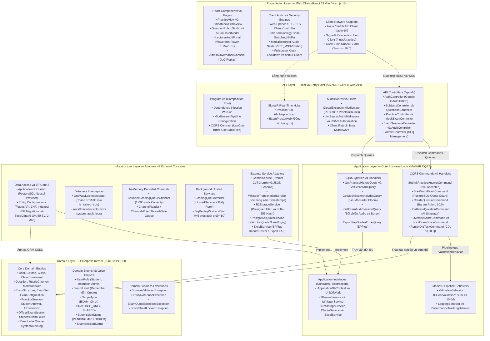
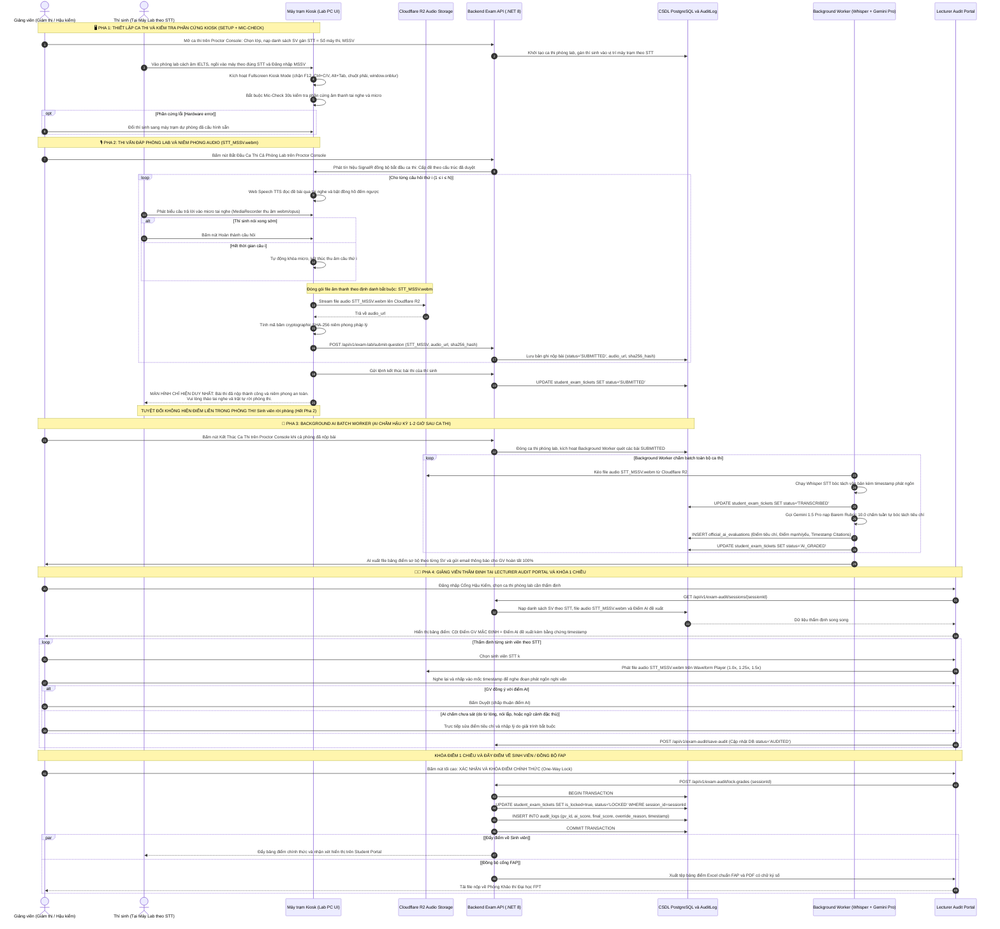
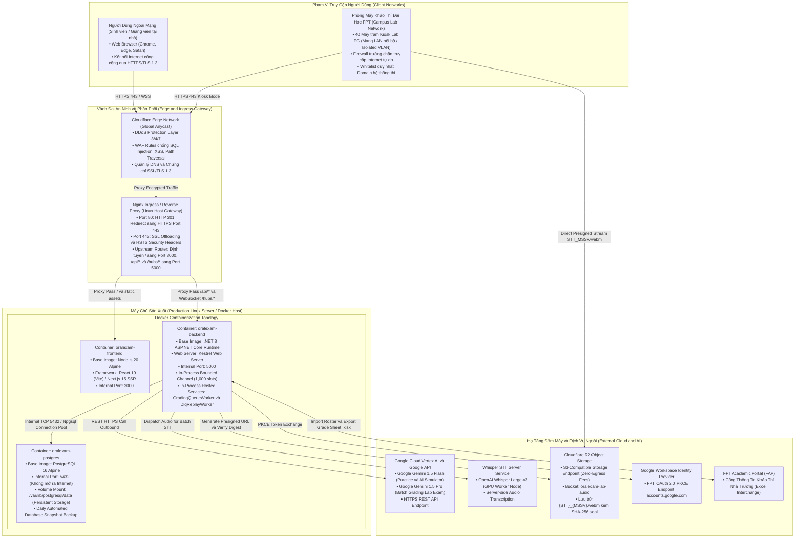
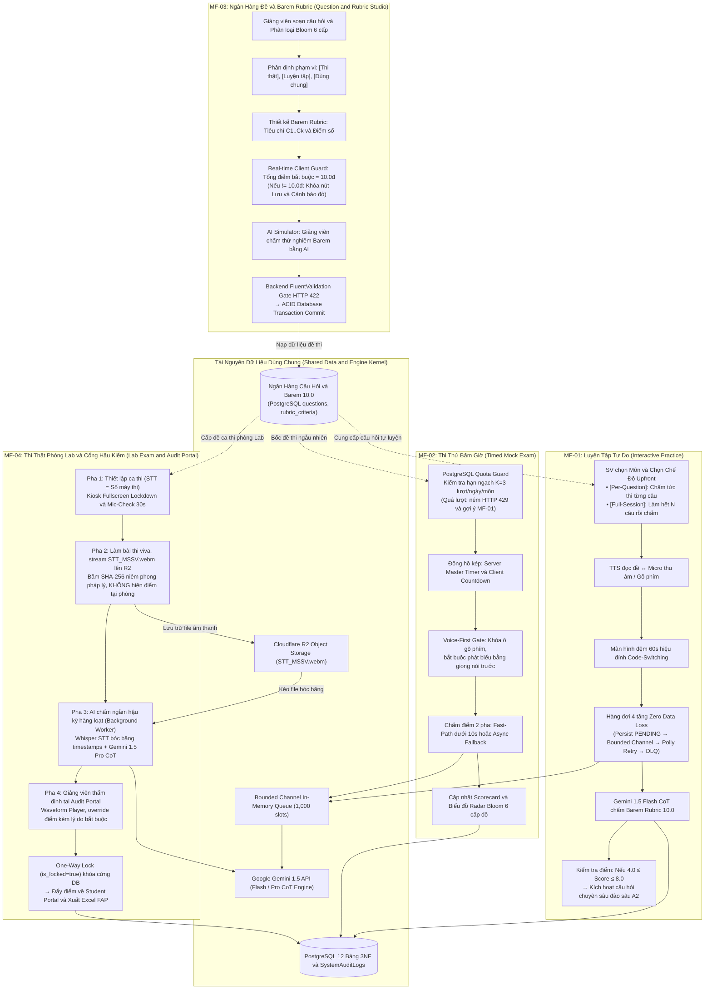

# 🏛️ TÀI LIỆU KIẾN TRÚC TỔNG THỂ HỆ THỐNG (MASTER SYSTEM ARCHITECTURE)
## HỆ THỐNG LUYỆN THI & ĐÁNH GIÁ VẤN ĐÁP BẰNG LLM CHO NGÀNH KỸ THUẬT PHẦN MỀM
### Đồ Án Tốt Nghiệp Capstone: FA26SE166 — Khoa Kỹ Thuật Phần Mềm — Đại Học FPT Hà Nội

> **Mã đề tài:** FA26SE166 | **Học kỳ:** Fall 2026 (FA26)  
> **Chuyên ngành:** Kỹ thuật Phần mềm (Software Engineering - SE) — Đại học FPT Hà Nội  
> **Giảng viên hướng dẫn:** ThS. Nguyễn Thị Cẩm Hương (`huongntc2@fpt.edu.vn`)  
> **Kiến trúc công nghệ chuẩn:** .NET 8 Clean Architecture 4 tầng · React 19 (Vite) / Next.js 15 · PostgreSQL 16 · Google Gemini 1.5 Flash/Pro · Whisper STT · Cloudflare R2 · SignalR Core  
> **Tiêu chuẩn tài liệu:** Báo cáo Hội đồng chấm tốt nghiệp FPTU & Tài liệu Đặc tả Kỹ thuật Hệ thống (C4 Model, Clean Architecture, Deployment Topology, 4 Core Main Flows).

---

## MỤC LỤC TÀI LIỆU

1. [Sơ Đồ 1: Sơ Đồ Thành Phần Hệ Thống (C4 System Context & Component Diagram)](#so-do-1)
2. [Sơ Đồ 2: Sơ Đồ Kiến Trúc Phân Tầng Clean Architecture (.NET 8 + Next.js 15 / React 19)](#so-do-2)
3. [Sơ Đồ 3: Sơ Đồ Tuần Tự MF-04 (Sequence Diagram: Lab Exam & Audit Flow)](#so-do-3)
4. [Sơ Đồ 4: Sơ Đồ Kiến Trúc Hạ Tầng Vật Lý & Mạng (Physical / Network Deployment Architecture)](#so-do-4)
5. [Sơ Đồ 5: Tổng Quan Kiến Trúc Luồng Dữ Liệu 4 Main Flows (Data Architecture)](#so-do-5)
6. [Ma Trận Bền Vững & Ranh Giới Bảo Mật Hệ Thống (NFRs & Security Guarantees)](#nfrs-security)

---

## 1. SƠ ĐỒ THÀNH PHẦN HỆ THỐNG (C4 SYSTEM CONTEXT & COMPONENT DIAGRAM)

### 1.1. Sơ Đồ Mermaid

### 1.2. Diễn Giải Thành Phần & Ranh Giới Kỹ Thuật
- **Nguyên tắc Zero-Trust Identity:** Hệ thống loại bỏ tác nhân người dùng nặc danh (Zero Guest Access). 100% người dùng bắt buộc xác thực qua Google Workspace `@fpt.edu.vn` bằng chuẩn OAuth 2.0 Authorization Code Flow kèm PKCE.
- **Phân tách Presentation & Ingestion:** Client giao tiếp với Backend thông qua HTTPS REST API (`/api/v1/`) và kết nối hai chiều WebSocket SignalR Core (`/hubs/practice`). Trình duyệt xử lý audio cục bộ qua Web Speech API (độ trễ dưới 0.5s) và màn hình đệm 60s để người học sửa lỗi phát âm thuật ngữ tiếng Anh (*Code-Switching*).
- **Hàng đợi chịu tải & Phòng thủ 4 tầng (Zero Data Loss):**
  1. *Tầng 1 (Persist-First):* Ghi bài nộp xuống PostgreSQL dưới trạng thái `PENDING` trong dưới 100ms và trả ngay `HTTP 202 Accepted`.
  2. *Tầng 2 (Bounded Channel):* Điều tiết tải bằng `System.Threading.Channels` dung lượng 1,000 slots, kích hoạt cơ chế `Wait` khi quá tải.
  3. *Tầng 3 (Polly Exponential Backoff):* Tự động thử lại cuộc gọi Gemini AI (2s → 4s → 8s) khi gặp lỗi mạng/HTTP 429/503.
  4. *Tầng 4 (Dead-Letter Queue):* Cách ly các bài nộp lỗi vào bảng `dead_letter_queues`, tiến trình nền định kỳ 5 phút quét chấm bù tự động.

---

## 2. SƠ ĐỒ KIẾN TRÚC PHÂN TẦNG CLEAN ARCHITECTURE (.NET 8 + NEXT.JS 15 / REACT 19)

### 2.1. Sơ Đồ Mermaid

### 2.2. Diễn Giải Ranh Giới 4 Tầng & Nguyên Lý Dependency Inversion
- **Domain Layer (Hạt nhân bất biến):** Chứa 100% C# POCO thuần túy, tuyệt đối không tham chiếu bất kỳ thư viện ngoài, framework hay ORM nào. Nắm giữ quy tắc nghiệp vụ cốt lõi: các trạng thái bài thi (`SubmissionStatus`), phân loại Bloom, và ngoại lệ nghiệp vụ (`ScoreSheetLockedException`).
- **Application Layer (Điều phối nghiệp vụ):** Độc lập với cơ sở dữ liệu và công nghệ bên ngoài. Triển khai mẫu thiết kế CQRS qua MediatR; mọi thao tác ghi dữ liệu đều đóng gói trong Command, thao tác đọc trong Query. Toàn bộ nghiệp vụ kiểm tra tính hợp lệ của Barem Rubric 10.0đ được kiểm soát tập trung qua `FluentValidation` và `ValidationBehavior`.
- **Infrastructure Layer (Triển khai kỹ thuật):** Chịu trách nhiệm thực thi các Interfaces định nghĩa tại Application: kết nối PostgreSQL 16 qua EF Core 8, điều phối hàng đợi bộ nhớ `System.Threading.Channels`, giao tiếp Google Gemini API, bóc băng Whisper STT, lưu trữ Cloudflare R2, và chốt chặn khóa điểm bất biến bằng `OneWayLockInterceptor`.
- **API Layer (Cổng tiếp nhận & Host):** Chịu trách nhiệm khởi tạo Composition Root (`Program.cs`), tiếp nhận HTTP Request, đóng gói mã lỗi thống nhất theo chuẩn RFC 7807 (`ProblemDetails`), và duy trì kết nối thời gian thực SignalR Hub.

---

## 3. SƠ ĐỒ TUẦN TỰ MF-04 (SEQUENCE DIAGRAM: LAB EXAM & AUDIT FLOW)

### 3.1. Sơ Đồ Mermaid

### 3.2. Diễn Giải Quy Trình Khảo Thí 4 Pha (MF-04)
1. **Chuẩn hóa định danh `STT = Số Máy Thi`:** Sinh viên bước vào phòng lab cách âm ngồi vào máy theo đúng số thứ tự STT danh sách thi. Mọi dữ liệu thu âm được định danh tự động theo cú pháp bắt buộc **`STT_MSSV.webm`** (ví dụ: `01_SE170123.webm`), triệt tiêu hoàn toàn rủi ro nhầm lẫn bài nộp.
2. **Nguyên tắc Bảo mật Phòng Thi — Zero Immediate Score:** Máy trạm phòng thi sau khi kết thúc giờ làm bài chỉ hiển thị thông báo niêm phong an toàn và yêu cầu thí sinh trật tự rời phòng thi. Tuyệt đối không hiển thị điểm số hay nhận xét của AI tại phòng lab, ngăn chặn triệt để tình trạng hoang mang hoặc tranh cãi tại chỗ.
3. **Bóc băng Whisper kèm Timestamps & Chấm Hậu kỳ:** AI chấm ngầm độc lập ở Pha 3 sau khi ca thi đóng. Mô hình Whisper Large-v3 bóc băng âm thanh có gắn mốc thời gian chi tiết từng câu nói, giúp Gemini 1.5 Pro trích dẫn bằng chứng cụ thể vào Scorecard.
4. **Cổng Hậu kiểm Giảng viên & Khóa Một Chiều (One-Way Lock):** Giảng viên nghe lại bản ghi âm trên Waveform Player (hỗ trợ tua 1.25x/1.5x và nhảy nhanh đến timestamp trích dẫn). Giảng viên có toàn quyền điều chỉnh điểm kèm theo **lý do giải trình bắt buộc**. Khi bấm nút khóa điểm, hệ thống kích hoạt transaction đặt cờ `is_locked = true`, kích hoạt `OneWayLockInterceptor` tại DB để ngăn chặn mọi hành vi can thiệp trái phép sau đó.
5. **Vòng đời 5 trạng thái bài thi thật:**
   $$\mathbf{SUBMITTED} \longrightarrow \mathbf{TRANSCRIBED} \longrightarrow \mathbf{AI\_GRADED} \longrightarrow \mathbf{AUDITED} \longrightarrow \mathbf{LOCKED}$$
   *(Hiển thị chuẩn hóa: **SUBMITTED** → **TRANSCRIBED** → **AI_GRADED** → **AUDITED** → **LOCKED**)*

---

## 4. SƠ ĐỒ KIẾN TRÚC HẠ TẦNG VẬT LÝ & MẠNG (PHYSICAL / NETWORK DEPLOYMENT ARCHITECTURE)

### 4.1. Sơ Đồ Mermaid

### 4.2. Bảng Phân Bổ Cổng Mạng, Vùng Cách Ly & Bảo Mật

| Vùng mạng | Thành phần | Cổng tiếp nhận | Giao thức | Chính sách truy cập & Bảo vệ an ninh |
|:---|:---|:---:|:---:|:---|
| **Public Edge** | Cloudflare Edge Network | 443 (HTTPS), 80 (HTTP) | TLS 1.3 / WSS | WAF kiểm soát botnet, chống DDoS Layer 7, chặn truy cập ngoài dải IP FPT nếu ca thi bật giới hạn. |
| **Ingress Gateway** | Nginx Reverse Proxy | 443, 80 | HTTPS / WSS | Tiếp nhận traffic từ Cloudflare, chuyển hướng 80 → 443, cấu hình Rate Limiting 100 req/s/IP. |
| **Frontend App** | `oralexam-frontend` | 3000 (Internal) | HTTP | Chỉ lắng nghe gói tin từ Nginx trên mạng ảo Docker bridge (`oralexam-net`). |
| **Backend API** | `oralexam-backend` | 5000 (Internal) | HTTP / WSS | Chạy Kestrel Server, tiếp nhận REST request và kết nối WebSocket SignalR `/hubs/practice`. |
| **Database Tier** | `oralexam-postgres` | 5432 (Internal) | TCP / PostgreSQL | **CẤM TUYỆT ĐỐI mở port 5432 ra Internet**. Chỉ cho phép Backend kết nối nội bộ qua mật khẩu mạnh mã hóa. |
| **Object Storage** | Cloudflare R2 | 443 (HTTPS) | S3 API | Lưu trữ âm thanh bài thi phòng Lab với chính sách **Zero-Egress** không tính phí tải về, phân quyền qua Pre-signed URL có hạn 15 phút. |

---

## 5. TỔNG QUAN KIẾN TRÚC LUỒNG DỮ LIỆU 4 MAIN FLOWS (DATA ARCHITECTURE)

### 5.1. Sơ Đồ Mermaid

### 5.2. Ma Trận So Sánh Điểm Nhấn 4 Core Main Flows

| Đặc tính kiến trúc | MF-01: Luyện tập tự do | MF-02: Thi thử bấm giờ | MF-03: Quản lý ngân hàng đề | MF-04: Thi thật phòng Lab |
|:---|:---|:---|:---|:---|
| **Tác nhân chính** | Sinh viên SE (`ACT-01`) | Sinh viên SE (`ACT-01`) | Giảng viên (`ACT-02`) | Sinh viên (`ACT-01`) & Giảng viên (`ACT-02`) |
| **Mục tiêu sư phạm** | Formative Assessment (Rèn luyện phản xạ) | Mock Pressure (Tập dượt áp lực thời gian) | Governance (Chuẩn hóa chuẩn đầu ra) | Summative Assessment (Đánh giá học phần lấy điểm) |
| **Cơ chế kiểm soát** | Tự do chọn chế độ Upfront (`[Per-Q]` vs `[Full]`) | Daily Quota Guard (K=3 lượt/ngày) | Ràng buộc bất biến ∑ Barem ≡ 10.0đ | Kiosk Lockdown, STT=Số máy, One-Way Lock |
| **Xử lý âm thanh** | Web Speech STT/TTS (dưới 0.5s) | Voice-First Gate (Bắt buộc nói) | Text-based Barem & Audio Preview | Whisper Large-v3 STT bóc băng có timestamps |
| **Lưu trữ âm thanh** | Không lưu trữ (tối ưu chi phí) | Không lưu trữ (tối ưu chi phí) | Không áp dụng | Cloudflare R2 (`STT_MSSV.webm`) kèm SHA-256 |
| **Mô hình AI** | Gemini 1.5 Flash (CoT 3 bước) | Gemini 1.5 Flash (Dual-Path) | Gemini 1.5 Flash (AI Simulator) | Gemini 1.5 Pro (Batch Grading hậu kỳ) |
| **Tính năng độc bản** | Adaptive Follow-up A2 (4.0 ≤ Score ≤ 8.0) | Biểu đồ Radar Bloom 6 mức độ | AI Simulator thẩm định độ nhạy Barem | Cổng Thẩm định Giảng viên & Khóa điểm FAP |

---

## 6. MA TRẬN BỀN VỮNG & RANH GIỚI BẢO MẬT HỆ THỐNG (NFRS & SECURITY GUARANTEES)

1. **Hiệu năng & Tốc độ đáp ứng (NFR-P1 & NFR-P2):**
   - Phản hồi chấm điểm tức thời qua Gemini 1.5 Flash hoàn tất trong vòng ≤ 10 giây (thực tế đo lường đạt 1.8s - 2.5s).
   - Nhận diện giọng nói phía client qua Web Speech API đạt độ trễ cực thấp dưới 0.5 giây.
   - Thao tác nộp bài ghi nhận đĩa cứng PostgreSQL trong dưới 100ms và trả mã `202 Accepted` trước khi phân luồng vào hàng đợi.
2. **Bảo đảm Không Mất Dữ Liệu (Zero Data Loss - NFR-R1):**
   - Hàng đợi `BoundedChannel` 1,000 slots kết hợp cơ chế `Wait` ngăn chặn tràn bộ nhớ khi lượng truy cập tăng vọt đột biến.
   - Cơ chế thử lại tự động Polly Exponential Backoff (2s → 4s → 8s) bảo vệ hệ thống trước sự cố chập chờn mạng hoặc nghẽn API Google Cloud.
   - Các tác vụ chấm điểm thất bại sau 3 lần retry được lưu trữ vĩnh viễn trong bảng `dead_letter_queues`, sẵn sàng cho tiến trình tự động chấm bù hoặc thao tác Replay thủ công từ Quản trị viên.
3. **Toàn vẹn Pháp lý & Chống Can Thiệp Điểm Thi (NFR-S1 & NFR-S2):**
   - Toàn bộ file âm thanh thi thật tại phòng Lab được niêm phong bằng mã băm SHA-256 ngay tại thời điểm nộp bài trên máy trạm Kiosk và kiểm chứng lại tại Server.
   - Quy trình khóa điểm một chiều (`is_locked = true`) kích hoạt `OneWayLockInterceptor` tại tầng Entity Framework Core, triệt tiêu hoàn toàn nguy cơ sửa điểm sau khi Giảng viên đã ký số và chốt kết quả.
   - Mọi thao tác sửa điểm của Giảng viên bắt buộc phải có trường `overrideReason` và tự động lưu vết vào `system_audit_logs`.

---
*Tài liệu kiến trúc hệ thống chính thức phục vụ đồ án tốt nghiệp Capstone FA26SE166 — Đại học FPT Hà Nội.*
