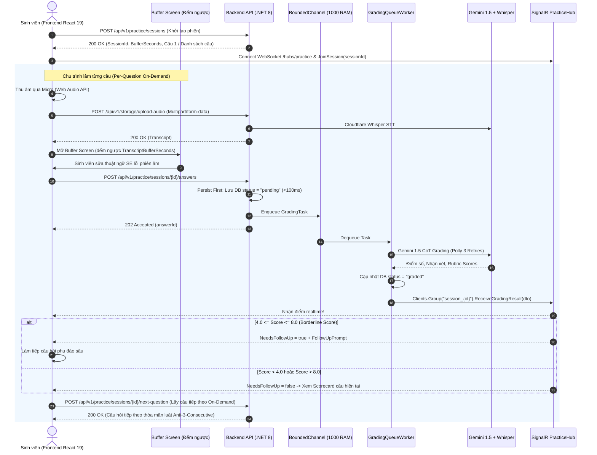

# 📘 TÀI LIỆU TÍCH HỢP FRONTEND — LUỒNG MF-01 (INTERACTIVE PRACTICE)
## DỰ ÁN: LLM ORAL EXAM SYSTEM (FA26SE166 — ĐẠI HỌC FPT TP.HCM)

> **Dành cho:** Frontend Developers (Lê Vũ Hoàng & Nguyễn Đăng Hải)  
> **Tác giả:** Senior Backend Engineer & Integration Specialist  
> **Phiên bản:** 1.0 (Production-Ready) — Cập nhật: 2026-10-07  
> **Mục tiêu:** Hướng dẫn tích hợp toàn diện giao diện React 19 với Backend .NET 8 cho luồng Luyện tập tương tác tự do (MF-01), bao gồm RESTful APIs, Realtime WebSocket SignalR, Buffer Screen và Follow-up Engine.

---

## 📑 MỤC LỤC
1. [Kiến Trúc Tổng Quan Luồng MF-01](#1-kiến-trúc-tổng-quan-luồng-mf-01)
2. [Quy Chuẩn Kết Nối & Môi Trường](#2-quy-chuẩn-kết-nối--môi-trường)
3. [Danh Sách RESTful API Endpoints](#3-danh-sách-restful-api-endpoints)
   - [3.1. Khởi tạo phiên luyện tập (`POST /api/v1/practice/sessions`)](#31-khởi-tạo-phiên-luyện-tập-post-apiv1practicesessions)
   - [3.2. Lấy chi tiết phiên & Scorecard (`GET /api/v1/practice/sessions/{sessionId}`)](#32-lấy-chi-tiết-phiên--scorecard-get-apiv1practicesessionssessionid)
   - [3.3. Tải Audio & Bóc Băng Whisper STT (`POST /api/v1/storage/upload-audio`)](#33-tải-audio--bóc-băng-whisper-stt-post-apiv1storageupload-audio)
   - [3.4. Nộp câu trả lời đơn lẻ [Per-Question] (`POST /api/v1/practice/sessions/{sessionId}/answers`)](#34-nộp-câu-trả-lời-đơn-lẻ-per-question-post-apiv1practicesessionssessionidanswers)
   - [3.5. Nộp trọn gói [Full-Session] (`POST /api/v1/practice/sessions/{sessionId}/batch-submit`)](#35-nộp-trọn-gói-full-session-post-apiv1practicesessionssessionidbatch-submit)
   - [3.6. Hoàn thành phiên luyện tập (`POST /api/v1/practice/sessions/{sessionId}/complete`)](#36-hoàn-thành-phiên-luyện-tập-post-apiv1practicesessionssessionidcomplete)
   - [3.7. Lấy danh sách lịch sử luyện tập (`GET /api/v1/practice/student/history`)](#37-lấy-danh-sách-lịch-sử-luyện-tập-get-apiv1practicestudenthistory)
   - [3.8. Lấy câu hỏi tiếp theo theo yêu cầu [Per-Question On-Demand] (`POST /api/v1/practice/sessions/{sessionId}/next-question`)](#38-lấy-câu-hỏi-tiếp-theo-theo-yêu-cầu-per-question-on-demand-post-apiv1practicesessionssessionidnext-question)
4. [Chuẩn Xử Lý Lỗi RFC 7807 Problem Details](#4-chuẩn-xử-lý-lỗi-rfc-7807-problem-details)
5. [Tích Hợp Realtime SignalR (`@microsoft/signalr`)](#5-tích-hợp-realtime-signalr-microsoftsignalr)
   - [5.1. Cơ chế SignalR Group & Sự kiện](#51-cơ-chế-signalr-group--sự-kiện)
   - [5.2. Mẫu TypeScript Hook: `usePracticeHub.ts`](#52-mẫu-typescript-hook-usepracticehubts)
   - [5.3. Payload JSON Mẫu Sự Kiện Realtime](#53-payload-json-mẫu-sự-kiện-realtime)
6. [Đặc Tả Nghiệp Vụ Buffer Screen, Follow-up Engine, Anti-Consecutive & Inactivity Timeout](#6-đặc-tả-nghiệp-vụ-buffer-screen-follow-up-engine-anti-consecutive--inactivity-timeout)
   - [6.1. Buffer Screen (Màn hình đệm hiệu đính)](#61-buffer-screen-màn-hình-đệm-hiệu-đính)
   - [6.2. Follow-up Engine (Câu hỏi phụ chuyên sâu)](#62-follow-up-engine-câu-hỏi-phụ-chuyên-sâu)
   - [6.3. Thuật toán Anti-3-Consecutive Randomizer](#63-thuật-toán-anti-3-consecutive-randomizer)
   - [6.4. Cơ chế Timeout 10 phút không tương tác (Inactivity Timeout)](#64-cơ-chế-timeout-10-phút-không-tương-tác-inactivity-timeout)
7. [Checklist Tác Chiến Cho Frontend Dev](#7-checklist-tác-chiến-cho-frontend-dev)
8. [Công Cụ Test Độc Lập Cho Frontend (`docs/MF01_Mini_Tester.html`)](#8-công-cụ-test-độc-lập-cho-frontend-docsmf01_mini_testerhtml)

---

## 1. KIẾN TRÚC TỔNG QUAN LUỒNG MF-01

Luồng **MF-01 (Interactive Practice - Luyện tập tương tác tự do)** được thiết kế theo kiến trúc phản hồi tức thì phân tầng (Tiered Realtime Feedback Architecture):



### 2 Chế Độ Luyện Tập (Practice Modes):
1. **Luyện từng câu theo yêu cầu (`[Per-Question On-Demand]`)**: 
   - Sinh viên có thể chọn **đơn lẻ** (`"easy"`, `"medium"`, `"hard"`) hoặc **tổ hợp độ khó** (ví dụ `["easy", "medium"]`, `["easy", "medium", "hard"]`).
   - Không bắt buộc chốt trước số lượng câu hỏi (`questionCount` là tùy chọn). Phiên cấp câu đầu tiên (Câu 1) khi bắt đầu, sau đó sinh viên trả lời và gọi `POST /next-question` để lấy câu tiếp theo theo nhu cầu (On-Demand) đến khi muốn dừng thì ấn Hoàn thành.
   - **Luật Random Chặn 3 Câu Cùng Mức (Anti-3-Consecutive Same-Level Rule)**: Trong bất kỳ chuỗi 3 câu liên tiếp nào, tối đa chỉ có 2 câu chung mức độ. Khi 2 câu liền trước cùng độ khó, lần bốc tiếp theo bắt buộc chuyển sang mức khác.
   - **Không lặp câu**: Tuyệt đối không cấp lại câu hỏi sinh viên đã trả lời trong phiên.
   - **Kích hoạt Follow-up**: Khi điểm số câu trả lời rơi vào ranh giới $4.0 \le \text{Score} \le 8.0$, hệ thống kích hoạt câu hỏi phụ đào sâu (`NeedsFollowUp = true`, kèm `FollowUpPrompt`). Nếu điểm $< 4.0$ hoặc $> 8.0$, hệ thống bỏ qua câu hỏi phụ và mở ngay bảng điểm Scorecard.
2. **Luyện trọn gói theo tiến trình (`[Full-Session Progressive]`)**:
   - Sinh viên nhập số lượng câu hỏi muốn làm từ **3 đến 10 câu** (do `MinMixedPracticeQuestions` và `MaxMixedPracticeQuestions` trong `system_configs` cấu hình).
   - Hệ thống tự động chia đều theo tiến trình từ Dễ đến Khó: cấp trọn gói toàn bộ câu hỏi và sắp xếp theo thứ tự phát vấn tăng dần từ Dễ $\to$ Trung bình $\to$ Khó.
   - Nộp toàn bộ 1 lần qua endpoint `batch-submit` hoặc nộp từng câu.
   - **TUYỆT ĐỐI KHÔNG có câu hỏi Follow-up** (`NeedsFollowUp` luôn bằng `false`).
   - Sau khi nộp, hệ thống xử lý chấm toàn bộ và sinh viên nhận bảng điểm Scorecard tổng kết.
3. **Cơ chế Timeout 10 phút không tương tác (Inactivity Timeout)**:
   - Áp dụng cho cả 2 chế độ: Nếu sinh viên không tương tác (không nộp câu trả lời, không lấy câu tiếp theo) quá `SessionInactivityTimeoutMinutes` (mặc định **10 phút**), phiên tự động kết thúc (`status = "completed"`).
   - Mọi thao tác tiếp theo sẽ nhận mã lỗi **HTTP 410 Gone** (Session Timed Out). Toàn bộ câu trả lời và điểm số đã hoàn thành trước đó được bảo toàn 100%.

---

## 2. QUY CHUẨN KẾT NỐI & MÔI TRƯỜNG

* **Base URL Backend:** `http://localhost:5000` (hoặc URL Reverse Proxy cổng 5000 theo Cam kết bất biến #4).
* **SignalR WebSocket URL:** `http://localhost:5000/hubs/practice`.
* **Standard Headers Bắt Buộc:**
  ```http
  Authorization: Bearer <JWT_ACCESS_TOKEN>
  Content-Type: application/json
  Accept: application/json
  ```
* **Multipart Form-Data Headers (Cho Upload Audio):**
  ```http
  Authorization: Bearer <JWT_ACCESS_TOKEN>
  (KHÔNG set Content-Type thủ công, để trình duyệt tự sinh kèm boundary)
  ```

---

## 3. DANH SÁCH RESTFUL API ENDPOINTS

### 3.1. Khởi tạo phiên luyện tập (`POST /api/v1/practice/sessions`)
Khởi tạo một phiên luyện tập mới cho sinh viên theo môn học đã chọn.

* **Method:** `POST`
* **URL:** `/api/v1/practice/sessions`
* **Request Body:**
  ```json
  {
    "studentId": "3fa85f64-5717-4562-b3fc-2c963f66afa6",
    "courseId": "7b8e5c21-1234-4a56-8bc9-9e8d7c6b5a4f",
    "difficulties": ["easy", "medium"],
    "isFullSession": false,
    "topic": "Clean Architecture & Design Patterns",
    "questionCount": null
  }
  ```
  * `studentId` (*Guid*, optional): ID tài khoản sinh viên đăng nhập (nếu không truyền, backend tự lấy từ JWT).
  * `courseId` (*Guid*, required): ID môn học cần luyện tập.
  * `difficulties` (*string[]*, optional/khuyên dùng): Mảng các độ khó muốn luyện tập, ví dụ: `["easy"]`, `["easy", "medium"]`, `["easy", "hard"]`, `["medium", "hard"]`, hoặc `["easy", "medium", "hard"]`.
  * `difficulty` (*string*, optional, tương thích ngược): Mức độ khó đơn lẻ (`"easy"`, `"medium"`, `"hard"`) hoặc `"progressive"` ("Ngẫu nhiên từ dễ đến khó", tự động gán cả 3 mức `["easy", "medium", "hard"]`).
  * `isFullSession` (*boolean*, optional, default: `false`):
    - `false`: Chế độ **[Per-Question On-Demand]** (luyện từng câu, lấy câu tiếp theo qua `POST /next-question`, có follow-up khi điểm 4.0–8.0).
    - `true`: Chế độ **[Full-Session Progressive]** (luyện trọn gói liền mạch không follow-up, chia đều tiến trình Dễ $\to$ Trung bình $\to$ Khó).
  * `topic` (*string?*, optional): Chủ đề mong muốn (nếu có).
  * `questionCount` (*int?*, optional/required):
    - Đối với `[Per-Question]` (`isFullSession: false`): **Không bắt buộc** (optional). Khi khởi tạo, hệ thống cấp ngay Câu 1 trong mảng `questions`.
    - Đối với `[Full-Session]` (`isFullSession: true`) hoặc khi `difficulty = "progressive"`: **Bắt buộc** từ 3 đến 10 câu (ràng buộc bởi `MinMixedPracticeQuestions` và `MaxMixedPracticeQuestions` trong `system_configs`). Cấp trọn gói toàn bộ câu hỏi.
* **Response Success (HTTP 200 OK):**
  ```json
  {
    "sessionId": "b4a3c2d1-9876-4abc-9def-0123456789ab",
    "transcriptBufferSeconds": 60,
    "questions": [
      {
        "questionId": "11111111-2222-3333-4444-555555555555",
        "content": "Giải thích nguyên lý Dependency Inversion Principle (DIP) trong SOLID và cho ví dụ áp dụng trong .NET 8.",
        "rubricCriteria": [
          "Định nghĩa chính xác DIP (High-level không phụ thuộc Low-level)",
          "Mô tả vai trò của Interface/Abstraction",
          "Ví dụ triển khai Dependency Injection trong C# / .NET 8"
        ]
      },
      {
        "questionId": "66666666-7777-8888-9999-000000000000",
        "content": "Phân biệt sự khác nhau giữa CQRS Command và CQRS Query.",
        "rubricCriteria": [
          "Mục đích Command làm thay đổi trạng thái (State change)",
          "Mục đích Query chỉ đọc dữ liệu (Read-only, AsNoTracking)",
          "Lợi ích tách biệt hai mô hình"
        ]
      }
    ]
  }
  ```
  > ⚠️ **Lưu ý Frontend:** Lưu ngay `sessionId` và `transcriptBufferSeconds` vào state. Dùng `transcriptBufferSeconds` để khởi tạo đồng hồ đếm ngược cho màn hình đệm Buffer Screen.

---

### 3.2. Lấy chi tiết phiên & Scorecard (`GET /api/v1/practice/sessions/{sessionId}`)
Lấy toàn bộ dữ liệu phiên luyện tập, danh sách câu hỏi, câu trả lời đã nộp và bảng điểm Scorecard chi tiết từng tiêu chí.

* **Method:** `GET`
* **URL:** `/api/v1/practice/sessions/{sessionId}`
* **Response Success (HTTP 200 OK):**
  ```json
  {
    "sessionId": "b4a3c2d1-9876-4abc-9def-0123456789ab",
    "courseId": "7b8e5c21-1234-4a56-8bc9-9e8d7c6b5a4f",
    "courseCode": "SWD392",
    "courseName": "Software Architecture and Design",
    "studentId": "3fa85f64-5717-4562-b3fc-2c963f66afa6",
    "studentName": "Nguyen Van A",
    "practiceMode": "per_question",
    "status": "in_progress",
    "transcriptBufferSeconds": 60,
    "startedAt": "2026-10-07T07:00:00Z",
    "endedAt": null,
    "questions": [
      {
        "questionId": "11111111-2222-3333-4444-555555555555",
        "content": "Giải thích nguyên lý Dependency Inversion Principle (DIP)...",
        "rubricCriteria": [
          "Định nghĩa chính xác DIP",
          "Mô tả vai trò Interface",
          "Ví dụ .NET 8"
        ]
      }
    ],
    "answers": [
      {
        "answerId": "c3d4e5f6-7a8b-9c0d-1e2f-3a4b5c6d7e8f",
        "questionId": "11111111-2222-3333-4444-555555555555",
        "answerText": "Nguyên lý DIP phát biểu rằng các module cấp cao không nên phụ thuộc trực tiếp vào module cấp thấp...",
        "isFollowUp": false,
        "parentAnswerId": null,
        "status": "graded",
        "submittedAt": "2026-10-07T07:02:15Z",
        "totalScore": 6.5,
        "feedback": "Bạn trả lời đúng trọng tâm về định nghĩa DIP và áp dụng Interface. Tuy nhiên phần ví dụ về ServiceCollection chưa chi tiết.",
        "confidenceScore": 0.92,
        "isSuspicious": false,
        "needsFollowUp": true,
        "followUpPrompt": "Bạn có thể giải thích cụ thể hơn cách cấu hình AddScoped và AddTransient trong file Program.cs khi áp dụng DIP không?",
        "criteriaScores": [
          {
            "criterionId": "aaaa1111-0000-0000-0000-000000000001",
            "criterionName": "Định nghĩa chính xác DIP",
            "score": 3.0,
            "comment": "Trình bày rõ ràng khái niệm Abstraction."
          },
          {
            "criterionId": "aaaa1111-0000-0000-0000-000000000002",
            "criterionName": "Ví dụ triển khai .NET 8",
            "score": 3.5,
            "comment": "Cần nêu rõ lifecycle của dependency."
          }
        ]
      }
    ]
  }
  ```

---

### 3.3. Tải Audio & Bóc Băng Whisper STT (`POST /api/v1/storage/upload-audio`)
Chuyển tiếp file ghi âm trực tiếp qua API Cloudflare Whisper dạng stream để bóc băng văn bản tức thì phục vụ Buffer Screen (không lưu trữ lên Cloudflare R2, không băm SHA-256 cho luyện tập, và không lưu URL vào cơ sở dữ liệu).

* **Method:** `POST`
* **URL:** `/api/v1/storage/upload-audio`
* **Request Type:** `multipart/form-data`
* **Form Field:**
  * `file`: File nhị phân âm thanh (`audio/webm` hoặc `audio/wav`).
* **Response Success (HTTP 200 OK):**
  ```json
  {
    "transcript": "Nguyên lý DIP trong SOLID quy định rằng các module cấp cao không nên phụ thuộc vào module cấp thấp, mà cả hai nên phụ thuộc vào abstraction."
  }
  ```
  > 💡 **Quy trình Frontend:** Sau khi gọi API này nhận về `transcript`, Frontend hiển thị `transcript` trên **Buffer Screen** kèm đồng hồ đếm ngược để sinh viên có thể hiệu đính các từ vựng chuyên ngành bị nhận diện sai trước khi bấm nộp bài.

---

### 3.4. Nộp câu trả lời đơn lẻ [Per-Question] (`POST /api/v1/practice/sessions/{sessionId}/answers`)
Nộp câu trả lời cho một câu hỏi cụ thể trong chế độ `[Per-Question]`.

* **Method:** `POST`
* **URL:** `/api/v1/practice/sessions/{sessionId}/answers`
* **Request Body:**
  ```json
  {
    "questionId": "11111111-2222-3333-4444-555555555555",
    "studentId": "3fa85f64-5717-4562-b3fc-2c963f66afa6",
    "answerText": "Nguyên lý DIP trong SOLID quy định rằng các module cấp cao không nên phụ thuộc vào module cấp thấp...",
    "isFollowUp": false,
    "parentAnswerId": null
  }
  ```
  * `questionId` (*Guid*, required): ID câu hỏi.
  * `studentId` (*Guid*, required): ID sinh viên.
  * `answerText` (*string*, required): Văn bản trả lời (sau khi đã hiệu đính trên Buffer Screen).
  * `isFollowUp` (*boolean*, required): `false` cho câu hỏi chính, `true` nếu đang trả lời câu hỏi phụ.
  * `parentAnswerId` (*Guid?*, optional): ID câu trả lời cha nếu `isFollowUp == true`.
* **Response Success (HTTP 202 Accepted):**
  ```json
  {
    "answerId": "c3d4e5f6-7a8b-9c0d-1e2f-3a4b5c6d7e8f"
  }
  ```
  > ⚡ **Cơ chế Persist First:** Endpoint trả về ngay `HTTP 202 Accepted` trong $< 100$ms. Kết quả chấm điểm AI sẽ được gửi về qua SignalR Event `ReceiveGradingResult`.
* **Response Error (HTTP 410 Gone — Khi phiên bị timeout quá 10 phút không tương tác):**
  ```json
  {
    "type": "https://tools.ietf.org/html/rfc7807",
    "title": "Session Timed Out",
    "status": 410,
    "detail": "Phiên luyện tập đã kết thúc tự động do không có tương tác trong hơn 10 phút."
  }
  ```

---

### 3.5. Nộp trọn gói [Full-Session] (`POST /api/v1/practice/sessions/{sessionId}/batch-submit`)
Nộp toàn bộ câu trả lời của phiên luyện tập trong chế độ `[Full-Session]`.

* **Method:** `POST`
* **URL:** `/api/v1/practice/sessions/{sessionId}/batch-submit`
* **Request Body:**
  ```json
  {
    "studentId": "3fa85f64-5717-4562-b3fc-2c963f66afa6",
    "answers": [
      {
        "questionId": "11111111-2222-3333-4444-555555555555",
        "answerText": "Nguyên lý DIP là...",
        "isFollowUp": false,
        "parentAnswerId": null
      },
      {
        "questionId": "66666666-7777-8888-9999-000000000000",
        "answerText": "CQRS Command thay đổi trạng thái...",
        "isFollowUp": false,
        "parentAnswerId": null
      }
    ]
  }
  ```
* **Response Success (HTTP 202 Accepted):** Không có response body (Empty body với status `202 Accepted`).
* **Response Error (HTTP 410 Gone — Khi phiên bị timeout quá 10 phút không tương tác):**
  ```json
  {
    "type": "https://tools.ietf.org/html/rfc7807",
    "title": "Session Timed Out",
    "status": 410,
    "detail": "Phiên luyện tập đã kết thúc tự động do không có tương tác trong hơn 10 phút."
  }
  ```
---

### 3.6. Hoàn Thành Phiên Luyện Tập (`POST /api/v1/practice/sessions/{sessionId}/complete`)
Gọi API này khi sinh viên hoàn thành toàn bộ các câu hỏi trong phiên luyện tập hoặc bấm kết thúc phiên để cập nhật trạng thái `status = "completed"` và ghi nhận `ended_at = DateTime.UtcNow`.

* **Method:** `POST`
* **URL:** `/api/v1/practice/sessions/{sessionId}/complete`
* **Request Headers:**
  * `Authorization: Bearer <JWT_ACCESS_TOKEN>` (hoặc `X-User-Id: <GUID>` trong môi trường dev)
* **Response Success (HTTP 200 OK):**
  ```json
  {
    "message": "Phiên luyện tập đã kết thúc thành công."
  }
  ```

---

### 3.7. Lấy Danh Sách Lịch Sử Luyện Tập (`GET /api/v1/practice/student/history`)
Lấy toàn bộ lịch sử các phiên luyện tập của sinh viên để hiển thị lên Tab Luyện Tập của trang Lịch sử (FE-02) trên Student Portal.

* **Method:** `GET`
* **URL:** `/api/v1/practice/student/history` (hoặc `/api/v1/practice/student/history?studentId={GUID}`)
* **Request Headers:**
  * `Authorization: Bearer <JWT_ACCESS_TOKEN>`
* **Response Success (HTTP 200 OK):**
  ```json
  [
    {
      "sessionId": "e2a3b4c5-6789-0123-4567-89abcdef0123",
      "courseId": "44444444-5555-6666-7777-888888888888",
      "courseCode": "SWP391",
      "courseName": "Software Development Project",
      "practiceMode": "per_question",
      "status": "completed",
      "startedAt": "2026-10-08T03:00:00Z",
      "endedAt": "2026-10-08T03:25:30Z",
      "totalQuestions": 5,
      "answeredQuestions": 6,
      "averageScore": 7.8
    }
  ]
  ```

---

### 3.8. Lấy câu hỏi tiếp theo theo yêu cầu [Per-Question On-Demand] (`POST /api/v1/practice/sessions/{sessionId}/next-question`)
Cấp câu hỏi tiếp theo cho sinh viên trong chế độ `[Per-Question]` theo nhu cầu (On-Demand), tuân thủ thuật toán chống lặp 3 câu liên tiếp cùng mức và lazy check timeout 10 phút.

* **Method:** `POST`
* **URL:** `/api/v1/practice/sessions/{sessionId}/next-question` (hoặc `/api/v1/practice/sessions/{sessionId}/next-question?studentId={GUID}`)
* **Request Headers:**
  * `Authorization: Bearer <JWT_ACCESS_TOKEN>`
* **Request Body:** Không có (Empty Body).
* **Response Success (HTTP 200 OK — Khi còn câu hỏi khả dụng):**
  ```json
  {
    "hasMoreQuestions": true,
    "message": null,
    "question": {
      "id": "77777777-8888-9999-aaaa-bbbbbbbbbbbb",
      "content": "Giải thích cách hoạt động của Pattern Matching trong C# 12 và so sánh với switch-case truyền thống.",
      "difficulty": "medium",
      "questionOrder": 2,
      "rubricCriteria": [
        "Khái niệm Pattern Matching và các dạng pattern (Type, Relational, Positional)",
        "Tính rõ ràng và an toàn kiểu dữ liệu so với switch-case",
        "Ví dụ minh họa code C#"
      ]
    }
  }
  ```
* **Response Success (HTTP 200 OK — Khi đã làm hết toàn bộ câu trong kho theo mức độ đã chọn):**
  ```json
  {
    "hasMoreQuestions": false,
    "message": "Đã hoàn thành toàn bộ câu hỏi khả dụng theo mức độ đã chọn.",
    "question": null
  }
  ```
* **Response Error (HTTP 410 Gone — Khi phiên bị timeout quá 10 phút không tương tác):**
  ```json
  {
    "type": "https://tools.ietf.org/html/rfc7807",
    "title": "Session Timed Out",
    "status": 410,
    "detail": "Phiên luyện tập đã kết thúc tự động do không có tương tác trong hơn 10 phút."
  }
  ```
* **Response Error (HTTP 404 Not Found — Không tìm thấy phiên hoặc sai quyền):**
  ```json
  {
    "type": "https://tools.ietf.org/html/rfc7807",
    "title": "Session Not Found",
    "status": 404,
    "detail": "Phiên luyện tập không tồn tại hoặc không thuộc về sinh viên này."
  }
  ```

---

## 4. CHUẨN XỬ LÝ LỖI RFC 7807 PROBLEM DETAILS

Backend chuẩn hóa 100% các mã phản hồi lỗi theo chuẩn **RFC 7807 Problem Details**:

| Mã HTTP Status | Tình huống kích hoạt | Hướng xử lý trên Frontend |
|:---|:---|:---|
| **400 Bad Request** | Request không hợp lệ (Dữ liệu gửi lên sai định dạng hoặc phiên đã hoàn tất) | Hiển thị thông báo Toast cảnh báo người dùng. |
| **401 Unauthorized** | Token hết hạn hoặc không có Header Authorization | Điều hướng người dùng về trang Đăng nhập (`/login`). |
| **403 Forbidden** | Cố tình nộp bài của sinh viên khác hoặc can thiệp dữ liệu bị khóa | Hiển thị thông báo "Bạn không có quyền thực hiện hành động này". |
| **404 Not Found** | Không tìm thấy `sessionId`, `courseId` hoặc câu hỏi tương ứng | Hiển thị Empty State hoặc quay lại màn hình chọn môn học. |
| **410 Gone** | Phiên luyện tập đã bị timeout do không có tương tác quá 10 phút (`SessionInactivityTimeoutMinutes = 10`) | Hiển thị modal: *"Phiên luyện tập đã kết thúc do không tương tác trong hơn 10 phút. Kết quả các câu đã hoàn thành đã được lưu an toàn."* $\to$ Chuyển về màn hình Scorecard/Lịch sử. |
| **422 Unprocessable Entity** | Lỗi Validation nghiệp vụ (vd: số lượng câu hỏi ngoài khoảng 3..10 trong Full-Session) | Hiển thị lỗi đỏ trực tiếp dưới ô nhập liệu form. |
| **500 Internal Server Error** | Lỗi nội bộ hệ thống | Báo lỗi thân thiện, khuyến khích thử lại sau ít phút. |

### Cấu trúc JSON Problem Details mẫu:
```json
{
  "type": "https://oralexam.fpt.edu.vn/errors/validation-failed",
  "title": "Validation Error",
  "status": 422,
  "detail": "Dữ liệu gửi lên không thỏa mãn quy tắc nghiệp vụ.",
  "errors": {
    "QuestionCount": [
      "Số lượng câu hỏi cho chế độ Dễ đến Khó phải từ 3 đến 10 câu."
    ]
  }
}
```

---

## 5. TÍCH HỢP REALTIME SIGNALR (`@microsoft/signalr`)

### 5.1. Cơ chế SignalR Group & Sự kiện
* **WebSocket Endpoint:** `http://localhost:5000/hubs/practice`
* **GroupName:** `$"session_{sessionId}"`
* **Vòng đời kết nối:**
  1. Khi người dùng vào trang làm bài: Khởi tạo kết nối $\to$ `connection.start()` $\to$ Gọi `connection.invoke("JoinSession", sessionId)`.
  2. Lắng nghe 2 sự kiện:
     * `ReceiveGradingResult`: Nhận kết quả chấm điểm từng câu (`PracticeAnswerDetailDto`).
     * `ReceiveGradingError`: Nhận cảnh báo khi AI quá tải hoặc lỗi (`answerId: string, error: string`).
  3. Khi rời trang: Gọi `connection.invoke("LeaveSession", sessionId)` $\to$ `connection.stop()`.

---

### 5.2. Mẫu TypeScript Hook: `usePracticeHub.ts`
Dưới đây là mã nguồn hook React 19 chuẩn Clean Code để Frontend Dev tích hợp ngay:

```typescript
import { useEffect, useRef, useState, useCallback } from 'react';
import * as signalR from '@microsoft/signalr';

export interface PracticeEvaluationDetailDto {
  criterionId: string;
  criterionName: string;
  score: number;
  comment?: string;
}

export interface PracticeAnswerDetailDto {
  answerId: string;
  questionId: string;
  answerText: string;
  isFollowUp: boolean;
  parentAnswerId?: string;
  status: 'pending' | 'graded' | 'failed';
  submittedAt: string;
  totalScore?: number;
  feedback?: string;
  confidenceScore?: number;
  isSuspicious?: boolean;
  needsFollowUp: boolean;
  followUpPrompt?: string;
  criteriaScores: PracticeEvaluationDetailDto[];
}

interface UsePracticeHubProps {
  sessionId?: string;
  token?: string;
  onGradingResult?: (result: PracticeAnswerDetailDto) => void;
  onGradingError?: (answerId: string, error: string) => void;
}

export const usePracticeHub = ({
  sessionId,
  token,
  onGradingResult,
  onGradingError,
}: UsePracticeHubProps) => {
  const [isConnected, setIsConnected] = useState<boolean>(false);
  const hubConnectionRef = useRef<signalR.HubConnection | null>(null);

  useEffect(() => {
    if (!sessionId) return;

    // Khởi tạo Hub Connection
    const connection = new signalR.HubConnectionBuilder()
      .withUrl('http://localhost:5000/hubs/practice', {
        accessTokenFactory: () => token || '',
        skipNegotiation: false,
        transport: signalR.HttpTransportType.WebSockets | signalR.HttpTransportType.LongPolling,
      })
      .withAutomaticReconnect([0, 2000, 5000, 10000])
      .configureLogging(signalR.LogLevel.Information)
      .build();

    hubConnectionRef.current = connection;

    // Lắng nghe sự kiện trả kết quả chấm
    connection.on('ReceiveGradingResult', (result: PracticeAnswerDetailDto) => {
      console.log('[SignalR] Received Grading Result:', result);
      if (onGradingResult) {
        onGradingResult(result);
      }
    });

    // Lắng nghe sự kiện lỗi chấm điểm
    connection.on('ReceiveGradingError', (answerId: string, error: string) => {
      console.error(`[SignalR] Grading error for answer ${answerId}:`, error);
      if (onGradingError) {
        onGradingError(answerId, error);
      }
    });

    // Bắt đầu kết nối và JoinSession
    connection
      .start()
      .then(async () => {
        setIsConnected(true);
        console.log('[SignalR] Connected to PracticeHub successfully.');
        await connection.invoke('JoinSession', sessionId);
        console.log(`[SignalR] Joined group: session_${sessionId}`);
      })
      .catch((err) => {
        console.error('[SignalR] Connection error:', err);
        setIsConnected(false);
      });

    // Cleanup khi component unmount hoặc sessionId thay đổi
    return () => {
      if (connection.state === signalR.HubConnectionState.Connected) {
        connection
          .invoke('LeaveSession', sessionId)
          .catch((err) => console.warn('[SignalR] LeaveSession error:', err))
          .finally(() => {
            connection.stop();
            setIsConnected(false);
          });
      } else {
        connection.stop();
        setIsConnected(false);
      }
    };
  }, [sessionId, token, onGradingResult, onGradingError]);

  return {
    isConnected,
  };
};
```

---

### 5.3. Payload JSON Mẫu Sự Kiện Realtime

#### 🎯 Sự kiện `ReceiveGradingResult`:
Được kích hoạt khi AI hoàn tất chấm điểm:
```json
{
  "answerId": "c3d4e5f6-7a8b-9c0d-1e2f-3a4b5c6d7e8f",
  "questionId": "11111111-2222-3333-4444-555555555555",
  "answerText": "Nguyên lý DIP quy định các module cấp cao không nên phụ thuộc trực tiếp vào module cấp thấp...",
  "isFollowUp": false,
  "parentAnswerId": null,
  "status": "graded",
  "submittedAt": "2026-10-07T07:05:00Z",
  "totalScore": 6.8,
  "feedback": "Phần trình bày đúng định nghĩa cốt lõi của DIP. Bạn đã chỉ ra được lợi ích giảm coupling.",
  "confidenceScore": 0.94,
  "isSuspicious": false,
  "needsFollowUp": true,
  "followUpPrompt": "Hãy giải thích thêm cách áp dụng IoC Container trong ASP.NET Core để hiện thực hóa nguyên lý này.",
  "criteriaScores": [
    {
      "criterionId": "aaaa1111-0000-0000-0000-000000000001",
      "criterionName": "Định nghĩa DIP",
      "score": 3.4,
      "comment": "Chính xác, súc tích."
    },
    {
      "criterionId": "aaaa1111-0000-0000-0000-000000000002",
      "criterionName": "Ứng dụng thực tế",
      "score": 3.4,
      "comment": "Nên bổ sung minh họa mã nguồn."
    }
  ]
}
```

#### ⚠️ Sự kiện `ReceiveGradingError`:
Được kích hoạt khi AI gặp sự cố quá tải (đã đẩy vào DLQ để xử lý sau):
- Tham số 1: `answerId` (`"c3d4e5f6-7a8b-9c0d-1e2f-3a4b5c6d7e8f"`)
- Tham số 2: `error` (`"Hệ thống AI hiện đang quá tải. Đã lưu bài làm và sẽ chấm lại sau."`)

---

## 6. ĐẶC TẢ NGHIỆP VỤ BUFFER SCREEN, FOLLOW-UP ENGINE, ANTI-CONSECUTIVE & INACTIVITY TIMEOUT

### 6.1. Buffer Screen (Màn hình đệm hiệu đính)
- **Mục đích:** Khắc phục nhược điểm nhận diện sai các thuật ngữ kỹ thuật chuyên ngành Kỹ thuật Phần mềm (Code-Switching SE Glossary như: *Polymorphism, Asynchronous, Docker, Kubernetes, MediatR, CQRS*).
- **Cơ chế hoạt động:**
  1. Sau khi sinh viên ngừng ghi âm micro, Frontend tự động tải file lên `POST /api/v1/storage/upload-audio`.
  2. Nhận kết quả `transcript` từ Whisper STT và hiển thị ngay trên một Modal/Màn hình đệm trung gian.
  3. Bật đồng hồ đếm ngược dựa trên giá trị `transcriptBufferSeconds` nhận từ API tạo phiên (10–300 giây, mặc định **60 giây**).
  4. Sinh viên có thể:
     - Nghe lại đoạn audio vừa nói qua trình phát Waveform Player.
     - Chỉnh sửa trực tiếp các từ ngữ bị sai chính tả trong khung textarea `transcript`.
     - Nhấn nút **"Nộp Ngay"** để hoàn tất ngay lập tức.
  5. Nếu đồng hồ đếm ngược về `0s` mà sinh viên chưa bấm nộp: Hệ thống tự động lấy nội dung hiện tại trong textarea và nộp tự động.

---

### 6.2. Follow-up Engine (Câu hỏi phụ chuyên sâu)
- **Quy tắc phân tầng:**
  * Ở chế độ `[Full-Session]`: **TUYỆT ĐỐI KHÔNG HỎI FOLLOW-UP** (`NeedsFollowUp` luôn là `false`).
  * Ở chế độ `[Per-Question]`:
    + Nếu điểm của câu hỏi chính nằm trong khoảng **$4.0 \le \text{Score} \le 8.0$**: Hệ thống kích hoạt hỏi chuyên sâu (`NeedsFollowUp = true`).
    + Nội dung câu hỏi phụ được lấy từ trường `followUpPrompt` trong payload sự kiện `ReceiveGradingResult`.
    + Nếu điểm $< 4.0$ (chưa đạt yêu cầu) hoặc $> 8.0$ (đã xuất sắc): Hệ thống KHÔNG hỏi câu hỏi phụ (`NeedsFollowUp = false`), cho phép sinh viên chuyển sang câu tiếp theo hoặc xem Scorecard.
- **Hiển thị câu hỏi phụ:**
  - Phát âm nội dung `followUpPrompt` qua Web Speech API TTS (hoặc hiển thị hộp thoại nổi bật trên UI).
  - Đánh dấu thuộc tính `isFollowUp = true` và `parentAnswerId = answerId` của câu hỏi chính khi gửi câu trả lời phụ lên `POST /api/v1/practice/sessions/{sessionId}/answers`.

---

### 6.3. Thuật toán Anti-3-Consecutive Randomizer (Chống lặp 3 câu cùng mức)
- **Mục tiêu sư phạm:** Đảm bảo tính đa dạng và thách thức liên tục khi sinh viên luyện tập tổ hợp độ khó (ví dụ: `["easy", "medium"]`, `["easy", "medium", "hard"]`).
- **Quy tắc bất biến:** *Trong bất kỳ 3 câu hỏi chính liên tiếp nào, tối đa chỉ có 2 câu chung mức độ.*
- **Cơ chế vận hành:**
  1. Khi sinh viên gọi `POST /api/v1/practice/sessions/{sessionId}/next-question`, backend phân tích 2 câu hỏi gần nhất mà sinh viên đã trả lời trong phiên (`!IsFollowUp`).
  2. Nếu cả 2 câu liền trước có cùng độ khó $D$ (ví dụ: `easy`, `easy`) và sinh viên đã chọn từ 2 mức độ trở lên:
     - Hệ thống **tạm thời loại trừ mức độ $D$** khỏi tập ứng viên bốc đề tiếp theo.
     - Câu tiếp theo bắt buộc thuộc các mức độ còn lại (ví dụ: `medium` hoặc `hard`).
  3. **Không lặp câu đã làm:** Toàn bộ câu hỏi đã làm trong phiên đều bị loại trừ khỏi kho ứng viên (`Id NOT IN (...)`).
  4. **Cơ chế Fallback thông minh:** Nếu tất cả các mức còn lại trong tổ hợp đã cạn kiệt câu hỏi chưa làm, hệ thống tự động quay lại bốc các câu còn lại của mức $D$ để không làm gián đoạn bài học của sinh viên.
  5. **Báo cạn đề:** Nếu toàn bộ các mức độ đã chọn đều không còn câu hỏi nào chưa làm trong môn học, API trả về `hasMoreQuestions: false` kèm thông báo đã hoàn thành.

---

### 6.4. Cơ chế Timeout 10 phút không tương tác (Inactivity Timeout)
- **Mục đích:** Giải phóng tài nguyên hệ thống, bảo vệ an toàn dữ liệu và ngăn chặn tình trạng bỏ quên phiên luyện tập.
- **Cấu hình động:** Tham số `SessionInactivityTimeoutMinutes = 10` được lưu trong bảng `system_configs`.
- **Nguyên lý hoạt động (Lazy Validation & Auto-Completion):**
  1. Thực thể `PracticeSession` duy trì trường `last_activity_at` (TIMESTAMPTZ), tự động cập nhật thời điểm hiện tại (`DateTime.UtcNow`) mỗi khi sinh viên:
     - Khởi tạo phiên (`StartPracticeSession`).
     - Lấy câu hỏi tiếp theo (`NextQuestion`).
     - Nộp câu trả lời (`SubmitAnswer` hoặc `SubmitBatch`).
  2. Khi có request gọi lên (`NextQuestion`, `SubmitAnswer`, `SubmitBatch`), backend kiểm tra khoảng thời gian trôi qua:
     $$\Delta t = \text{DateTime.UtcNow} - \text{session.LastActivityAt}$$
  3. Nếu $\Delta t > 10\text{ phút}$:
     - Hệ thống tự động chuyển trạng thái phiên thành **`status = "completed"`**, ghi nhận `completed_at = last_activity_at + 10m` và lưu vào CSDL.
     - Trả về mã lỗi **HTTP 410 Gone** RFC 7807 (`Title = "Session Timed Out"`).
  4. **Bảo toàn dữ liệu 100%:** Toàn bộ các câu trả lời, điểm số AI chấm và nhận xét đã thực hiện trước thời điểm timeout đều được lưu trữ vĩnh viễn, sinh viên vẫn xem lại được đầy đủ trong lịch sử luyện tập (`/api/v1/practice/student/history`).

---

## 7. CHECKLIST TÁC CHIẾN CHO FRONTEND DEV

- [ ] **Khởi tạo kết nối SignalR:** Cài đặt package `@microsoft/signalr` và gắn hook `usePracticeHub` vào component màn hình luyện tập.
- [ ] **Lưu trữ Session State:** Lưu `sessionId`, `transcriptBufferSeconds` và danh sách câu hỏi `questions` vào React Context hoặc Zustand store.
- [ ] **Giao diện Micro & Waveform:** Tích hợp Web Audio API để ghi âm với chuẩn `audio/webm`, hiển thị sóng âm trực quan khi sinh viên phát biểu.
- [ ] **Màn hình đệm (Buffer Screen):** Xây dựng bộ đếm ngược thời gian đệm `TranscriptBufferSeconds` (mặc định 60s), cho phép hiệu đính `transcript` và nộp tự động khi hết giờ.
- [ ] **Hiển thị Feedback & Scorecard:** Render Scorecard Rubric chi tiết theo từng tiêu chí, thanh tiến độ điểm tổng và hiển thị `followUpPrompt` khi `needsFollowUp === true`.
- [ ] **Tích hợp NextQuestion On-Demand:** Gắn sự kiện nút "Câu Tiếp Theo" gọi `POST /api/v1/practice/sessions/{sessionId}/next-question`, cập nhật nội dung câu hỏi mới hoặc hiển thị modal hoàn thành khi `hasMoreQuestions === false`.
- [ ] **Bộ đếm Timeout 10 phút:** Thiết lập đếm ngược không tương tác 10 phút ở góc màn hình, tự động reset timer khi sinh viên tương tác mic / nộp bài / lấy câu tiếp theo, và bắt mã lỗi HTTP 410 Gone để hiển thị thông báo phiên hết hạn an toàn.
- [ ] **Xử lý ngắt kết nối:** Kiểm tra cờ `isConnected` của SignalR, hiển thị thông báo "Đang kết nối lại..." khi mạng chập chờn (`withAutomaticReconnect`).

---

## 8. CÔNG CỤ TEST ĐỘC LẬP CHO FRONTEND (`docs/MF01_Mini_Tester.html`)

Để giúp đội ngũ Frontend (Hoàng & Hải) kiểm chứng nhanh các API và sự kiện SignalR mà không cần phải tự dựng mock server hay chờ hoàn thiện toàn bộ giao diện React:
- **Đường dẫn tệp:** `05_Source_Code/docs/MF01_Mini_Tester.html`
- **Cách sử dụng:**
  1. Đảm bảo Backend API đang chạy tại `http://localhost:5000` (`dotnet run --project src/API`).
  2. Mở tệp `MF01_Mini_Tester.html` trực tiếp bằng trình duyệt Google Chrome hoặc Microsoft Edge (hoặc dùng tiện ích *Live Server* trong VS Code).
  3. Trên giao diện Tester:
     - Chọn chế độ `Per-Question` hoặc `Full-Session`.
     - Chọn độ khó `Progressive (Ngẫu nhiên Dễ -> Khó 3-10 câu)` hoặc mức cụ thể.
     - Nhấn **"🚀 Bắt Đầu Phiên & Kết Nối SignalR"** để kiểm tra API tạo phiên và kết nối WebSocket Realtime.
     - Chọn 1 file ghi âm để kiểm tra luồng **Bóc Băng Whisper STT** (`uploadAudio`).
     - Sửa transcript và nhấn **"✅ Nộp Câu Trả Lời"** để quan sát luồng AI chấm ngầm và lắng nghe sự kiện `ReceiveGradingResult` kèm `followUpPrompt` trên cửa sổ Realtime Monitor.
     - Nhấn **"🏁 Kết Thúc Phiên Luyện Tập"** hoặc **"📜 Xem Lịch Sử Luyện Tập SV"** để kiểm chứng các endpoint kết thúc và lịch sử.

---
*(Tài liệu được phát hành chính thức cho đội ngũ kỹ sư Frontend dự án FA26SE166 — Tác giả: Nguyễn Quang Thành)*
