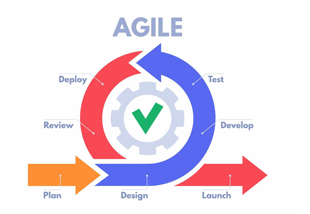

# REPORT 2 — PROJECT MANAGEMENT PLAN
## SECTION 2: MANAGEMENT APPROACH & SECTION 5: PROJECT COMMUNICATIONS
* **Author:** Nguyen Quang Thanh (Team Leader & Lead Backend Architect)
* **Project:** LLM-based Oral Examination System for Software Engineering (FA26SE166)
* **Target Milestone:** Week 5 Report Submission (Report 2)

---

# 🇺🇸 PART 1: ENGLISH VERSION (OFFICIAL SUBMISSION FOR WORD REPORT)

## 2. Management Approach

### 2.1 Project Process

Figure 2.2.1 : Project Process

Reference: https://www.geeksforgeeks.org/what-is-agile-methodology

This project applied the Agile model to ensure flexibility and adaptability to changes. It is also separated into 2-week-long sprints and includes the following stages for each sprint:

* **Planning** – The initial phase where requirements are gathered, goals are defined, and the overall roadmap for development is created.
* **Requirement Analysis** – Gathering and defining the project requirements and acceptance criteria for upcoming features.
* **Designing** – Creating wireframes, prototypes, API contracts (OpenAPI 3.1), database schemas, and system architecture to guide the development process.
* **Implementation** – Writing and implementing clean code (.NET 8 Clean Architecture and React 19) to build the software solution.
* **Testing** – Conducting multi-tier testing (unit, integration, and user acceptance testing) to ensure quality, security, and functionality.
* **Deployment** – Releasing the product to users, either in a containerized staging or production-ready environment.

### 2.2 Quality Management

To ensure the quality of the Oral Exam System, the following practices will be followed:

* **Code Review:** Code must be reviewed and approved by at least one other engineer on GitHub Pull Requests before merging into main branches.
* **API Conventions:** Lock OpenAPI 3.1 contracts and route standards to eliminate frontend-backend integration mismatches.
* **Unit Testing:** Automated tests with xUnit and Moq to validate domain entities, handlers, and the 10.0-point rubric constraint.
* **Integration Testing:** Utilize PostgreSQL 16 and WebApplicationFactory to ensure seamless interaction between client and server.
* **System Testing:** Full end-to-end validation across oral examination flows (MF-01 to MF-04) and Kiosk lockdown to ensure stability.

---

## 5. Project Communications

### 5.1 Communication Plan

**Table 2.5.1 : Communication Plan**

| Communication Item | Who / Target | Purpose | Frequency | Type, Tool, Method(s) |
|---|---|---|---|---|
| **Team Sync Meeting** | All 4 team members | Synchronize progress, review completed tasks, plan upcoming work, and resolve technical blockers | Alternate days (at 15:00 or 21:30) | Video Conference via Google Meet |
| **Team Chat & Discussion** | All 4 team members | Daily communication, rapid coordination, file exchange, and immediate issue raising | Daily / Continuous | Instant Messaging via Zalo Group |
| **Technical Sync & Contract Check** | Frontend & Backend Leads (Thành, Hoàng, Tốt, Hải) | Review OpenAPI 3.1 schemas, database migrations, and resolve cross-layer integration issues | 2–3 times per week (as needed) | Google Meet & GitHub Pull Requests |
| **Code Review & Quality Gate** | Code author & Peer reviewer | Audit source code against Clean Architecture rules, ensure zero-placeholder code, and approve PRs | Continuous (per Pull Request) | Asynchronous via GitHub Pull Requests |
| **Supervisor Progress Meeting** | Project Supervisor & Team members | Report weekly progress, demonstrate working software increments, review report drafts, and receive academic guidance | Weekly | In-person at Student Cultural House (NVHSV) or Online via Google Meet |

### 5.2 External Interface

**Table 2.5.2 : External Interface**

| Function / Role | Contact Person (Name, Position) | Contact Details (Email / Phone) | Responsibility |
|---|---|---|---|
| **Project Supervisor** | Dr. Nguyen Thi Cam Huong (Senior Lecturer, Department of Software Engineering) | huongntc2@fe.edu.vn | Supervise engineering direction, review sprint deliverables, validate methodology, and sign off weekly progress logs |
| **Examination Committee** | FPT University Examination Committee | academic.hcm@fpt.edu.vn | Evaluate and grade formal milestone deliverables at Review 1 (W03), Review 2 (W08), and Final Graduation Defense (W15) |

---
---

# 🇻🇳 PHẦN 2: BẢN TIẾNG VIỆT (DÀNH CHO ĐỐI SOÁT & GIẢI TRÌNH BẢO VỆ)

## 2. Phương Pháp Quản Trị

### 2.1 Quy Trình Dự Án

Hình 2.2.1 : Quy trình phát triển dự án

*(Vị trí chèn sơ đồ Hình 2.2.1)*

Tham khảo: https://www.geeksforgeeks.org/what-is-agile-methodology

Dự án áp dụng mô hình Agile nhằm đảm bảo tính linh hoạt và khả năng thích ứng với các thay đổi. Dự án được chia thành các sprint kéo dài 2 tuần và bao gồm các giai đoạn sau trong mỗi sprint:

* **Lập kế hoạch (Planning):** Giai đoạn ban đầu thu thập các yêu cầu, xác định mục tiêu và xây dựng lộ trình phát triển tổng thể cho backlog.
* **Phân tích yêu cầu (Requirement Analysis):** Thu thập và định nghĩa chi tiết các yêu cầu dự án và tiêu chí nghiệm thu cho các tính năng sắp phát triển.
* **Thiết kế (Designing):** Tạo wireframe, prototype giao diện, hợp đồng API (OpenAPI 3.1), lược đồ cơ sở dữ liệu và kiến trúc hệ thống để định hướng quá trình phát triển.
* **Hiện thực hóa (Implementation):** Viết và triển khai mã nguồn sạch (.NET 8 Clean Architecture và React 19) để xây dựng giải pháp phần mềm.
* **Kiểm thử (Testing):** Tiến hành kiểm thử đa tầng (kiểm thử đơn vị unit test, kiểm thử tích hợp integration test và kiểm thử chấp nhận người dùng UAT) để đảm bảo chất lượng, bảo mật và chức năng.
* **Triển khai (Deployment):** Phát hành sản phẩm đến người dùng, trên môi trường staging container hóa hoặc môi trường production.

### 2.2 Quản Lý Chất Lượng

Để đảm bảo chất lượng của Hệ thống Thi Vấn đáp (Oral Exam System), các hoạt động sau sẽ được tuân thủ:

* **Đánh giá mã nguồn (Code Review):** Mã nguồn bắt buộc phải được ít nhất một kỹ sư khác xem xét và phê duyệt trên GitHub Pull Request trước khi hợp nhất vào nhánh chính.
* **Quy chuẩn API (API Conventions):** Khóa cứng hợp đồng OpenAPI 3.1 và quy chuẩn định tuyến nhằm loại trừ sai lệch tích hợp giữa frontend và backend.
* **Kiểm thử đơn vị (Unit Testing):** Kiểm thử tự động bằng xUnit và Moq để đảm bảo các Domain Entity, Handler và ràng buộc Barem chuẩn 10.0 điểm hoạt động chính xác.
* **Kiểm thử tích hợp (Integration Testing):** Sử dụng PostgreSQL 16 và WebApplicationFactory nhằm đảm bảo sự tương tác thông suốt giữa client và server.
* **Kiểm thử hệ thống (System Testing):** Xác thực toàn diện từ đầu đến cuối trên tất cả các luồng thi (MF-01 đến MF-04) và an ninh Kiosk để đảm bảo tính ổn định.

---

## 5. Kế Hoạch Giao Tiếp Dự Án

### 5.1 Kế Hoạch Giao Tiếp

**Bảng 2.5.1 : Kế hoạch giao tiếp nội bộ**

| Hoạt động giao tiếp | Đối tượng tham gia | Mục đích | Tần suất | Hình thức, Công cụ |
|---|---|---|---|---|
| **Họp Đồng Bộ Nhóm** | Cả 4 thành viên | Đồng bộ tiến độ, báo cáo công việc hoàn thành, lập kế hoạch sắp tới và tháo gỡ khó khăn kỹ thuật | Cách ngày (lúc 15:00 hoặc 21:30) | Gọi video qua Google Meet |
| **Trao Đổi & Nhắn Tin Nhóm** | Cả 4 thành viên | Trao đổi hàng ngày, phối hợp nhanh, chia sẻ tài liệu và cảnh báo sự cố tức thời | Hàng ngày / Liên tục | Nhắn tin qua Nhóm Zalo |
| **Đồng bộ Kỹ thuật & Hợp đồng** | Các Lead FE & BE (Thành, Hoàng, Tốt, Hải) | Rà soát schema OpenAPI 3.1, migration CSDL và giải quyết vướng mắc tích hợp giữa các tầng | 2–3 lần / tuần (khi cần) | Google Meet & GitHub Pull Requests |
| **Review Code & Chốt Chất Lượng** | Tác giả & Người review chéo | Kiểm tra code theo luật Clean Architecture, đảm bảo không có code giả và phê duyệt PR | Liên tục (theo từng PR) | Bất đồng bộ qua GitHub Pull Requests |
| **Gặp Báo Cáo GVHD** | GVHD & Thành viên | Báo cáo tiến độ tuần, demo tính năng phần mềm chạy thật, duyệt báo cáo và tiếp thu chỉ dẫn học thuật | Hàng tuần | Trực tiếp tại Nhà Văn Hóa Sinh Viên (NVHSV) hoặc Online qua Google Meet |

### 5.2 Giao Tiếp Đối Ngoại

**Bảng 2.5.2 : Giao tiếp với các bên liên quan bên ngoài**

| Chức năng / Vai trò | Đầu mối liên hệ (Họ tên, Vị trí) | Thông tin liên hệ (Email / Số ĐT) | Trách nhiệm chính |
|---|---|---|---|
| **Giảng Viên Hướng Dẫn** | TS. Nguyễn Thị Cẩm Hương (Giảng viên cao cấp, Bộ môn Kỹ thuật Phần mềm) | huongntc2@fe.edu.vn | Định hướng kỹ thuật, nghiệm thu sản phẩm từng sprint, xác nhận phương pháp luận và ký duyệt nhật ký tiến độ hàng tuần |
| **Hội Đồng Chấm Đồ Án** | Hội đồng Đánh giá Đồ án FPT University | academic.hcm@fpt.edu.vn | Đánh giá và chấm điểm các mốc báo cáo chính thức tại Review 1 (Tuần 3), Review 2 (Tuần 8), và Lễ Bảo vệ Tốt nghiệp (Tuần 15) |
